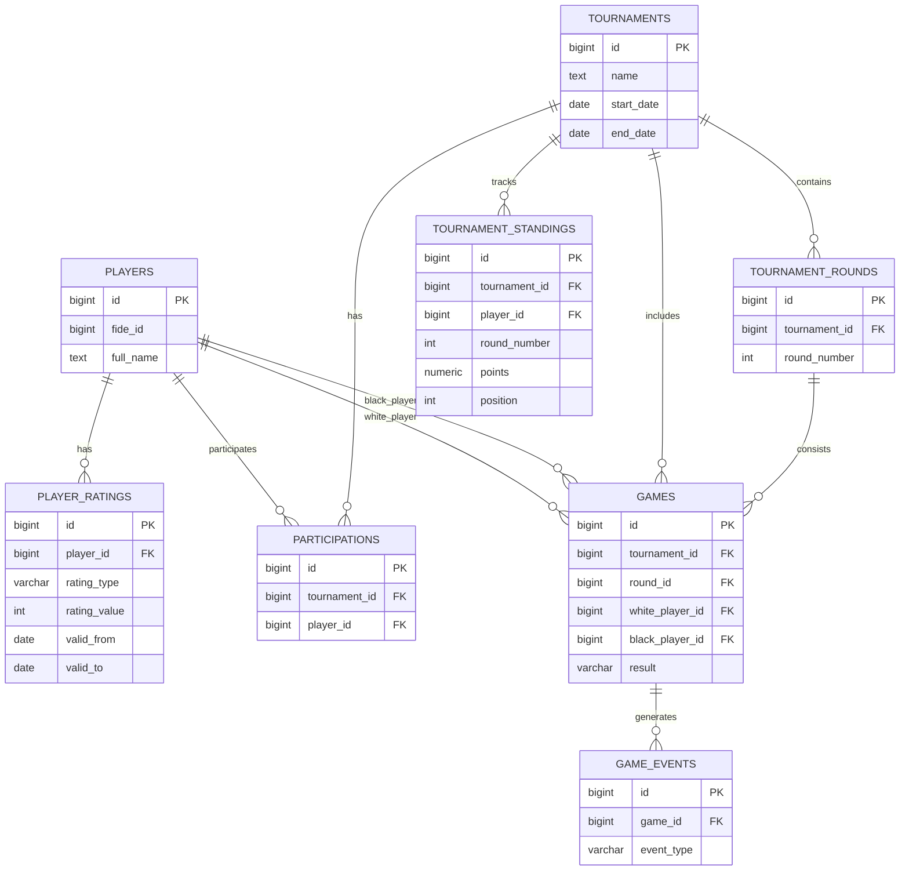

# Анализ трёх проектов БД для сервиса мониторинга шахматиста

Ниже — профессиональный разбор трёх предложенных архитектур:

* Проект A — ChatGPT proposal 
* Проект B — DeepSeek proposal 
* Проект C — Qwen proposal 

---

# 1. Общий вывод

Все три проекта — качественные и зрелые решения уровня production-ready PostgreSQL.

Но:

| Проект   | Сильная сторона                       | Основной недостаток                      |
| -------- | ------------------------------------- | ---------------------------------------- |
| ChatGPT  | Архитектурная зрелость и историчность | Немного переусложнён для MVP             |
| DeepSeek | Простота и хорошая потоковая модель   | Недостаточная нормализация               |
| Qwen     | Наиболее полный enterprise-подход     | Чрезмерная сложность некоторых сущностей |

---

# 2. Сравнительный анализ

## 2.1 Архитектурный подход

| Критерий                          | ChatGPT   | DeepSeek    | Qwen | Лучший       |
| --------------------------------- | --------- | ----------- | ---- | ------------ |
| Разделение справочников и событий | ✅         | ⚠️ частично | ✅    | ChatGPT/Qwen |
| Историчность данных               | ✅ сильная | ✅           | ✅    | ChatGPT      |
| Поддержка live-турниров           | ✅         | ✅           | ✅    | Все          |
| Materialized Views                | ✅         | ✅           | ✅    | Все          |
| Realtime / notifications          | ✅         | ✅           | ✅    | Все          |
| Поддержка аналитики               | ✅         | ⚠️ базовая  | ✅    | Qwen         |
| Масштабирование                   | ✅         | ⚠️          | ✅    | Qwen         |
| Простота MVP                      | ⚠️        | ✅           | ⚠️   | DeepSeek     |

---

# 2.2 Таблица players

## ChatGPT

Плюсы:

* GENERATED full_name
* хорошая историчность
* адекватные индексы

Минусы:

* city/region денормализованы
* federation_code без FK

## DeepSeek

Плюсы:

* минималистично
* удобно для MVP

Минусы:

* слабая защита от дублей
* нет updated_at

## Qwen

Плюсы:

* лучшая защита от дублей
* title/gender constraints
* audit-friendly

Минусы:

* слишком много nullable-полей
* title CHECK неудобен для расширения

### Лучшее решение:

* структура Qwen
* full_name из ChatGPT
* federation через отдельный справочник

---

# 2.3 История рейтингов

## ChatGPT

Лучшее решение.

Причина:
использует validity interval:

```sql
valid_from
valid_to
```

Это enterprise-подход.

Позволяет:

* temporal queries
* рейтинг на дату партии
* реконструкцию состояния

## DeepSeek/Qwen

Используют snapshot by date.

Проще, но слабее аналитически.

### Вывод

Использовать:

* temporal validity model из ChatGPT
* плюс snapshot date для удобства UI

---

# 2.4 Участие в турнире

Все три решения понимают важнейшую вещь:

> Игрок ≠ участие в турнире

Это критично.

Лучшее решение:

* Qwen participation
* * historical fields из ChatGPT

---

# 2.5 Games

## ChatGPT

Плюсы:

* game_events
* realtime-ready

Минусы:

* слабая детализация партии

## DeepSeek

Плюсы:

* player_game_score ускоряет аналитику

Минусы:

* денормализация

## Qwen

Наиболее зрелая модель:

* ECO
* opening_name
* generated points
* status lifecycle
* source_updated_at

### Победитель:

Qwen + game_events из ChatGPT

---

# 2.6 Snapshot standings

Это ключевая часть всей системы.

## ChatGPT

Лучшее решение:

* отдельная snapshot table

## DeepSeek

materialized view

Минус:

* сложно хранить историю изменений

## Qwen

player_round_progress — хороший hybrid

### Лучшее решение:

* snapshot table из ChatGPT
* * projection fields из Qwen

---

# 2.7 What-if прогнозы

| Проект   | Подход                      |
| -------- | --------------------------- |
| ChatGPT  | отдельная таблица сценариев |
| DeepSeek | query-driven                |
| Qwen     | external prediction service |

### Лучший подход

Комбинация:

* внешний prediction service
* кэшируемые scenario tables
* snapshots standings

---

# 2.8 Realtime и notifications

Лучшее решение — DeepSeek/Qwen:

* pg_notify
* триггеры
* event-driven architecture

ChatGPT тоже хороший, но менее детализирован.

---

# 2.9 Аналитика

Qwen победитель:

* H2H MV
* рейтинг динамики
* tournament summary
* projection ranges

---

# 3. Главные проблемы исходных проектов

## Проблема 1 — отсутствие справочников

Во всех проектах не хватает:

* federations
* countries
* titles
* time_controls
* tournament_formats

Это приведёт к:

* грязным данным
* невозможности BI

---

## Проблема 2 — нет audit trail

Нужно:

```sql
audit_log
```

Для:

* отладки парсеров
* отслеживания правок

---

## Проблема 3 — нет soft delete

Production-система должна иметь:

```sql
deleted_at
```

---

## Проблема 4 — PGN хранится неоптимально

Нужно:

* PGN отдельно
* compressed storage
* возможно object storage

---

# 4. Рекомендуемый итоговый проект (best practice)

---

# Архитектурный подход

## PostgreSQL как:

* OLTP
* realtime source
* lightweight analytics

## Redis:

* live standings
* websocket cache

## ClickHouse:

* аналитика при росте

## Kafka/RabbitMQ:

* event bus

---

# 5. Итоговая рекомендуемая структура БД

---

# Core справочники

## players

```sql
players
---------
id PK
fide_id UNIQUE
national_id
first_name
last_name
middle_name
full_name GENERATED
birth_date
gender
federation_id FK
title_id FK
is_active
created_at
updated_at
deleted_at
```

---

## federations

```sql
federations
------------
id PK
code UNIQUE
name
country_id FK
```

---

## titles

```sql
titles
-------
id PK
code UNIQUE
name
priority
```

---

## tournaments

```sql
tournaments
------------
id PK
external_id
name
format_id FK
time_control_id FK
country_id FK
city
start_date
end_date
rounds_count
status
created_at
updated_at
```

---

## tournament_rounds

```sql
tournament_rounds
-----------------
id PK
tournament_id FK
round_number
status
started_at
finished_at
```

---

# Историчность

## player_ratings

```sql
player_ratings
---------------
id PK
player_id FK
rating_type
rating_value
valid_from
valid_to
source
created_at
```

---

# Участие

## participations

```sql
participations
---------------
id PK
tournament_id FK
player_id FK
seed_number
initial_rating
final_rating
rating_delta
final_position
performance_rating
is_withdrawn
withdrawal_round
created_at
updated_at
```

---

# Партии

## games

```sql
games
------
id PK
tournament_id FK
round_id FK
white_player_id FK
black_player_id FK
board_number
result
status
eco_code
opening_name
moves_count
pgn_storage_key
played_at
source_updated_at
created_at
updated_at
```

---

## game_events

```sql
game_events
------------
id PK
game_id FK
event_type
payload JSONB
created_at
```

---

# Турнирные snapshot

## tournament_standings

```sql
tournament_standings
--------------------
id PK
tournament_id FK
round_number
player_id FK

position
points

buchholz
buchholz_cut1
sonneborn_berger

wins
draws
losses

rating_delta
performance_rating

projected_min_place
projected_max_place

created_at
```

---

# Прогнозы

## live_predictions

```sql
live_predictions
----------------
id PK
tournament_id FK
round_number
player_id FK
prediction_type
payload JSONB
created_at
```

---

# What-if

## whatif_scenarios

```sql
whatif_scenarios
----------------
id PK
user_id
tournament_id
player_id
round_number
scenario_payload JSONB
result_payload JSONB
created_at
expires_at
```

---

# Уведомления

## notification_subscriptions

```sql
notification_subscriptions
--------------------------
id PK
user_id
player_id
tournament_id
notify_round_results
notify_rating_changes
notify_pairings
created_at
```

---

# Служебные таблицы

## ingestion_logs

```sql
ingestion_logs
---------------
id PK
source_name
entity_type
entity_external_id
status
message
created_at
```

---

## audit_log

```sql
audit_log
----------
id PK
table_name
record_id
operation_type
old_data JSONB
new_data JSONB
created_at
```

---

# 6. Итоговые materialized views

---

## mv_player_profile

Для карточки игрока.

---

## mv_head_to_head

Для статистики соперников.

---

## mv_active_standings

Для live UI.

---

## mv_rating_timeline

Для графиков рейтинга.

---

# 7. Mermaid ER Diagram



---

# 8. Финальная рекомендация

## Для MVP

Использовать:

* players
* player_ratings
* tournaments
* tournament_rounds
* participations
* games
* tournament_standings

Этого достаточно для:

* live таблиц
* профилей
* динамики рейтинга
* аналитики

---

## Для production

Добавить:

* game_events
* live_predictions
* notifications
* audit_log
* Kafka
* Redis
* ClickHouse

---

# 9. Что я бы выбрал как архитектор

## Основа:

* архитектура ChatGPT

## Аналитика:

* Qwen

## Realtime:

* DeepSeek

## Финальная стратегия:

* PostgreSQL + event-driven architecture + snapshot standings

Это наиболее масштабируемый и профессиональный вариант для шахматной аналитической платформы.
