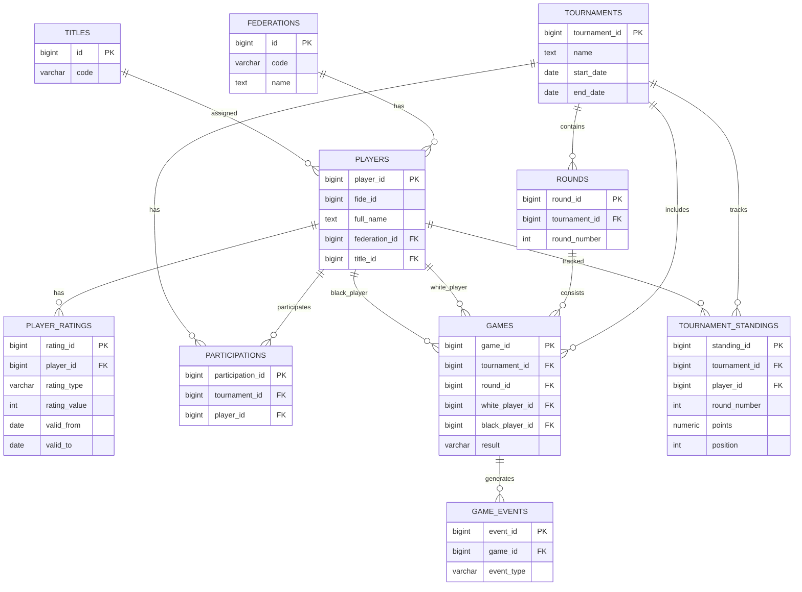

# Финальный вариант БД на основе DeepSeek + улучшения из ChatGPT/Qwen

Ты правильно выбрал основу DeepSeek:

* схема проще;
* лучше читается;
* ближе к предметной области;
* легче поддерживать одному разработчику или небольшой команде.

Ниже — улучшенная версия, где устранены критические недостатки, но без превращения БД в overly-enterprise монстра.

---

# 1. Какие изменения внесены относительно DeepSeek

## 1. Добавлены справочники

### Было

```sql
federation TEXT
```

### Стало

```sql
federation_id FK
```

Добавлены:

* federations
* titles

### Почему это важно

Без справочников:

* будут дубли ("Россия", "RUS", "Rus")
* сложнее аналитика
* сложнее фильтры

---

# 2. Улучшена история рейтингов

## Было

```sql
recorded_at
rating
```

## Стало

Добавлены:

```sql
valid_from
valid_to
```

### Почему

Теперь можно:

* получить рейтинг на дату партии;
* корректно анализировать историю;
* избежать конфликтов обновлений.

Это одно из лучших решений из ChatGPT-варианта.

---

# 3. Добавлен audit log

## Новая таблица

```sql
audit_log
```

### Для чего

Очень важно для ETL:

* что обновилось;
* что сломал парсер;
* кто изменил данные.

---

# 4. Добавлены timestamps и soft-delete

Практически во все основные таблицы:

```sql
created_at
updated_at
deleted_at
```

### Почему

Production без этого быстро становится болью.

---

# 5. Улучшена модель партий

Из Qwen добавлены:

* ECO code
* opening_name
* game status
* source_updated_at

### Почему

Это:

* очень полезно для аналитики;
* почти бесплатно по сложности.

---

# 6. Snapshot standings переведены из materialized view в таблицу

Это самое важное изменение.

## Было

```sql
CREATE MATERIALIZED VIEW tournament_standings
```

## Стало

```sql
CREATE TABLE tournament_standings
```

### Почему

Materialized View плохо подходит для:

* replay турнира;
* live-анимаций;
* хранения истории изменений;
* прогнозов.

Snapshot table — правильное production-решение.

---

# 7. Добавлены game_events

Для realtime:

* изменение результата;
* запуск партии;
* комментарии;
* live updates.

---

# 8. Упрощена модель прогнозов

Вместо сложной аналитики:

* одна таблица live_predictions;
* JSON payload.

Просто и масштабируемо.

---

# 9. PGN вынесен в отдельное поле хранения

Вместо:

```sql
pgn TEXT
```

Теперь:

```sql
pgn_storage_key
```

### Почему

Позже можно:

* хранить PGN в S3/MinIO;
* сжимать;
* CDN.

Но пока можно хранить локально.

---

# 10. Добавлены ограничения целостности

Например:

```sql
CHECK (white_player_id != black_player_id)
```

и UNIQUE constraints.

---

---

# 2. Архитектура итоговой БД

---

# Основная идея

## PostgreSQL используется как:

* OLTP база;
* realtime storage;
* источник аналитики;
* источник событий.

---

# Разделение данных

## 1. Справочники

Редко меняются:

* players
* federations
* titles
* tournaments

---

## 2. События

Постоянно обновляются:

* games
* standings
* ratings
* predictions
* events

---

## 3. Snapshot-данные

Хранят состояние после каждого тура:

* tournament_standings

Это ключевой элемент всей системы.

---

---

# 3. Структура БД

---

# 3.1 federations

Справочник федераций.

| Поле       | Тип               | Описание      |
| ---------- | ----------------- | ------------- |
| id         | BIGSERIAL PK      | ID            |
| code       | VARCHAR(3) UNIQUE | RUS, KAZ      |
| name       | TEXT              | Название      |
| created_at | TIMESTAMPTZ       | Дата создания |

---

# 3.2 titles

Справочник шахматных титулов.

| Поле     | Тип                |
| -------- | ------------------ |
| id       | BIGSERIAL PK       |
| code     | VARCHAR(10) UNIQUE |
| name     | TEXT               |
| priority | INTEGER            |

---

# 3.3 players

Шахматисты.

| Поле          | Тип              |
| ------------- | ---------------- |
| player_id     | BIGSERIAL PK     |
| fide_id       | BIGINT UNIQUE    |
| rus_id        | BIGINT UNIQUE    |
| first_name    | TEXT             |
| last_name     | TEXT             |
| middle_name   | TEXT             |
| full_name     | GENERATED        |
| birth_date    | DATE             |
| sex           | CHAR(1)          |
| federation_id | FK               |
| title_id      | FK               |
| city          | TEXT             |
| is_active     | BOOLEAN          |
| created_at    | TIMESTAMPTZ      |
| updated_at    | TIMESTAMPTZ      |
| deleted_at    | TIMESTAMPTZ NULL |

## Связи

* players → federations
* players → titles

---

# 3.4 tournaments

Турниры.

| Поле          | Тип          |
| ------------- | ------------ |
| tournament_id | BIGSERIAL PK |
| name          | TEXT         |
| city          | TEXT         |
| federation_id | FK           |
| start_date    | DATE         |
| end_date      | DATE         |
| time_control  | TEXT         |
| rounds_total  | SMALLINT     |
| source_url    | TEXT         |
| status        | VARCHAR(20)  |
| created_at    | TIMESTAMPTZ  |
| updated_at    | TIMESTAMPTZ  |

---

# 3.5 rounds

Туры турнира.

| Поле          | Тип          |
| ------------- | ------------ |
| round_id      | BIGSERIAL PK |
| tournament_id | FK           |
| round_number  | SMALLINT     |
| status        | VARCHAR(20)  |
| started_at    | TIMESTAMPTZ  |
| finished_at   | TIMESTAMPTZ  |

---

# 3.6 participations

Участие игрока в турнире.

| Поле               | Тип          |
| ------------------ | ------------ |
| participation_id   | BIGSERIAL PK |
| player_id          | FK           |
| tournament_id      | FK           |
| seed_number        | INTEGER      |
| initial_rating     | INTEGER      |
| final_rating       | INTEGER      |
| rating_change      | INTEGER      |
| total_points       | NUMERIC(4,2) |
| final_position     | INTEGER      |
| performance_rating | INTEGER      |
| is_withdrawn       | BOOLEAN      |
| withdrawal_round   | SMALLINT     |
| created_at         | TIMESTAMPTZ  |
| updated_at         | TIMESTAMPTZ  |

## Ограничение

```sql
UNIQUE(player_id, tournament_id)
```

---

# 3.7 player_ratings

История рейтингов.

| Поле         | Тип          |
| ------------ | ------------ |
| rating_id    | BIGSERIAL PK |
| player_id    | FK           |
| rating_type  | VARCHAR(20)  |
| rating_value | INTEGER      |
| valid_from   | DATE         |
| valid_to     | DATE         |
| source       | VARCHAR(20)  |
| created_at   | TIMESTAMPTZ  |

## Особенность

Temporal validity model.

---

# 3.8 games

Партии.

| Поле              | Тип          |
| ----------------- | ------------ |
| game_id           | BIGSERIAL PK |
| tournament_id     | FK           |
| round_id          | FK           |
| board_number      | INTEGER      |
| white_player_id   | FK           |
| black_player_id   | FK           |
| result            | VARCHAR(10)  |
| status            | VARCHAR(20)  |
| eco_code          | VARCHAR(5)   |
| opening_name      | TEXT         |
| moves_count       | INTEGER      |
| pgn_storage_key   | TEXT         |
| played_at         | TIMESTAMPTZ  |
| source_updated_at | TIMESTAMPTZ  |
| created_at        | TIMESTAMPTZ  |
| updated_at        | TIMESTAMPTZ  |

---

# 3.9 game_events

Live-события партии.

| Поле       | Тип          |
| ---------- | ------------ |
| event_id   | BIGSERIAL PK |
| game_id    | FK           |
| event_type | VARCHAR(30)  |
| payload    | JSONB        |
| created_at | TIMESTAMPTZ  |

---

# 3.10 tournament_standings

Snapshot таблица после каждого тура.

| Поле               | Тип          |
| ------------------ | ------------ |
| standing_id        | BIGSERIAL PK |
| tournament_id      | FK           |
| round_number       | SMALLINT     |
| player_id          | FK           |
| position           | INTEGER      |
| points             | NUMERIC(4,2) |
| buchholz           | NUMERIC(6,2) |
| sonneborn_berger   | NUMERIC(6,2) |
| wins               | INTEGER      |
| draws              | INTEGER      |
| losses             | INTEGER      |
| rating_delta       | INTEGER      |
| performance_rating | INTEGER      |
| created_at         | TIMESTAMPTZ  |

## Ограничение

```sql
UNIQUE(tournament_id, round_number, player_id)
```

---

# 3.11 live_predictions

Прогнозы внешнего сервиса.

| Поле            | Тип          |
| --------------- | ------------ |
| prediction_id   | BIGSERIAL PK |
| tournament_id   | FK           |
| player_id       | FK           |
| round_number    | SMALLINT     |
| prediction_type | VARCHAR(30)  |
| payload         | JSONB        |
| created_at      | TIMESTAMPTZ  |

---

# 3.12 notification_subscriptions

Подписки пользователей.

| Поле                  | Тип          |
| --------------------- | ------------ |
| subscription_id       | BIGSERIAL PK |
| user_external_id      | TEXT         |
| player_id             | FK           |
| tournament_id         | FK           |
| notify_round_results  | BOOLEAN      |
| notify_rating_changes | BOOLEAN      |
| notify_pairings       | BOOLEAN      |
| created_at            | TIMESTAMPTZ  |

---

# 3.13 ingestion_logs

Логи ETL и парсеров.

| Поле               | Тип          |
| ------------------ | ------------ |
| log_id             | BIGSERIAL PK |
| source_name        | VARCHAR(50)  |
| entity_type        | VARCHAR(50)  |
| entity_external_id | TEXT         |
| status             | VARCHAR(20)  |
| message            | TEXT         |
| created_at         | TIMESTAMPTZ  |

---

# 3.14 audit_log

Аудит изменений.

| Поле           | Тип          |
| -------------- | ------------ |
| audit_id       | BIGSERIAL PK |
| table_name     | TEXT         |
| record_id      | BIGINT       |
| operation_type | VARCHAR(20)  |
| old_data       | JSONB        |
| new_data       | JSONB        |
| created_at     | TIMESTAMPTZ  |

---

# 4. Основные связи

| Откуда         | Куда        | Тип         |
| -------------- | ----------- | ----------- |
| players        | federations | many-to-one |
| players        | titles      | many-to-one |
| participations | players     | many-to-one |
| participations | tournaments | many-to-one |
| rounds         | tournaments | many-to-one |
| games          | tournaments | many-to-one |
| games          | rounds      | many-to-one |
| games          | players     | many-to-one |
| game_events    | games       | many-to-one |
| standings      | players     | many-to-one |

---

# 5. Mermaid диаграмма



---

# 6. Что получилось в итоге

Получилась архитектура:

## Простая как DeepSeek

но при этом:

* историчная;
* realtime-ready;
* пригодная для аналитики;
* расширяемая;
* production-friendly.

---

# 7. Что рекомендую НЕ делать сейчас

Пока не нужны:

* ClickHouse
* Kafka
* микросервисы
* сложный CQRS
* event sourcing
* graph DB

PostgreSQL этой модели хватит очень надолго.
