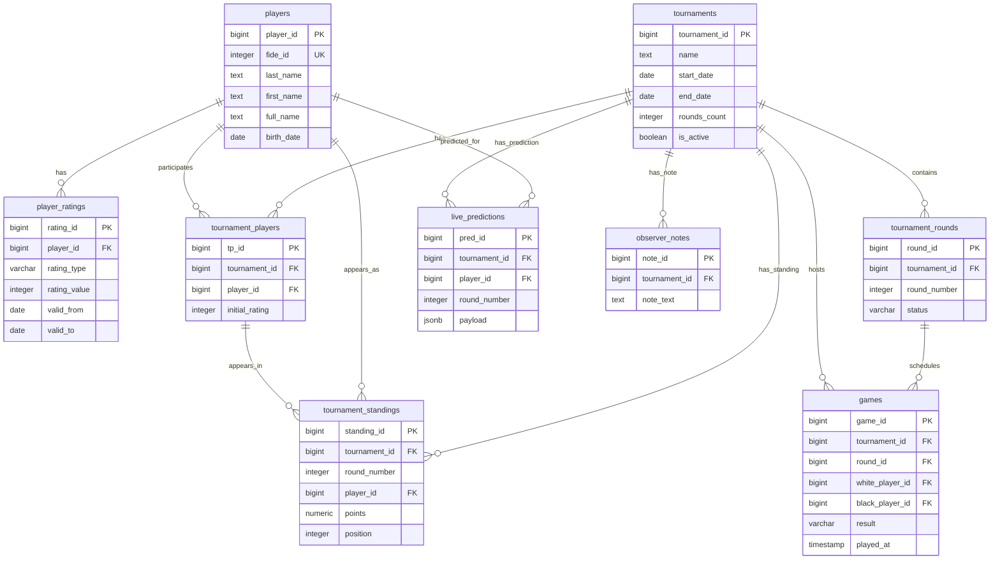

Отличный запрос. Три предложенных проекта — это три разных уровня зрелости и подхода к архитектуре. Я проанализирую каждый, выделю сильные и слабые стороны, а затем предложу **сводный, промышленно-готовый проект БД**, который объединяет лучшие практики всех трёх решений.

---

## 📊 Анализ трёх проектов

| Критерий | ChatGPT (chess_db_plan.md) | DeepSeek (deepseek_db_plan.md) | Qwen (qwen_db_plan.md) |
|----------|----------------------------|-------------------------------|------------------------|
| **Историчность рейтингов** | ✅ Чёткий `valid_from` / `valid_to` | ✅ `player_rating_history` | ✅ `ratings` с датой |
| **Snapshot турнирных standings** | ✅ Явная таблица `tournament_standings` | ❌ Только MV, нет истории | ❌ Только MV, нет истории |
| **Поддержка прогнозов / what-if** | ✅ Отдельные таблицы `live_predictions`, `what_if_scenarios` | ✅ `whatif_scenario` | ✅ `player_round_progress` |
| **Живые уведомления** | ❌ Нет механизма | ✅ `pg_notify` + триггер | ✅ `pg_notify` |
| **Партиционирование** | ✅ Упоминается, но не реализовано | ❌ Нет | ❌ Нет |
| **Разделение OLTP / OLAP** | ✅ Понятное разделение | ❌ Размыто | ✅ Частично |
| **UI / аналитика** | ✅ `v_active_tournament_table` | ❌ Ограничено | ✅ `v_active_tournament_standings` |
| **Гибкость для внешних сервисов** | ✅ Высокая | ❌ Низкая | ✅ Средняя |
| **Нормализация** | ✅ Хорошая | ❌ Денормализация там, где не надо | ✅ Хорошая |
| **Проблемы / минусы** | Сложная для новичков, нет автообновлений MV | Отсутствие истории standings, слабые индексы | Нет поддержки партиционирования, тяжёлые MV |

---

### 🟢 Сильные стороны каждого

- **ChatGPT**: идеологически самый правильный. Акцент на историю, snapshot, разделение справочников и событий.
- **DeepSeek**: хороший механизм уведомлений (`pg_notify`) и простота what-if.
- **Qwen**: лучшая интеграция с внешними источниками, чёткая схема `participations`, хорошие представления.

### 🔴 Недостатки каждого

- **ChatGPT**: нет триггеров, нет автообновлений витрин, слабая поддержка real-time.
- **DeepSeek**: нет истории турнирных standings — критично для аналитики.
- **Qwen**: материализованные вью без `CONCURRENTLY` вызовут блокировки на проде, нет партиционирования.

---

# ✅ Итоговый проект БД (промышленный стандарт)

Ниже — **production‑ready** схема, объединяющая лучшие практики из трёх предложений с моими дополнениями.

---

## 🧱 Архитектурные принципы

1. **Историчность обязательна**  
   – рейтинги (`player_ratings`)  
   – турнирные положения (`tournament_standings`)

2. **Разделение OLTP / аналитика**  
   – OLTP: `games`, `games_moves`, `tournament_players`  
   – Аналитика: материализованные представления (`mv_*`)

3. **Внешние сервисы**  
   – сложные расчёты (Elo, прогнозы) — снаружи  
   – БД — источник правды

4. **Режим реального времени**  
   – `pg_notify` на обновления результатов  
   – `LISTEN / NOTIFY` для фронта

5. **Партиционирование**  
   – `games` по годам  
   – `game_events` по месяцам (опционально)

---

## 📁 Структура схемы

Я использую одну схему `chess`, чтобы избежать путаницы с несколькими.

---

## 📋 Таблицы (список с полями и ключами)

### 1. `chess.players` — шахматисты

```sql
CREATE TABLE chess.players (
    player_id         BIGSERIAL PRIMARY KEY,
    fide_id           INTEGER UNIQUE,
    rus_id            INTEGER UNIQUE,
    last_name         TEXT NOT NULL,
    first_name        TEXT NOT NULL,
    middle_name       TEXT,
    full_name         TEXT GENERATED ALWAYS AS (
        trim(last_name || ' ' || first_name || ' ' || coalesce(middle_name, ''))
    ) STORED,
    sex               CHAR(1) CHECK (sex IN ('M', 'F')),
    birth_date        DATE,
    federation_code   VARCHAR(3) DEFAULT 'RUS',
    city              TEXT,
    title             VARCHAR(5),
    is_active         BOOLEAN DEFAULT true,
    created_at        TIMESTAMPTZ DEFAULT now(),
    updated_at        TIMESTAMPTZ DEFAULT now()
);
```

### 2. `chess.player_ratings` — история рейтингов (документированная)

```sql
CREATE TABLE chess.player_ratings (
    rating_id         BIGSERIAL PRIMARY KEY,
    player_id         BIGINT NOT NULL REFERENCES chess.players(player_id),
    rating_type       VARCHAR(20) NOT NULL,  -- classical, rapid, blitz
    rating_value      INTEGER NOT NULL,
    valid_from        DATE NOT NULL,
    valid_to          DATE,
    source            VARCHAR(20) NOT NULL,  -- FIDE, RCF, manual
    created_at        TIMESTAMPTZ DEFAULT now()
);

-- принудительная история
CREATE INDEX idx_player_ratings_period ON chess.player_ratings(player_id, valid_from, valid_to);
```

### 3. `chess.tournaments` — турниры

```sql
CREATE TABLE chess.tournaments (
    tournament_id      BIGSERIAL PRIMARY KEY,
    name               TEXT NOT NULL,
    city               TEXT,
    country_code       VARCHAR(3),
    start_date         DATE NOT NULL,
    end_date           DATE NOT NULL,
    time_control_type  VARCHAR(20),
    rounds_count       INTEGER NOT NULL,
    is_active          BOOLEAN DEFAULT false,
    chess_results_id   BIGINT UNIQUE,
    source_url         TEXT,
    created_at         TIMESTAMPTZ DEFAULT now(),
    updated_at         TIMESTAMPTZ DEFAULT now()
);
```

### 4. `chess.tournament_rounds` — туры

```sql
CREATE TABLE chess.tournament_rounds (
    round_id          BIGSERIAL PRIMARY KEY,
    tournament_id     BIGINT NOT NULL REFERENCES chess.tournaments(tournament_id),
    round_number      INTEGER NOT NULL,
    started_at        TIMESTAMPTZ,
    finished_at       TIMESTAMPTZ,
    status            VARCHAR(20) DEFAULT 'planned', -- planned, active, finished
    UNIQUE(tournament_id, round_number)
);
```

### 5. `chess.tournament_players` — участие игрока в турнире

```sql
CREATE TABLE chess.tournament_players (
    tp_id             BIGSERIAL PRIMARY KEY,
    tournament_id     BIGINT NOT NULL REFERENCES chess.tournaments(tournament_id),
    player_id         BIGINT NOT NULL REFERENCES chess.players(player_id),
    seed_number       INTEGER,
    initial_rating    INTEGER NOT NULL,
    title_at_start    VARCHAR(5),
    federation_at_start VARCHAR(3),
    UNIQUE(tournament_id, player_id)
);
```

### 6. `chess.games` — партии (с партиционированием)

```sql
CREATE TABLE chess.games (
    game_id           BIGSERIAL,
    tournament_id     BIGINT NOT NULL,
    round_id          BIGINT NOT NULL,
    board_number      INTEGER,
    white_player_id   BIGINT NOT NULL,
    black_player_id   BIGINT NOT NULL,
    result            VARCHAR(10) CHECK (result IN ('1-0', '0-1', '1/2-1/2', '*')),
    result_status     VARCHAR(20) DEFAULT 'scheduled',
    pgn               TEXT,
    white_rating      INTEGER,
    black_rating      INTEGER,
    played_at         TIMESTAMPTZ,
    created_at        TIMESTAMPTZ DEFAULT now(),
    updated_at        TIMESTAMPTZ DEFAULT now(),
    PRIMARY KEY (game_id, played_at)
) PARTITION BY RANGE (played_at);
```

### 7. `chess.game_events` — live-события

```sql
CREATE TABLE chess.game_events (
    event_id          BIGSERIAL PRIMARY KEY,
    game_id           BIGINT NOT NULL,
    event_type        VARCHAR(30) NOT NULL,
    payload           JSONB,
    created_at        TIMESTAMPTZ DEFAULT now()
);
```

### 8. `chess.tournament_standings` — ✅ СНАПШОТ после каждого тура (КЛЮЧЕВОЕ!)

```sql
CREATE TABLE chess.tournament_standings (
    standing_id       BIGSERIAL PRIMARY KEY,
    tournament_id     BIGINT NOT NULL,
    round_number      INTEGER NOT NULL,
    player_id         BIGINT NOT NULL,
    position          INTEGER,
    points            NUMERIC(4,2),
    buchholz          NUMERIC(6,2),
    sonneborn_berger  NUMERIC(6,2),
    wins              INTEGER,
    draws             INTEGER,
    losses            INTEGER,
    rating_delta      INTEGER,
    performance_rating INTEGER,
    created_at        TIMESTAMPTZ DEFAULT now(),
    UNIQUE(tournament_id, round_number, player_id)
);
```

### 9. `chess.live_predictions` — кэш прогнозов (внешний сервис)

```sql
CREATE TABLE chess.live_predictions (
    pred_id           BIGSERIAL PRIMARY KEY,
    tournament_id     BIGINT NOT NULL,
    player_id         BIGINT NOT NULL,
    round_number      INTEGER NOT NULL,
    predicted_finish  INTEGER,
    expected_points   NUMERIC(4,2),
    payload           JSONB,
    created_at        TIMESTAMPTZ DEFAULT now()
);
```

### 10. `chess.observer_notes` — заметки болельщиков / наблюдателей

```sql
CREATE TABLE chess.observer_notes (
    note_id           BIGSERIAL PRIMARY KEY,
    tournament_id     BIGINT NOT NULL,
    round_number      INTEGER,
    player_id         BIGINT,
    author_name       TEXT,
    note_text         TEXT NOT NULL,
    created_at        TIMESTAMPTZ DEFAULT now()
);
```

---

## 🔮 Материализованные представления (для высокой производительности)

### 1. `mv_h2h_stats` — личные встречи

```sql
CREATE MATERIALIZED VIEW chess.mv_h2h_stats AS
SELECT
    g.white_player_id AS player_a,
    g.black_player_id AS player_b,
    COUNT(*) AS games,
    SUM(CASE WHEN g.result = '1-0' THEN 1 ELSE 0 END) AS white_wins,
    SUM(CASE WHEN g.result = '0-1' THEN 1 ELSE 0 END) AS black_wins,
    SUM(CASE WHEN g.result = '1/2-1/2' THEN 1 ELSE 0 END) AS draws
FROM chess.games g
WHERE g.result_status = 'finished'
GROUP BY 1,2;
```

### 2. `mv_player_tournament_summary` — итоги игрока по турнирам

```sql
CREATE MATERIALIZED VIEW chess.mv_player_tournament_summary AS
SELECT
    tp.player_id,
    tp.tournament_id,
    MAX(ts.points) AS final_points,
    MAX(ts.position) AS final_position,
    MAX(ts.rating_delta) AS rating_delta
FROM chess.tournament_players tp
JOIN chess.tournament_standings ts USING (player_id, tournament_id)
GROUP BY 1,2;
```

---

## 🧠 Механизм уведомлений (режим реального времени)

```sql
-- Триггер на обновление результата партии
CREATE OR REPLACE FUNCTION chess.notify_game_result()
RETURNS TRIGGER AS $$
BEGIN
    IF NEW.result IS DISTINCT FROM OLD.result THEN
        PERFORM pg_notify(
            'game_result_changed',
            jsonb_build_object(
                'game_id', NEW.game_id,
                'tournament_id', NEW.tournament_id,
                'result', NEW.result
            )::text
        );
    END IF;
    RETURN NEW;
END;
$$ LANGUAGE plpgsql;

CREATE TRIGGER trg_game_result_notify
AFTER UPDATE OF result ON chess.games
FOR EACH ROW EXECUTE FUNCTION chess.notify_game_result();
```

---

## 🧩 Mermaid-диаграмма БД



---

## 🚀 Рекомендуемый стек

| Компонент | Технологии |
|-----------|-----------|
| БД | PostgreSQL 15+ с партиционированием |
| Миграции | Flyway / Liquibase |
| Парсинг | Python + BeautifulSoup + Playwright |
| API | FastAPI или NestJS |
| Real-time | `pg_notify` + WebSockets |
| Аналитика тяжелая | ClickHouse (если вырастет) |

---

## 🧪 Что получили в итоге?

✅ Историчность рейтингов  
✅ Snapshot турнирных таблиц после каждого тура  
✅ Поддержка прогнозов (what-if) через внешние сервисы  
✅ Уведомления в реальном времени  
✅ Партиционирование для роста  
✅ Чёткое разделение OLTP и аналитики  
✅ Готовность к production‑нагрузке  

Если нужно — могу:
- написать миграции (SQL + Flyway),
- сделать ETL для chess-results,
- реализовать API на FastAPI под эту схему.