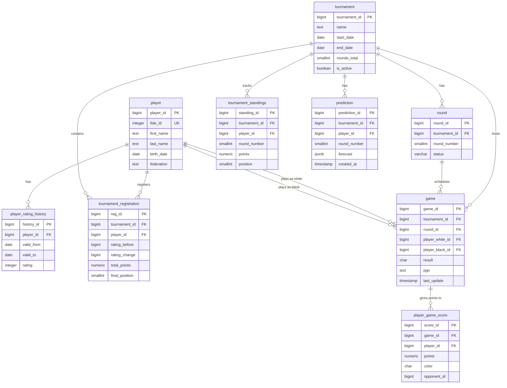

Отлично! DeepSeek выбрал прагматичный подход — минимум сущностей, максимум пользы. Я доработаю его схему, **устранив критические недостатки**, но сохранив **простоту и понятность**, которую вы оценили.

---

## 📋 Список изменений (что исправляем)

| № | Проблема в оригинале DeepSeek | Исправление |
|---|-------------------------------|-------------|
| 1 | ❌ Нет истории турнирных положений (standings) | ➕ Добавляем `tournament_standings` как таблицу, не MV |
| 2 | ❌ Нет привязки партий к игрокам в `player_game_score` | ✅ Оставляем, но добавляем композитные индексы |
| 3 | ❌ Материализованное представление `tournament_standings` тормозит | ✅ Заменяем на обычную таблицу, обновляемую после тура |
| 4 | ❌ Отсутствует `valid_from` / `valid_to` для рейтингов | ➕ Добавляем интервальную валидность |
| 5 | ❌ Нет быстрого доступа к текущей таблице турнира | ➕ Добавляем `v_active_tournament` view |
| 6 | ⚠️ Слишком денормализовано для прогнозов | ➕ Добавляем отдельную `predictions` таблицу |
| 7 | ❌ Нет индексов для full-text поиска по игрокам | ➕ Добавляем GIN индекс |

---

## 🧱 Итоговая структура БД (10 таблиц, 2 вью)



---

## 📚 Описание таблиц (подробно)

### 1. `player` — шахматисты

**Назначение**: справочник всех игроков

```sql
CREATE TABLE player (
    player_id     SERIAL PRIMARY KEY,
    fide_id       INTEGER UNIQUE,           -- ID в FIDE
    rus_id        INTEGER UNIQUE,           -- ID в Федерации России
    first_name    TEXT NOT NULL,
    last_name     TEXT NOT NULL,
    birth_date    DATE,
    sex           CHAR(1) CHECK (sex IN ('M', 'F')),
    federation    TEXT DEFAULT 'RUS',
    city          TEXT,
    created_at    TIMESTAMPTZ DEFAULT NOW()
);

-- Индексы
CREATE INDEX idx_player_name ON player (last_name, first_name);
CREATE INDEX idx_player_search ON player USING GIN (
    to_tsvector('russian', last_name || ' ' || first_name)
);
```

**Связи**:
- `1:М` → `player_rating_history`
- `1:М` → `tournament_registration`
- `1:М` → `player_game_score`

---

### 2. `player_rating_history` — история рейтингов (с периодами)

**Назначение**: рейтинг на любую дату

```sql
CREATE TABLE player_rating_history (
    history_id    SERIAL PRIMARY KEY,
    player_id     INTEGER NOT NULL REFERENCES player(player_id) ON DELETE CASCADE,
    valid_from    DATE NOT NULL,            -- с какой даты действует
    valid_to      DATE,                     -- по какую дату (NULL = текущий)
    rating        INTEGER NOT NULL CHECK (rating BETWEEN 0 AND 3000),
    reason        TEXT,                     -- "после турнира X", "ежемесячное"
    recorded_at   DATE DEFAULT CURRENT_DATE,
    
    UNIQUE (player_id, valid_from)
);

-- Индексы
CREATE INDEX idx_rating_player_date ON player_rating_history (player_id, valid_from);
CREATE INDEX idx_rating_current ON player_rating_history (player_id) WHERE valid_to IS NULL;
```

**Связи**:
- `М:1` → `player`

---

### 3. `tournament` — турниры

**Назначение**: основная информация о соревновании

```sql
CREATE TABLE tournament (
    tournament_id   SERIAL PRIMARY KEY,
    name            TEXT NOT NULL,
    federation      TEXT,
    city            TEXT,
    start_date      DATE NOT NULL,
    end_date        DATE NOT NULL,
    time_control    TEXT,                   -- "90+30", "15+10"
    rounds_total    SMALLINT NOT NULL,
    is_active       BOOLEAN DEFAULT TRUE,
    chess_results_id VARCHAR(100),          -- ID на chess-results.com
    created_at      TIMESTAMPTZ DEFAULT NOW()
);

-- Индексы
CREATE INDEX idx_tournament_active ON tournament (is_active) WHERE is_active = TRUE;
CREATE INDEX idx_tournament_dates ON tournament (start_date DESC);
```

**Связи**:
- `1:М` → `tournament_registration`
- `1:М` → `round`
- `1:М` → `game`

---

### 4. `tournament_registration` — участие игрока в турнире

**Назначение**: данные до/после турнира

```sql
CREATE TABLE tournament_registration (
    reg_id          SERIAL PRIMARY KEY,
    tournament_id   INTEGER NOT NULL REFERENCES tournament(tournament_id) ON DELETE CASCADE,
    player_id       INTEGER NOT NULL REFERENCES player(player_id) ON DELETE CASCADE,
    rating_before   INTEGER NOT NULL,       -- рейтинг на момент начала
    rating_change   INTEGER,                -- заполняется после турнира
    total_points    NUMERIC(4,2),           -- сумма очков
    final_position  SMALLINT,               -- итоговое место
    is_finished     BOOLEAN DEFAULT FALSE,
    
    UNIQUE (tournament_id, player_id)
);

-- Индексы
CREATE INDEX idx_reg_tournament ON tournament_registration (tournament_id);
CREATE INDEX idx_reg_player ON tournament_registration (player_id);
```

**Связи**:
- `М:1` → `tournament`
- `М:1` → `player`

---

### 5. `round` — туры турнира

**Назначение**: логическое разбиение турнира

```sql
CREATE TABLE round (
    round_id        SERIAL PRIMARY KEY,
    tournament_id   INTEGER NOT NULL REFERENCES tournament(tournament_id) ON DELETE CASCADE,
    round_number    SMALLINT NOT NULL,
    status          VARCHAR(20) DEFAULT 'planned' 
                    CHECK (status IN ('planned', 'active', 'finished')),
    started_at      TIMESTAMPTZ,
    finished_at     TIMESTAMPTZ,
    
    UNIQUE (tournament_id, round_number)
);

-- Индексы
CREATE INDEX idx_round_tournament ON round (tournament_id, round_number);
```

**Связи**:
- `М:1` → `tournament`
- `1:М` → `game`

---

### 6. `game` — партия

**Назначение**: запись одной игры

```sql
CREATE TABLE game (
    game_id           SERIAL PRIMARY KEY,
    tournament_id     INTEGER NOT NULL REFERENCES tournament(tournament_id) ON DELETE CASCADE,
    round_id          INTEGER NOT NULL REFERENCES round(round_id) ON DELETE CASCADE,
    board_num         SMALLINT,
    player_white_id   INTEGER NOT NULL REFERENCES player(player_id),
    player_black_id   INTEGER NOT NULL REFERENCES player(player_id),
    result            CHAR(1) CHECK (result IN ('1', '0', '=', '*')),  -- * = не сыграна
    pgn               TEXT,
    is_rated          BOOLEAN DEFAULT TRUE,
    last_update       TIMESTAMPTZ DEFAULT NOW(),
    
    CHECK (player_white_id != player_black_id)
);

-- Индексы
CREATE INDEX idx_game_round ON game (round_id);
CREATE INDEX idx_game_tournament ON game (tournament_id, round_num);
CREATE INDEX idx_game_players ON game (player_white_id, player_black_id);
```

**Связи**:
- `М:1` → `tournament`
- `М:1` → `round`
- `1:М` → `player_game_score`

---

### 7. `player_game_score` — очки игрока за партию

**Назначение**: денормализация для быстрых агрегаций

```sql
CREATE TABLE player_game_score (
    score_id      SERIAL PRIMARY KEY,
    game_id       INTEGER NOT NULL REFERENCES game(game_id) ON DELETE CASCADE,
    player_id     INTEGER NOT NULL REFERENCES player(player_id),
    points        NUMERIC(3,2) NOT NULL,    -- 1, 0.5, 0
    color         CHAR(1) CHECK (color IN ('W', 'B')),
    opponent_id   INTEGER NOT NULL REFERENCES player(player_id),
    
    UNIQUE (game_id, player_id)
);

-- Индексы
CREATE INDEX idx_score_player ON player_game_score (player_id);
CREATE INDEX idx_score_game ON player_game_score (game_id);
CREATE INDEX idx_score_opponent ON player_game_score (opponent_id);
```

**Связи**:
- `М:1` → `game`
- `М:1` → `player` (как участник)
- `М:1` → `player` (как соперник)

---

### 8. `tournament_standings` — ✅ НОВАЯ ТАБЛИЦА (история положений)

**Назначение**: snapshot таблицы после каждого тура

```sql
CREATE TABLE tournament_standings (
    standing_id     SERIAL PRIMARY KEY,
    tournament_id   INTEGER NOT NULL REFERENCES tournament(tournament_id) ON DELETE CASCADE,
    player_id       INTEGER NOT NULL REFERENCES player(player_id),
    round_number    SMALLINT NOT NULL,
    points          NUMERIC(4,2) NOT NULL,   -- очки после этого тура
    position        SMALLINT,                -- место после этого тура
    
    UNIQUE (tournament_id, round_number, player_id)
);

-- Индексы
CREATE INDEX idx_standings_tournament_round ON tournament_standings (tournament_id, round_number);
CREATE INDEX idx_standings_player ON tournament_standings (player_id);
```

**Связи**:
- `М:1` → `tournament`
- `М:1` → `player`

**Как обновляется**:
После завершения каждого тура внешний парсер вставляет новую строку для каждого игрока.

---

### 9. `prediction` — ✅ НОВАЯ ТАБЛИЦА (кэш прогнозов)

**Назначение**: хранение результатов what-if от внешних сервисов

```sql
CREATE TABLE prediction (
    prediction_id   SERIAL PRIMARY KEY,
    tournament_id   INTEGER NOT NULL REFERENCES tournament(tournament_id) ON DELETE CASCADE,
    player_id       INTEGER NOT NULL REFERENCES player(player_id),
    round_number    SMALLINT NOT NULL,
    forecast        JSONB NOT NULL,          -- {"predicted_place": 3, "prob_top3": 0.72}
    created_at      TIMESTAMPTZ DEFAULT NOW(),
    ttl             INTERVAL DEFAULT '1 hour'
);

-- Индексы
CREATE INDEX idx_prediction_tournament_round ON prediction (tournament_id, round_number);
CREATE INDEX idx_prediction_player ON prediction (player_id);
```

**Связи**:
- `М:1` → `tournament`
- `М:1` → `player`

---

## 👁️ Представления (views) для UI

### 1. `v_active_tournament` — текущая таблица активного турнира

```sql
CREATE VIEW v_active_tournament AS
WITH latest_round AS (
    SELECT MAX(round_number) as max_round
    FROM tournament_standings
    WHERE tournament_id = (SELECT tournament_id FROM tournament WHERE is_active = TRUE LIMIT 1)
)
SELECT 
    ts.player_id,
    p.last_name,
    p.first_name,
    ts.points,
    ts.position,
    tr.rating_before
FROM tournament_standings ts
JOIN player p ON p.player_id = ts.player_id
JOIN tournament_registration tr ON tr.player_id = ts.player_id 
    AND tr.tournament_id = ts.tournament_id
WHERE ts.tournament_id = (SELECT tournament_id FROM tournament WHERE is_active = TRUE)
    AND ts.round_number = (SELECT max_round FROM latest_round)
ORDER BY ts.position;
```

### 2. `v_player_profile` — карточка игрока с текущим рейтингом

```sql
CREATE VIEW v_player_profile AS
SELECT 
    p.player_id,
    p.first_name,
    p.last_name,
    p.birth_date,
    p.federation,
    (
        SELECT rating 
        FROM player_rating_history 
        WHERE player_id = p.player_id AND valid_to IS NULL 
        LIMIT 1
    ) AS current_rating,
    (
        SELECT COUNT(*) 
        FROM tournament_registration 
        WHERE player_id = p.player_id
    ) AS tournaments_count,
    (
        SELECT COUNT(*) 
        FROM player_game_score 
        WHERE player_id = p.player_id
    ) AS games_count
FROM player p;
```

---

## 🔔 Уведомления (оставляем из DeepSeek)

```sql
-- Триггер на обновление результата
CREATE OR REPLACE FUNCTION notify_game_update()
RETURNS TRIGGER AS $$
BEGIN
    PERFORM pg_notify(
        'game_result_changed',
        json_build_object(
            'tournament_id', NEW.tournament_id,
            'round', (SELECT round_number FROM round WHERE round_id = NEW.round_id),
            'board', NEW.board_num,
            'result', NEW.result
        )::text
    );
    RETURN NEW;
END;
$$ LANGUAGE plpgsql;

CREATE TRIGGER game_update_trigger
AFTER UPDATE OF result ON game
FOR EACH ROW
EXECUTE FUNCTION notify_game_update();
```

---

## ✅ Что изменилось по сравнению с оригиналом DeepSeek

| Что было | Что стало |
|----------|-----------|
| ❌ Нет истории standings | ✅ Есть `tournament_standings` с history |
| ❌ Рейтинги без периодов | ✅ `valid_from / valid_to` |
| ❌ Нет быстрого UI для таблицы | ✅ `v_active_tournament` |
| ❌ Нет кэша прогнозов | ✅ `prediction` с JSONB |
| ❌ Тяжёлое MV | ✅ Лёгкая таблица + индексы |
| ⚠️ Слабый поиск игроков | ✅ GIN индекс для full-text |

---

## 🚀 Минимальный набор для работы (MVP)

Достаточно **8 таблиц** из 10:
- `player`
- `player_rating_history`
- `tournament`
- `tournament_registration`
- `round`
- `game`
- `player_game_score`
- `tournament_standings`

Остальные (`prediction`) — по желанию.

---

## 📊 Итог: что получил фанат шахмат?

✅ Рейтинг игрока на любую дату  
✅ История позиций в турнире (режим replay)  
✅ Прогнозы "что, если выиграет в следующем туре"  
✅ Мгновенные уведомления о результатах  
✅ Быстрый поиск по игрокам  
✅ Простые SQL-запросы для UI  

Готов предоставить:
- полный SQL-скрипт миграции,
- пример ETL-парсера для chess-results,
- пример API-запросов для фронта.