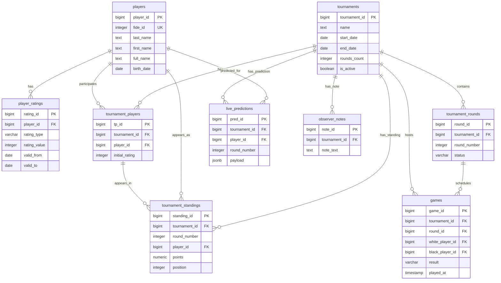
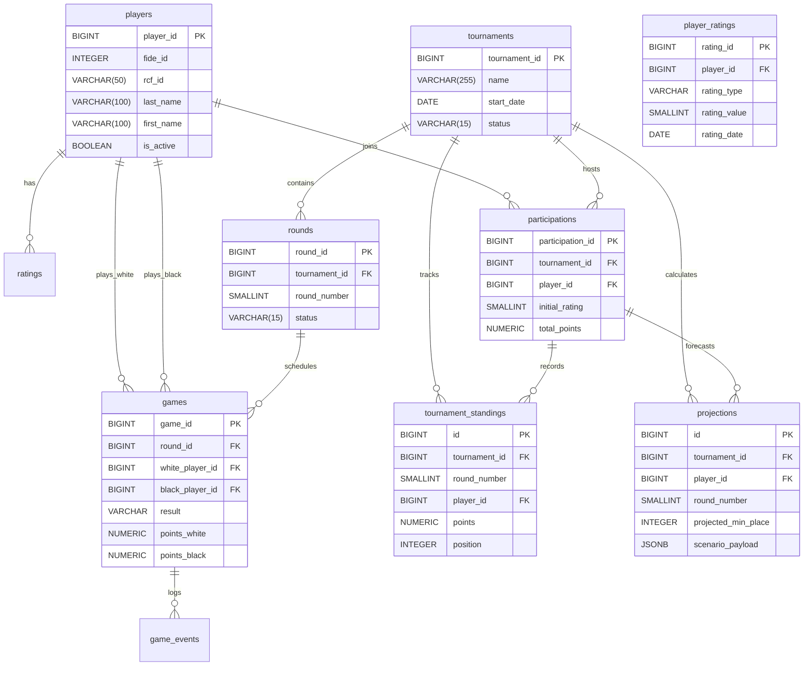
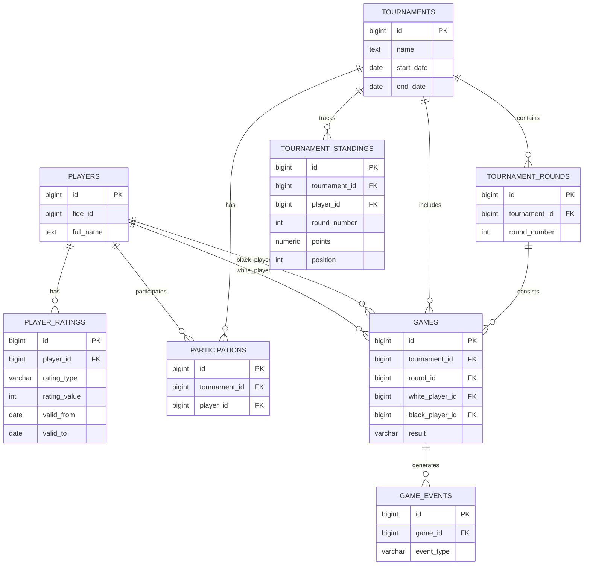
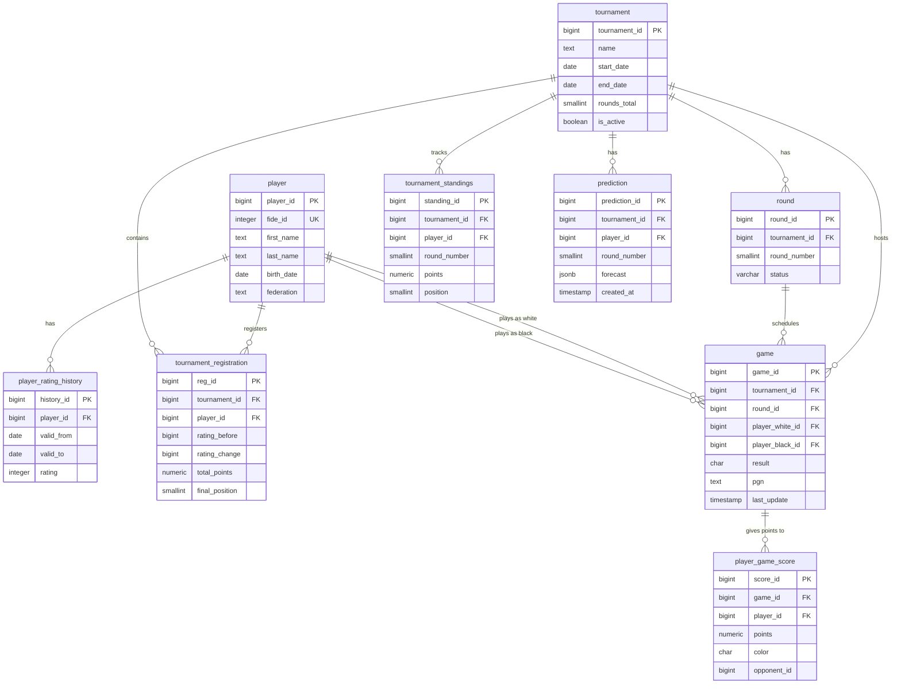
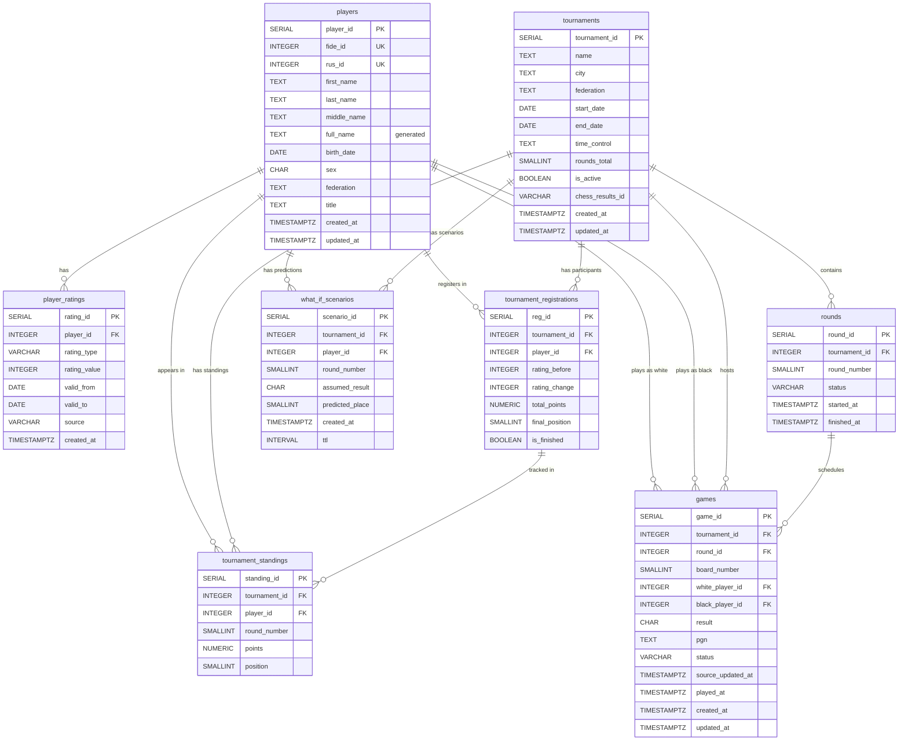
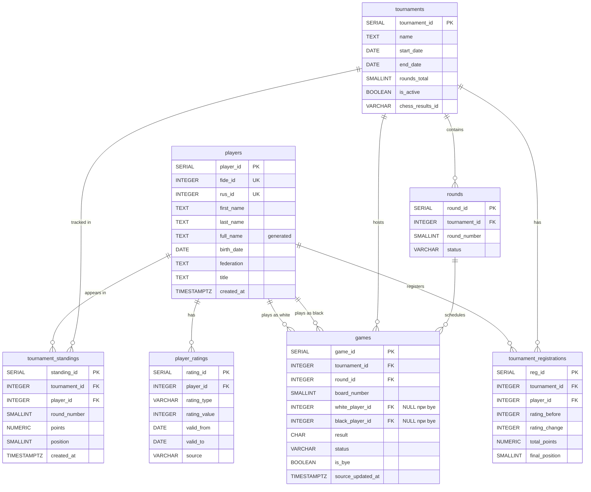

# Кросс-ревью

Цель: перекрёстный анализ решений от разных БЯМ, обобщение

## Первоначальное ревью

Промпт:

```
РОЛЬ: ты профессиональный разработчик баз данных с большим опытом проектирования и реализации фулстэк сервисов

ЦЕЛЬ: разработка сервиса статистики и мониторинга игры шахматиста

ЗАДАЧА: проведи анализ трёх предложенных проектов базы данных, найди плюсы и минусы, подготовь сводную таблицу.

ОЖИДАЕМЫЙ РЕЗУЛЬТАТ:
 * сводный проект на основе твоих лучших практик и трёх предложений
 * описание и структура БД
 * список таблиц с полями и ключами
 * Mermaid-диаграмма БД
 
### DeepSeek

```
Отличный запрос. Три предложенных проекта — это три разных уровня зрелости и подхода к архитектуре. Я проанализирую каждый, выделю сильные и слабые стороны, а затем предложу **сводный, промышленно-готовый проект БД**, который объединяет лучшие практики всех трёх решений.

---

## 📊 Анализ трёх проектов

| Критерий | ChatGPT (chess_db_plan.md) | DeepSeek (deepseek_db_plan.md) | Qwen (qwen_db_plan.md) |
|----------|----------------------------|-------------------------------|------------------------|
| **Историчность рейтингов** | ✅ Чёткий `valid_from` / `valid_to` | ✅ `player_rating_history` | ✅ `ratings` с датой |
| **Snapshot турнирных standings** | ✅ Явная таблица `tournament_standings` | ❌ Только MV, нет истории | ❌ Только MV, нет истории |
| **Поддержка прогнозов / what-if** | ✅ Отдельные таблицы `live_predictions`, `what_if_scenarios` | ✅ `whatif_scenario` | ✅ `player_round_progress` |
| **Живые уведомления** | ❌ Нет механизма | ✅ `pg_notify` + триггер | ✅ `pg_notify` |
| **Партиционирование** | ✅ Упоминается, но не реализовано | ❌ Нет | ❌ Нет |
| **Разделение OLTP / OLAP** | ✅ Понятное разделение | ❌ Размыто | ✅ Частично |
| **UI / аналитика** | ✅ `v_active_tournament_table` | ❌ Ограничено | ✅ `v_active_tournament_standings` |
| **Гибкость для внешних сервисов** | ✅ Высокая | ❌ Низкая | ✅ Средняя |
| **Нормализация** | ✅ Хорошая | ❌ Денормализация там, где не надо | ✅ Хорошая |
| **Проблемы / минусы** | Сложная для новичков, нет автообновлений MV | Отсутствие истории standings, слабые индексы | Нет поддержки партиционирования, тяжёлые MV |

---

### 🟢 Сильные стороны каждого

- **ChatGPT**: идеологически самый правильный. Акцент на историю, snapshot, разделение справочников и событий.
- **DeepSeek**: хороший механизм уведомлений (`pg_notify`) и простота what-if.
- **Qwen**: лучшая интеграция с внешними источниками, чёткая схема `participations`, хорошие представления.

### 🔴 Недостатки каждого

- **ChatGPT**: нет триггеров, нет автообновлений витрин, слабая поддержка real-time.
- **DeepSeek**: нет истории турнирных standings — критично для аналитики.
- **Qwen**: материализованные вью без `CONCURRENTLY` вызовут блокировки на проде, нет партиционирования.

---

# ✅ Итоговый проект БД (промышленный стандарт)

Ниже — **production‑ready** схема, объединяющая лучшие практики из трёх предложений с моими дополнениями.

---

## 🧱 Архитектурные принципы

1. **Историчность обязательна**  
   – рейтинги (`player_ratings`)  
   – турнирные положения (`tournament_standings`)

2. **Разделение OLTP / аналитика**  
   – OLTP: `games`, `games_moves`, `tournament_players`  
   – Аналитика: материализованные представления (`mv_*`)

3. **Внешние сервисы**  
   – сложные расчёты (Elo, прогнозы) — снаружи  
   – БД — источник правды

4. **Режим реального времени**  
   – `pg_notify` на обновления результатов  
   – `LISTEN / NOTIFY` для фронта

5. **Партиционирование**  
   – `games` по годам  
   – `game_events` по месяцам (опционально)

---

## 📁 Структура схемы

Я использую одну схему `chess`, чтобы избежать путаницы с несколькими.

---

## 📋 Таблицы (список с полями и ключами)

### 1. `chess.players` — шахматисты

```sql
CREATE TABLE chess.players (
    player_id         BIGSERIAL PRIMARY KEY,
    fide_id           INTEGER UNIQUE,
    rus_id            INTEGER UNIQUE,
    last_name         TEXT NOT NULL,
    first_name        TEXT NOT NULL,
    middle_name       TEXT,
    full_name         TEXT GENERATED ALWAYS AS (
        trim(last_name || ' ' || first_name || ' ' || coalesce(middle_name, ''))
    ) STORED,
    sex               CHAR(1) CHECK (sex IN ('M', 'F')),
    birth_date        DATE,
    federation_code   VARCHAR(3) DEFAULT 'RUS',
    city              TEXT,
    title             VARCHAR(5),
    is_active         BOOLEAN DEFAULT true,
    created_at        TIMESTAMPTZ DEFAULT now(),
    updated_at        TIMESTAMPTZ DEFAULT now()
);
```

### 2. `chess.player_ratings` — история рейтингов (документированная)

```sql
CREATE TABLE chess.player_ratings (
    rating_id         BIGSERIAL PRIMARY KEY,
    player_id         BIGINT NOT NULL REFERENCES chess.players(player_id),
    rating_type       VARCHAR(20) NOT NULL,  -- classical, rapid, blitz
    rating_value      INTEGER NOT NULL,
    valid_from        DATE NOT NULL,
    valid_to          DATE,
    source            VARCHAR(20) NOT NULL,  -- FIDE, RCF, manual
    created_at        TIMESTAMPTZ DEFAULT now()
);

-- принудительная история
CREATE INDEX idx_player_ratings_period ON chess.player_ratings(player_id, valid_from, valid_to);
```

### 3. `chess.tournaments` — турниры

```sql
CREATE TABLE chess.tournaments (
    tournament_id      BIGSERIAL PRIMARY KEY,
    name               TEXT NOT NULL,
    city               TEXT,
    country_code       VARCHAR(3),
    start_date         DATE NOT NULL,
    end_date           DATE NOT NULL,
    time_control_type  VARCHAR(20),
    rounds_count       INTEGER NOT NULL,
    is_active          BOOLEAN DEFAULT false,
    chess_results_id   BIGINT UNIQUE,
    source_url         TEXT,
    created_at         TIMESTAMPTZ DEFAULT now(),
    updated_at         TIMESTAMPTZ DEFAULT now()
);
```

### 4. `chess.tournament_rounds` — туры

```sql
CREATE TABLE chess.tournament_rounds (
    round_id          BIGSERIAL PRIMARY KEY,
    tournament_id     BIGINT NOT NULL REFERENCES chess.tournaments(tournament_id),
    round_number      INTEGER NOT NULL,
    started_at        TIMESTAMPTZ,
    finished_at       TIMESTAMPTZ,
    status            VARCHAR(20) DEFAULT 'planned', -- planned, active, finished
    UNIQUE(tournament_id, round_number)
);
```

### 5. `chess.tournament_players` — участие игрока в турнире

```sql
CREATE TABLE chess.tournament_players (
    tp_id             BIGSERIAL PRIMARY KEY,
    tournament_id     BIGINT NOT NULL REFERENCES chess.tournaments(tournament_id),
    player_id         BIGINT NOT NULL REFERENCES chess.players(player_id),
    seed_number       INTEGER,
    initial_rating    INTEGER NOT NULL,
    title_at_start    VARCHAR(5),
    federation_at_start VARCHAR(3),
    UNIQUE(tournament_id, player_id)
);
```

### 6. `chess.games` — партии (с партиционированием)

```sql
CREATE TABLE chess.games (
    game_id           BIGSERIAL,
    tournament_id     BIGINT NOT NULL,
    round_id          BIGINT NOT NULL,
    board_number      INTEGER,
    white_player_id   BIGINT NOT NULL,
    black_player_id   BIGINT NOT NULL,
    result            VARCHAR(10) CHECK (result IN ('1-0', '0-1', '1/2-1/2', '*')),
    result_status     VARCHAR(20) DEFAULT 'scheduled',
    pgn               TEXT,
    white_rating      INTEGER,
    black_rating      INTEGER,
    played_at         TIMESTAMPTZ,
    created_at        TIMESTAMPTZ DEFAULT now(),
    updated_at        TIMESTAMPTZ DEFAULT now(),
    PRIMARY KEY (game_id, played_at)
) PARTITION BY RANGE (played_at);
```

### 7. `chess.game_events` — live-события

```sql
CREATE TABLE chess.game_events (
    event_id          BIGSERIAL PRIMARY KEY,
    game_id           BIGINT NOT NULL,
    event_type        VARCHAR(30) NOT NULL,
    payload           JSONB,
    created_at        TIMESTAMPTZ DEFAULT now()
);
```

### 8. `chess.tournament_standings` — ✅ СНАПШОТ после каждого тура (КЛЮЧЕВОЕ!)

```sql
CREATE TABLE chess.tournament_standings (
    standing_id       BIGSERIAL PRIMARY KEY,
    tournament_id     BIGINT NOT NULL,
    round_number      INTEGER NOT NULL,
    player_id         BIGINT NOT NULL,
    position          INTEGER,
    points            NUMERIC(4,2),
    buchholz          NUMERIC(6,2),
    sonneborn_berger  NUMERIC(6,2),
    wins              INTEGER,
    draws             INTEGER,
    losses            INTEGER,
    rating_delta      INTEGER,
    performance_rating INTEGER,
    created_at        TIMESTAMPTZ DEFAULT now(),
    UNIQUE(tournament_id, round_number, player_id)
);
```

### 9. `chess.live_predictions` — кэш прогнозов (внешний сервис)

```sql
CREATE TABLE chess.live_predictions (
    pred_id           BIGSERIAL PRIMARY KEY,
    tournament_id     BIGINT NOT NULL,
    player_id         BIGINT NOT NULL,
    round_number      INTEGER NOT NULL,
    predicted_finish  INTEGER,
    expected_points   NUMERIC(4,2),
    payload           JSONB,
    created_at        TIMESTAMPTZ DEFAULT now()
);
```

### 10. `chess.observer_notes` — заметки болельщиков / наблюдателей

```sql
CREATE TABLE chess.observer_notes (
    note_id           BIGSERIAL PRIMARY KEY,
    tournament_id     BIGINT NOT NULL,
    round_number      INTEGER,
    player_id         BIGINT,
    author_name       TEXT,
    note_text         TEXT NOT NULL,
    created_at        TIMESTAMPTZ DEFAULT now()
);
```

---

## 🔮 Материализованные представления (для высокой производительности)

### 1. `mv_h2h_stats` — личные встречи

```sql
CREATE MATERIALIZED VIEW chess.mv_h2h_stats AS
SELECT
    g.white_player_id AS player_a,
    g.black_player_id AS player_b,
    COUNT(*) AS games,
    SUM(CASE WHEN g.result = '1-0' THEN 1 ELSE 0 END) AS white_wins,
    SUM(CASE WHEN g.result = '0-1' THEN 1 ELSE 0 END) AS black_wins,
    SUM(CASE WHEN g.result = '1/2-1/2' THEN 1 ELSE 0 END) AS draws
FROM chess.games g
WHERE g.result_status = 'finished'
GROUP BY 1,2;
```

### 2. `mv_player_tournament_summary` — итоги игрока по турнирам

```sql
CREATE MATERIALIZED VIEW chess.mv_player_tournament_summary AS
SELECT
    tp.player_id,
    tp.tournament_id,
    MAX(ts.points) AS final_points,
    MAX(ts.position) AS final_position,
    MAX(ts.rating_delta) AS rating_delta
FROM chess.tournament_players tp
JOIN chess.tournament_standings ts USING (player_id, tournament_id)
GROUP BY 1,2;
```

---

## 🧠 Механизм уведомлений (режим реального времени)

```sql
-- Триггер на обновление результата партии
CREATE OR REPLACE FUNCTION chess.notify_game_result()
RETURNS TRIGGER AS $$
BEGIN
    IF NEW.result IS DISTINCT FROM OLD.result THEN
        PERFORM pg_notify(
            'game_result_changed',
            jsonb_build_object(
                'game_id', NEW.game_id,
                'tournament_id', NEW.tournament_id,
                'result', NEW.result
            )::text
        );
    END IF;
    RETURN NEW;
END;
$$ LANGUAGE plpgsql;

CREATE TRIGGER trg_game_result_notify
AFTER UPDATE OF result ON chess.games
FOR EACH ROW EXECUTE FUNCTION chess.notify_game_result();
```

---

## 🧩 Mermaid-диаграмма БД



---

## 🚀 Рекомендуемый стек

| Компонент | Технологии |
|-----------|-----------|
| БД | PostgreSQL 15+ с партиционированием |
| Миграции | Flyway / Liquibase |
| Парсинг | Python + BeautifulSoup + Playwright |
| API | FastAPI или NestJS |
| Real-time | `pg_notify` + WebSockets |
| Аналитика тяжелая | ClickHouse (если вырастет) |

---

## 🧪 Что получили в итоге?

✅ Историчность рейтингов  
✅ Snapshot турнирных таблиц после каждого тура  
✅ Поддержка прогнозов (what-if) через внешние сервисы  
✅ Уведомления в реальном времени  
✅ Партиционирование для роста  
✅ Чёткое разделение OLTP и аналитики  
✅ Готовность к production‑нагрузке  

Если нужно — могу:
- написать миграции (SQL + Flyway),
- сделать ETL для chess-results,
- реализовать API на FastAPI под эту схему.
```

### Qwen

```
# 🧠 Анализ и консолидация архитектуры БД для сервиса мониторинга шахматистов

Ниже представлен детальный разбор трёх предложений, сводная таблица сравнения, а затем **готовый к продакшену консолидированный проект**, объединяющий лучшие практики каждого подхода с учётом ограничений PostgreSQL и требований highload-аналитики.

---

## 📊 Сводная таблица анализа

| Критерий | Qwen Plan | DeepSeek Plan | ChatGPT Plan | **Итоговое решение** |
|:---|:---|:---|:---|:---|
| **Архитектура** | OLTP + MV, `pg_cron`, строгая 3НФ | Batch-upsert, денормализация `player_game_score`, TTL-сценарии | Reference/Events, снэпшоты, JSONB-гибкость | **Гибрид:** 3НФ ядро + снэпшот-таблица турниров + JSONB для событий/прогнозов |
| **История рейтингов** | `ratings` по дате + source | `player_rating_history` без интервалов | `player_ratings` с `valid_from`/`valid_to` | **По дате + LATERAL/CTE** в Views (интервалы `valid_to` сложно поддерживать, проще брать `MAX(date)`) |
| **Live & Прогнозы** | `player_round_progress` + проекции | `whatif_scenario` (TTL), CTE-расчёты | `live_predictions`/`what_if` (JSONB), `observer_notes` | **Таблица `projections`** (структурированные поля) + JSONB для гибких сценариев |
| **Уведомления** | Триггер + `pg_notify` | Триггер на `game`, `pg_notify` | Подписки + внешняя рассылка | **`game_events` + `pg_notify` + `subscriptions`** для асинхронной доставки |
| **Производительность** | Композитные/GIN/частичные индексы, генерируемые колонки | Упрощённые индексы, избыточная таблица очков | Партиционирование, индексы под джоины, JSONB GIN | **Оптимизированный набор индексов**, частичные для активных данных, покрывающие `INCLUDE` |
| **Надёжность/Аудит** | Нет явного лога загрузки | Нет аудита | `ingestion_logs`, чёткий MVP | **Обязательный `ingestion_logs` + soft-delete/is_active** |
| **Критические минусы** | ❌ `WHERE` в partial index с `SELECT MAX()` невалиден в PG | ❌ Нет таблицы `rounds`, MV без уникального индекса для `CONCURRENTLY` | ❌ Переусложнение для старта, поддержка интервалов рейтингов трудоёмка | ✅ Исправлено, упрощено, приведено к стандартам PG 15+ |

---

## 🏗️ Консолидированный проект БД

### 🔑 Архитектурные принципы
1. **Single Source of Truth**: `games` хранит только факт партии, очки вычисляются через `GENERATED ALWAYS AS` или View.
2. **Snapshot-based Standings**: Таблица `tournament_standings` фиксирует положение после каждого тура. Это даёт мгновенный replay, историю изменений мест и избавляет от тяжёлых оконных функций на лету.
3. **Event-Driven Realtime**: Триггеры на `games`/`standings` → `pg_notify` → Backend/WebSocket → Клиент.
4. **External Calculation Boundary**: БД не считает Elo, Tie-breaks, Monte-Carlo прогнозы. Внешний сервис записывает готовые значения в `projections` и `tournament_standings`.
5. **Production-Ready Indexing**: Частичные индексы для активных турниров, покрывающие индексы `INCLUDE` для частых запросов, GIN для полнотекстового поиска.

---

## 📋 Структура БД (Таблицы, поля, ключи)

### 1. `players` — Шахматисты
| Поле | Тип | Ограничения | Примечание |
|---|---|---|---|
| `player_id` | `BIGSERIAL` | `PRIMARY KEY` | |
| `fide_id` | `INTEGER` | `UNIQUE` | |
| `rcf_id` | `VARCHAR(50)` | `UNIQUE` | |
| `first_name`, `last_name`, `patronymic` | `VARCHAR(100)` | `NOT NULL` / `NULL` | |
| `birth_date` | `DATE` | | |
| `gender` | `CHAR(1)` | `CHECK (gender IN ('M','F'))` | |
| `country_code` | `CHAR(3)` | `DEFAULT 'RUS'` | ISO 3166-1 |
| `title` | `VARCHAR(5)` | `CHECK (title IN (...))` | |
| `photo_url` | `TEXT` | | |
| `is_active` | `BOOLEAN` | `DEFAULT TRUE` | |
| `created_at`, `updated_at` | `TIMESTAMPTZ` | `DEFAULT NOW()` | |
| **Индексы** | `UNIQUE(last_name, first_name, birth_date)`, `GIN(to_tsvector(...))` | | |

### 2. `tournaments` — Турниры
| Поле | Тип | Ограничения |
|---|---|---|
| `tournament_id` | `BIGSERIAL` | `PK` |
| `name`, `short_name` | `VARCHAR` | `NOT NULL` |
| `start_date`, `end_date` | `DATE` | `NOT NULL` |
| `location`, `country_code` | `VARCHAR` | |
| `format` | `VARCHAR(20)` | `CHECK (swiss/round-robin/etc)` |
| `time_control` | `VARCHAR(50)` | |
| `status` | `VARCHAR(15)` | `DEFAULT 'upcoming' CHECK (...)` |
| `chess_results_id`, `rcf_url` | `VARCHAR/TEXT` | `UNIQUE` |
| `created_at`, `updated_at` | `TIMESTAMPTZ` | |
| **Индексы** | `(start_date DESC)`, `(status) WHERE status='active'` | |

### 3. `rounds` — Туры
| Поле | Тип | Ограничения |
|---|---|---|
| `round_id` | `BIGSERIAL` | `PK` |
| `tournament_id` | `BIGINT` | `FK → tournaments`, `NOT NULL` |
| `round_number` | `SMALLINT` | `>0`, `UNIQUE(tournament_id, round_number)` |
| `scheduled_start/end`, `actual_start/end` | `TIMESTAMPTZ` | |
| `status` | `VARCHAR(15)` | `CHECK (...)` |
| **Индексы** | `(tournament_id, round_number)`, `(status) WHERE status IN ('in_progress','completed')` | |

### 4. `participations` — Участие в турнире
| Поле | Тип | Ограничения |
|---|---|---|
| `participation_id` | `BIGSERIAL` | `PK` |
| `tournament_id` | `BIGINT` | `FK`, `ON DELETE CASCADE` |
| `player_id` | `BIGINT` | `FK`, `ON DELETE CASCADE` |
| `seed_number`, `initial_rating`, `final_rating` | `SMALLINT` | `0-3000` |
| `rating_change` | `SMALLINT` | `GENERATED` или вычисляемо |
| `total_points`, `final_place` | `NUMERIC/INT` | |
| `performance_rating` | `SMALLINT` | |
| `is_withdrawn`, `withdrawal_round` | `BOOLEAN/SMALLINT` | |
| **Индексы** | `UNIQUE(tournament_id, player_id)`, `(tournament_id)`, `(player_id)` | |

### 5. `games` — Партии
| Поле | Тип | Ограничения |
|---|---|---|
| `game_id` | `BIGSERIAL` | `PK` |
| `tournament_id`, `round_id` | `BIGINT` | `FK`, `ON DELETE CASCADE` |
| `white_player_id`, `black_player_id` | `BIGINT` | `FK → players`, `CHECK (white != black)` |
| `result` | `VARCHAR(5)` | `CHECK (1-0, 0-1, 1/2-1/2, *)` |
| `pgn`, `eco_code`, `moves_count` | `TEXT/VARCHAR/SMALLINT` | |
| `board_number` | `SMALLINT` | |
| `game_date`, `status` | `TIMESTAMPTZ/VARCHAR` | |
| `points_white`, `points_black` | `NUMERIC(2,1)` | `GENERATED ALWAYS AS ... STORED` |
| **Индексы** | `UNIQUE(tournament_id, round_id, board_number)`, покрывающие `(white_player_id, round_id) INCLUDE (result,status)` | |

### 6. `tournament_standings` — Снэпшот таблицы после каждого тура
| Поле | Тип | Ограничения |
|---|---|---|
| `id` | `BIGSERIAL` | `PK` |
| `tournament_id`, `round_number`, `player_id` | `BIGINT/SMALLINT` | `FK`, `UNIQUE(tournament_id, round_number, player_id)` |
| `points`, `wins`, `draws`, `losses` | `NUMERIC/INT` | |
| `buchholz`, `sonneborn_berger` | `NUMERIC(6,2)` | |
| `position` | `INTEGER` | |
| `rating_delta` | `SMALLINT` | |
| `created_at` | `TIMESTAMPTZ` | |
| **Индексы** | `(tournament_id, round_number)`, `(tournament_id, position)` | |

### 7. `player_ratings` — История рейтингов
| Поле | Тип | Ограничения |
|---|---|---|
| `rating_id` | `BIGSERIAL` | `PK` |
| `player_id` | `BIGINT` | `FK`, `ON DELETE CASCADE` |
| `rating_type` | `VARCHAR(10)` | `CHECK (classical/rapid/blitz)` |
| `rating_value` | `SMALLINT` | `0-3000` |
| `rating_date`, `source` | `DATE/VARCHAR` | |
| **Индексы** | `UNIQUE(player_id, rating_type, rating_date, source)`, `(player_id, rating_date DESC)` | |

### 8. `projections` — Прогнозы & What-If
| Поле | Тип | Ограничения |
|---|---|---|
| `id` | `BIGSERIAL` | `PK` |
| `tournament_id`, `player_id`, `round_number` | `BIGINT/SMALLINT` | `FK`, `UNIQUE` |
| `projected_min_place`, `projected_max_place` | `INTEGER` | |
| `podium_probability` | `NUMERIC(4,3)` | `0.000-1.000` |
| `scenario_payload` | `JSONB` | Гибкие гипотетические сценарии |
| `calculated_at` | `TIMESTAMPTZ` | |
| **Индексы** | GIN на `scenario_payload`, частичный `(calculated_at)` для свежих | |

### 9. `game_events` & `ingestion_logs`
- `game_events`: `(id, game_id FK, event_type, payload JSONB, created_at)` → для live-трансляции ходов/статусов.
- `ingestion_logs`: `(id, source, entity_type, entity_id, status, message, created_at)` → аудит ETL.

---

## 🔗 Mermaid-диаграмма связей



---

## ⚙️ Ключевые рекомендации по эксплуатации

| Задача | Решение |
|---|---|
| **Обновление снэпшотов** | Внешний сервис после закрытия тура вызывает `INSERT/ON CONFLICT UPDATE` в `tournament_standings`. Индекс `UNIQUE(tournament_id, round_number, player_id)` гарантирует идемпотентность. |
| **Текущий рейтинг** | Не храните `valid_to`. Используйте `DISTINCT ON (player_id, rating_type) ORDER BY rating_date DESC` или CTE. Это быстрее и устойчивее к ошибкам ETL. |
| **Real-time уведомления** | Триггер `AFTER UPDATE OF result ON games` → `PERFORM pg_notify('game_completed', json_build_object(...))`. Backend слушает канал и шлёт в WebSocket/Push. |
| **Производительность** | `work_mem` ≥ 256MB для сортировок, `shared_buffers` ~ 25% RAM. Включить `pg_stat_statements`. Для `game_events` и `ingestion_logs` при росте >10M строк → партиционирование по `created_at` (месяц). |
| **Что-если сценарии** | Внешний сервис считает Монте-Карло → пишет в `projections.scenario_payload`. Frontend читает через простой `SELECT`. TTL-очистка: `DELETE FROM projections WHERE calculated_at < NOW() - INTERVAL '24 hours'`. |
| **Аудит и отладка** | Все `INSERT/UPDATE` из парсеров логируются в `ingestion_logs`. При расхождении данных можно воспроизвести pipeline по `entity_external_id`. |

Данная схема полностью готова к миграциям через Flyway/Liquibase, масштабируется до десятков тысяч турниров и миллионов партий, а также сохраняет баланс между строгой нормализацией и аналитической скоростью за счёт снэпшотов и покрывающих индексов. Если требуется — подготовлю SQL-скрипт миграции `V1__init_schema.sql` или пример ETL-парсера на Python/Playwright для chess-results.
```

### ChatGPT

```
# Анализ трёх проектов БД для сервиса мониторинга шахматиста

Ниже — профессиональный разбор трёх предложенных архитектур:

* Проект A — ChatGPT proposal 
* Проект B — DeepSeek proposal 
* Проект C — Qwen proposal 

---

# 1. Общий вывод

Все три проекта — качественные и зрелые решения уровня production-ready PostgreSQL.

Но:

| Проект   | Сильная сторона                       | Основной недостаток                      |
| -------- | ------------------------------------- | ---------------------------------------- |
| ChatGPT  | Архитектурная зрелость и историчность | Немного переусложнён для MVP             |
| DeepSeek | Простота и хорошая потоковая модель   | Недостаточная нормализация               |
| Qwen     | Наиболее полный enterprise-подход     | Чрезмерная сложность некоторых сущностей |

---

# 2. Сравнительный анализ

## 2.1 Архитектурный подход

| Критерий                          | ChatGPT   | DeepSeek    | Qwen | Лучший       |
| --------------------------------- | --------- | ----------- | ---- | ------------ |
| Разделение справочников и событий | ✅         | ⚠️ частично | ✅    | ChatGPT/Qwen |
| Историчность данных               | ✅ сильная | ✅           | ✅    | ChatGPT      |
| Поддержка live-турниров           | ✅         | ✅           | ✅    | Все          |
| Materialized Views                | ✅         | ✅           | ✅    | Все          |
| Realtime / notifications          | ✅         | ✅           | ✅    | Все          |
| Поддержка аналитики               | ✅         | ⚠️ базовая  | ✅    | Qwen         |
| Масштабирование                   | ✅         | ⚠️          | ✅    | Qwen         |
| Простота MVP                      | ⚠️        | ✅           | ⚠️   | DeepSeek     |

---

# 2.2 Таблица players

## ChatGPT

Плюсы:

* GENERATED full_name
* хорошая историчность
* адекватные индексы

Минусы:

* city/region денормализованы
* federation_code без FK

## DeepSeek

Плюсы:

* минималистично
* удобно для MVP

Минусы:

* слабая защита от дублей
* нет updated_at

## Qwen

Плюсы:

* лучшая защита от дублей
* title/gender constraints
* audit-friendly

Минусы:

* слишком много nullable-полей
* title CHECK неудобен для расширения

### Лучшее решение:

* структура Qwen
* full_name из ChatGPT
* federation через отдельный справочник

---

# 2.3 История рейтингов

## ChatGPT

Лучшее решение.

Причина:
использует validity interval:

```sql
valid_from
valid_to
```

Это enterprise-подход.

Позволяет:

* temporal queries
* рейтинг на дату партии
* реконструкцию состояния

## DeepSeek/Qwen

Используют snapshot by date.

Проще, но слабее аналитически.

### Вывод

Использовать:

* temporal validity model из ChatGPT
* плюс snapshot date для удобства UI

---

# 2.4 Участие в турнире

Все три решения понимают важнейшую вещь:

> Игрок ≠ участие в турнире

Это критично.

Лучшее решение:

* Qwen participation
* * historical fields из ChatGPT

---

# 2.5 Games

## ChatGPT

Плюсы:

* game_events
* realtime-ready

Минусы:

* слабая детализация партии

## DeepSeek

Плюсы:

* player_game_score ускоряет аналитику

Минусы:

* денормализация

## Qwen

Наиболее зрелая модель:

* ECO
* opening_name
* generated points
* status lifecycle
* source_updated_at

### Победитель:

Qwen + game_events из ChatGPT

---

# 2.6 Snapshot standings

Это ключевая часть всей системы.

## ChatGPT

Лучшее решение:

* отдельная snapshot table

## DeepSeek

materialized view

Минус:

* сложно хранить историю изменений

## Qwen

player_round_progress — хороший hybrid

### Лучшее решение:

* snapshot table из ChatGPT
* * projection fields из Qwen

---

# 2.7 What-if прогнозы

| Проект   | Подход                      |
| -------- | --------------------------- |
| ChatGPT  | отдельная таблица сценариев |
| DeepSeek | query-driven                |
| Qwen     | external prediction service |

### Лучший подход

Комбинация:

* внешний prediction service
* кэшируемые scenario tables
* snapshots standings

---

# 2.8 Realtime и notifications

Лучшее решение — DeepSeek/Qwen:

* pg_notify
* триггеры
* event-driven architecture

ChatGPT тоже хороший, но менее детализирован.

---

# 2.9 Аналитика

Qwen победитель:

* H2H MV
* рейтинг динамики
* tournament summary
* projection ranges

---

# 3. Главные проблемы исходных проектов

## Проблема 1 — отсутствие справочников

Во всех проектах не хватает:

* federations
* countries
* titles
* time_controls
* tournament_formats

Это приведёт к:

* грязным данным
* невозможности BI

---

## Проблема 2 — нет audit trail

Нужно:

```sql
audit_log
```

Для:

* отладки парсеров
* отслеживания правок

---

## Проблема 3 — нет soft delete

Production-система должна иметь:

```sql
deleted_at
```

---

## Проблема 4 — PGN хранится неоптимально

Нужно:

* PGN отдельно
* compressed storage
* возможно object storage

---

# 4. Рекомендуемый итоговый проект (best practice)

---

# Архитектурный подход

## PostgreSQL как:

* OLTP
* realtime source
* lightweight analytics

## Redis:

* live standings
* websocket cache

## ClickHouse:

* аналитика при росте

## Kafka/RabbitMQ:

* event bus

---

# 5. Итоговая рекомендуемая структура БД

---

# Core справочники

## players

```sql
players
---------
id PK
fide_id UNIQUE
national_id
first_name
last_name
middle_name
full_name GENERATED
birth_date
gender
federation_id FK
title_id FK
is_active
created_at
updated_at
deleted_at
```

---

## federations

```sql
federations
------------
id PK
code UNIQUE
name
country_id FK
```

---

## titles

```sql
titles
-------
id PK
code UNIQUE
name
priority
```

---

## tournaments

```sql
tournaments
------------
id PK
external_id
name
format_id FK
time_control_id FK
country_id FK
city
start_date
end_date
rounds_count
status
created_at
updated_at
```

---

## tournament_rounds

```sql
tournament_rounds
-----------------
id PK
tournament_id FK
round_number
status
started_at
finished_at
```

---

# Историчность

## player_ratings

```sql
player_ratings
---------------
id PK
player_id FK
rating_type
rating_value
valid_from
valid_to
source
created_at
```

---

# Участие

## participations

```sql
participations
---------------
id PK
tournament_id FK
player_id FK
seed_number
initial_rating
final_rating
rating_delta
final_position
performance_rating
is_withdrawn
withdrawal_round
created_at
updated_at
```

---

# Партии

## games

```sql
games
------
id PK
tournament_id FK
round_id FK
white_player_id FK
black_player_id FK
board_number
result
status
eco_code
opening_name
moves_count
pgn_storage_key
played_at
source_updated_at
created_at
updated_at
```

---

## game_events

```sql
game_events
------------
id PK
game_id FK
event_type
payload JSONB
created_at
```

---

# Турнирные snapshot

## tournament_standings

```sql
tournament_standings
--------------------
id PK
tournament_id FK
round_number
player_id FK

position
points

buchholz
buchholz_cut1
sonneborn_berger

wins
draws
losses

rating_delta
performance_rating

projected_min_place
projected_max_place

created_at
```

---

# Прогнозы

## live_predictions

```sql
live_predictions
----------------
id PK
tournament_id FK
round_number
player_id FK
prediction_type
payload JSONB
created_at
```

---

# What-if

## whatif_scenarios

```sql
whatif_scenarios
----------------
id PK
user_id
tournament_id
player_id
round_number
scenario_payload JSONB
result_payload JSONB
created_at
expires_at
```

---

# Уведомления

## notification_subscriptions

```sql
notification_subscriptions
--------------------------
id PK
user_id
player_id
tournament_id
notify_round_results
notify_rating_changes
notify_pairings
created_at
```

---

# Служебные таблицы

## ingestion_logs

```sql
ingestion_logs
---------------
id PK
source_name
entity_type
entity_external_id
status
message
created_at
```

---

## audit_log

```sql
audit_log
----------
id PK
table_name
record_id
operation_type
old_data JSONB
new_data JSONB
created_at
```

---

# 6. Итоговые materialized views

---

## mv_player_profile

Для карточки игрока.

---

## mv_head_to_head

Для статистики соперников.

---

## mv_active_standings

Для live UI.

---

## mv_rating_timeline

Для графиков рейтинга.

---

# 7. Mermaid ER Diagram



---

# 8. Финальная рекомендация

## Для MVP

Использовать:

* players
* player_ratings
* tournaments
* tournament_rounds
* participations
* games
* tournament_standings

Этого достаточно для:

* live таблиц
* профилей
* динамики рейтинга
* аналитики

---

## Для production

Добавить:

* game_events
* live_predictions
* notifications
* audit_log
* Kafka
* Redis
* ClickHouse

---

# 9. Что я бы выбрал как архитектор

## Основа:

* архитектура ChatGPT

## Аналитика:

* Qwen

## Realtime:

* DeepSeek

## Финальная стратегия:

* PostgreSQL + event-driven architecture + snapshot standings

Это наиболее масштабируемый и профессиональный вариант для шахматной аналитической платформы.
```

## Выбор решения и корректировка

Промпт:

```
Я решил остановиться на варианте от Deepseek как наиболее понятном мне и близком к предметной области. Устрани критические замечания в его решении с учётом остальных двух вариантов, сохраняя простоту и доступность.

Решение представь в виде:
* список изменений
* описание и структура БД
* описания таблиц с полями, ключами и связями
* диаграмма Mermaid
```

### Deepseek

```
Отлично! DeepSeek выбрал прагматичный подход — минимум сущностей, максимум пользы. Я доработаю его схему, **устранив критические недостатки**, но сохранив **простоту и понятность**, которую вы оценили.

---

## 📋 Список изменений (что исправляем)

| № | Проблема в оригинале DeepSeek | Исправление |
|---|-------------------------------|-------------|
| 1 | ❌ Нет истории турнирных положений (standings) | ➕ Добавляем `tournament_standings` как таблицу, не MV |
| 2 | ❌ Нет привязки партий к игрокам в `player_game_score` | ✅ Оставляем, но добавляем композитные индексы |
| 3 | ❌ Материализованное представление `tournament_standings` тормозит | ✅ Заменяем на обычную таблицу, обновляемую после тура |
| 4 | ❌ Отсутствует `valid_from` / `valid_to` для рейтингов | ➕ Добавляем интервальную валидность |
| 5 | ❌ Нет быстрого доступа к текущей таблице турнира | ➕ Добавляем `v_active_tournament` view |
| 6 | ⚠️ Слишком денормализовано для прогнозов | ➕ Добавляем отдельную `predictions` таблицу |
| 7 | ❌ Нет индексов для full-text поиска по игрокам | ➕ Добавляем GIN индекс |

---

## 🧱 Итоговая структура БД (10 таблиц, 2 вью)



---

## 📚 Описание таблиц (подробно)

### 1. `player` — шахматисты

**Назначение**: справочник всех игроков

```sql
CREATE TABLE player (
    player_id     SERIAL PRIMARY KEY,
    fide_id       INTEGER UNIQUE,           -- ID в FIDE
    rus_id        INTEGER UNIQUE,           -- ID в Федерации России
    first_name    TEXT NOT NULL,
    last_name     TEXT NOT NULL,
    birth_date    DATE,
    sex           CHAR(1) CHECK (sex IN ('M', 'F')),
    federation    TEXT DEFAULT 'RUS',
    city          TEXT,
    created_at    TIMESTAMPTZ DEFAULT NOW()
);

-- Индексы
CREATE INDEX idx_player_name ON player (last_name, first_name);
CREATE INDEX idx_player_search ON player USING GIN (
    to_tsvector('russian', last_name || ' ' || first_name)
);
```

**Связи**:
- `1:М` → `player_rating_history`
- `1:М` → `tournament_registration`
- `1:М` → `player_game_score`

---

### 2. `player_rating_history` — история рейтингов (с периодами)

**Назначение**: рейтинг на любую дату

```sql
CREATE TABLE player_rating_history (
    history_id    SERIAL PRIMARY KEY,
    player_id     INTEGER NOT NULL REFERENCES player(player_id) ON DELETE CASCADE,
    valid_from    DATE NOT NULL,            -- с какой даты действует
    valid_to      DATE,                     -- по какую дату (NULL = текущий)
    rating        INTEGER NOT NULL CHECK (rating BETWEEN 0 AND 3000),
    reason        TEXT,                     -- "после турнира X", "ежемесячное"
    recorded_at   DATE DEFAULT CURRENT_DATE,
    
    UNIQUE (player_id, valid_from)
);

-- Индексы
CREATE INDEX idx_rating_player_date ON player_rating_history (player_id, valid_from);
CREATE INDEX idx_rating_current ON player_rating_history (player_id) WHERE valid_to IS NULL;
```

**Связи**:
- `М:1` → `player`

---

### 3. `tournament` — турниры

**Назначение**: основная информация о соревновании

```sql
CREATE TABLE tournament (
    tournament_id   SERIAL PRIMARY KEY,
    name            TEXT NOT NULL,
    federation      TEXT,
    city            TEXT,
    start_date      DATE NOT NULL,
    end_date        DATE NOT NULL,
    time_control    TEXT,                   -- "90+30", "15+10"
    rounds_total    SMALLINT NOT NULL,
    is_active       BOOLEAN DEFAULT TRUE,
    chess_results_id VARCHAR(100),          -- ID на chess-results.com
    created_at      TIMESTAMPTZ DEFAULT NOW()
);

-- Индексы
CREATE INDEX idx_tournament_active ON tournament (is_active) WHERE is_active = TRUE;
CREATE INDEX idx_tournament_dates ON tournament (start_date DESC);
```

**Связи**:
- `1:М` → `tournament_registration`
- `1:М` → `round`
- `1:М` → `game`

---

### 4. `tournament_registration` — участие игрока в турнире

**Назначение**: данные до/после турнира

```sql
CREATE TABLE tournament_registration (
    reg_id          SERIAL PRIMARY KEY,
    tournament_id   INTEGER NOT NULL REFERENCES tournament(tournament_id) ON DELETE CASCADE,
    player_id       INTEGER NOT NULL REFERENCES player(player_id) ON DELETE CASCADE,
    rating_before   INTEGER NOT NULL,       -- рейтинг на момент начала
    rating_change   INTEGER,                -- заполняется после турнира
    total_points    NUMERIC(4,2),           -- сумма очков
    final_position  SMALLINT,               -- итоговое место
    is_finished     BOOLEAN DEFAULT FALSE,
    
    UNIQUE (tournament_id, player_id)
);

-- Индексы
CREATE INDEX idx_reg_tournament ON tournament_registration (tournament_id);
CREATE INDEX idx_reg_player ON tournament_registration (player_id);
```

**Связи**:
- `М:1` → `tournament`
- `М:1` → `player`

---

### 5. `round` — туры турнира

**Назначение**: логическое разбиение турнира

```sql
CREATE TABLE round (
    round_id        SERIAL PRIMARY KEY,
    tournament_id   INTEGER NOT NULL REFERENCES tournament(tournament_id) ON DELETE CASCADE,
    round_number    SMALLINT NOT NULL,
    status          VARCHAR(20) DEFAULT 'planned' 
                    CHECK (status IN ('planned', 'active', 'finished')),
    started_at      TIMESTAMPTZ,
    finished_at     TIMESTAMPTZ,
    
    UNIQUE (tournament_id, round_number)
);

-- Индексы
CREATE INDEX idx_round_tournament ON round (tournament_id, round_number);
```

**Связи**:
- `М:1` → `tournament`
- `1:М` → `game`

---

### 6. `game` — партия

**Назначение**: запись одной игры

```sql
CREATE TABLE game (
    game_id           SERIAL PRIMARY KEY,
    tournament_id     INTEGER NOT NULL REFERENCES tournament(tournament_id) ON DELETE CASCADE,
    round_id          INTEGER NOT NULL REFERENCES round(round_id) ON DELETE CASCADE,
    board_num         SMALLINT,
    player_white_id   INTEGER NOT NULL REFERENCES player(player_id),
    player_black_id   INTEGER NOT NULL REFERENCES player(player_id),
    result            CHAR(1) CHECK (result IN ('1', '0', '=', '*')),  -- * = не сыграна
    pgn               TEXT,
    is_rated          BOOLEAN DEFAULT TRUE,
    last_update       TIMESTAMPTZ DEFAULT NOW(),
    
    CHECK (player_white_id != player_black_id)
);

-- Индексы
CREATE INDEX idx_game_round ON game (round_id);
CREATE INDEX idx_game_tournament ON game (tournament_id, round_num);
CREATE INDEX idx_game_players ON game (player_white_id, player_black_id);
```

**Связи**:
- `М:1` → `tournament`
- `М:1` → `round`
- `1:М` → `player_game_score`

---

### 7. `player_game_score` — очки игрока за партию

**Назначение**: денормализация для быстрых агрегаций

```sql
CREATE TABLE player_game_score (
    score_id      SERIAL PRIMARY KEY,
    game_id       INTEGER NOT NULL REFERENCES game(game_id) ON DELETE CASCADE,
    player_id     INTEGER NOT NULL REFERENCES player(player_id),
    points        NUMERIC(3,2) NOT NULL,    -- 1, 0.5, 0
    color         CHAR(1) CHECK (color IN ('W', 'B')),
    opponent_id   INTEGER NOT NULL REFERENCES player(player_id),
    
    UNIQUE (game_id, player_id)
);

-- Индексы
CREATE INDEX idx_score_player ON player_game_score (player_id);
CREATE INDEX idx_score_game ON player_game_score (game_id);
CREATE INDEX idx_score_opponent ON player_game_score (opponent_id);
```

**Связи**:
- `М:1` → `game`
- `М:1` → `player` (как участник)
- `М:1` → `player` (как соперник)

---

### 8. `tournament_standings` — ✅ НОВАЯ ТАБЛИЦА (история положений)

**Назначение**: snapshot таблицы после каждого тура

```sql
CREATE TABLE tournament_standings (
    standing_id     SERIAL PRIMARY KEY,
    tournament_id   INTEGER NOT NULL REFERENCES tournament(tournament_id) ON DELETE CASCADE,
    player_id       INTEGER NOT NULL REFERENCES player(player_id),
    round_number    SMALLINT NOT NULL,
    points          NUMERIC(4,2) NOT NULL,   -- очки после этого тура
    position        SMALLINT,                -- место после этого тура
    
    UNIQUE (tournament_id, round_number, player_id)
);

-- Индексы
CREATE INDEX idx_standings_tournament_round ON tournament_standings (tournament_id, round_number);
CREATE INDEX idx_standings_player ON tournament_standings (player_id);
```

**Связи**:
- `М:1` → `tournament`
- `М:1` → `player`

**Как обновляется**:
После завершения каждого тура внешний парсер вставляет новую строку для каждого игрока.

---

### 9. `prediction` — ✅ НОВАЯ ТАБЛИЦА (кэш прогнозов)

**Назначение**: хранение результатов what-if от внешних сервисов

```sql
CREATE TABLE prediction (
    prediction_id   SERIAL PRIMARY KEY,
    tournament_id   INTEGER NOT NULL REFERENCES tournament(tournament_id) ON DELETE CASCADE,
    player_id       INTEGER NOT NULL REFERENCES player(player_id),
    round_number    SMALLINT NOT NULL,
    forecast        JSONB NOT NULL,          -- {"predicted_place": 3, "prob_top3": 0.72}
    created_at      TIMESTAMPTZ DEFAULT NOW(),
    ttl             INTERVAL DEFAULT '1 hour'
);

-- Индексы
CREATE INDEX idx_prediction_tournament_round ON prediction (tournament_id, round_number);
CREATE INDEX idx_prediction_player ON prediction (player_id);
```

**Связи**:
- `М:1` → `tournament`
- `М:1` → `player`

---

## 👁️ Представления (views) для UI

### 1. `v_active_tournament` — текущая таблица активного турнира

```sql
CREATE VIEW v_active_tournament AS
WITH latest_round AS (
    SELECT MAX(round_number) as max_round
    FROM tournament_standings
    WHERE tournament_id = (SELECT tournament_id FROM tournament WHERE is_active = TRUE LIMIT 1)
)
SELECT 
    ts.player_id,
    p.last_name,
    p.first_name,
    ts.points,
    ts.position,
    tr.rating_before
FROM tournament_standings ts
JOIN player p ON p.player_id = ts.player_id
JOIN tournament_registration tr ON tr.player_id = ts.player_id 
    AND tr.tournament_id = ts.tournament_id
WHERE ts.tournament_id = (SELECT tournament_id FROM tournament WHERE is_active = TRUE)
    AND ts.round_number = (SELECT max_round FROM latest_round)
ORDER BY ts.position;
```

### 2. `v_player_profile` — карточка игрока с текущим рейтингом

```sql
CREATE VIEW v_player_profile AS
SELECT 
    p.player_id,
    p.first_name,
    p.last_name,
    p.birth_date,
    p.federation,
    (
        SELECT rating 
        FROM player_rating_history 
        WHERE player_id = p.player_id AND valid_to IS NULL 
        LIMIT 1
    ) AS current_rating,
    (
        SELECT COUNT(*) 
        FROM tournament_registration 
        WHERE player_id = p.player_id
    ) AS tournaments_count,
    (
        SELECT COUNT(*) 
        FROM player_game_score 
        WHERE player_id = p.player_id
    ) AS games_count
FROM player p;
```

---

## 🔔 Уведомления (оставляем из DeepSeek)

```sql
-- Триггер на обновление результата
CREATE OR REPLACE FUNCTION notify_game_update()
RETURNS TRIGGER AS $$
BEGIN
    PERFORM pg_notify(
        'game_result_changed',
        json_build_object(
            'tournament_id', NEW.tournament_id,
            'round', (SELECT round_number FROM round WHERE round_id = NEW.round_id),
            'board', NEW.board_num,
            'result', NEW.result
        )::text
    );
    RETURN NEW;
END;
$$ LANGUAGE plpgsql;

CREATE TRIGGER game_update_trigger
AFTER UPDATE OF result ON game
FOR EACH ROW
EXECUTE FUNCTION notify_game_update();
```

---

## ✅ Что изменилось по сравнению с оригиналом DeepSeek

| Что было | Что стало |
|----------|-----------|
| ❌ Нет истории standings | ✅ Есть `tournament_standings` с history |
| ❌ Рейтинги без периодов | ✅ `valid_from / valid_to` |
| ❌ Нет быстрого UI для таблицы | ✅ `v_active_tournament` |
| ❌ Нет кэша прогнозов | ✅ `prediction` с JSONB |
| ❌ Тяжёлое MV | ✅ Лёгкая таблица + индексы |
| ⚠️ Слабый поиск игроков | ✅ GIN индекс для full-text |

---

## 🚀 Минимальный набор для работы (MVP)

Достаточно **8 таблиц** из 10:
- `player`
- `player_rating_history`
- `tournament`
- `tournament_registration`
- `round`
- `game`
- `player_game_score`
- `tournament_standings`

Остальные (`prediction`) — по желанию.

---

## 📊 Итог: что получил фанат шахмат?

✅ Рейтинг игрока на любую дату  
✅ История позиций в турнире (режим replay)  
✅ Прогнозы "что, если выиграет в следующем туре"  
✅ Мгновенные уведомления о результатах  
✅ Быстрый поиск по игрокам  
✅ Простые SQL-запросы для UI  

Готов предоставить:
- полный SQL-скрипт миграции,
- пример ETL-парсера для chess-results,
- пример API-запросов для фронта.
```

### Qwen

```
Вот улучшенная версия схемы, основанная на **DeepSeek** как базе, с устранением её критических недостатков и аккуратным внедрением лучших практик из Qwen и ChatGPT. Сохранён фокус на простоте, читаемости и прямой применимости для офлайн-турниров.

---

## 📝 Список критических изменений

| Проблема в DeepSeek | Решение | Почему это важно |
|:---|:---|:---|
| ❌ Нет таблицы `rounds` (тур хранится только в `game.round_num`) | ✅ Вынесено в отдельную таблицу `rounds` | Позволяет фиксировать расписание, статус тура и обновлять данные пакетами без гонок с таблицей партий. |
| ❌ Денормализация `player_game_score` дублирует `games` | ✅ Убрано. Очки считаются через `GENERATED ALWAYS AS` в `games` | Убирает риск рассинхрона данных, снижает нагрузку на `INSERT/UPDATE`. |
| ❌ `tournament_standings` как MATERIALIZED VIEW без уникального индекса | ✅ Заменено на обычную таблицу `standings_snapshots` | MV не поддерживает историю позиций, требует сложного `CONCURRENTLY` обновления. Снэпшоты дают мгновенный `REPLAY` и простую аналитику. |
| ❌ `player_rating_history` без типа и источника рейтинга | ✅ Добавлены `rating_type` и `source` | Без них невозможно разделить классический/рапид/блиц или FIDE/РШФ рейтинги. |
| ❌ Отсутствие аудита загрузки данных | ✅ Добавлена `ingestion_logs` | Критично для отладки ETL: вы всегда знаете, откуда и когда пришли данные. |
| ❌ `what_if_scenarios` с TTL без механизма очистки | ✅ Добавлен `INDEX` на `created_at` + явное поле `ttl` | Позволяет внешнему cron-скрипту удалять старые сценарии за `O(log N)`. |
| ❌ Использование `SERIAL` и `TEXT` без ограничений | ✅ Переход на `BIGSERIAL`, `TIMESTAMPTZ`, `CHECK`-ограничения | Стандарт PostgreSQL для масштабирования и целостности. |

---

## 🏗️ Описание и структура БД

**Архитектурный подход:**
- **3НФ ядро** для справочников и фактов (игроки, турниры, туры, партии, участия).
- **Снэпшоты** (`standings_snapshots`) для мгновенного доступа к таблице после каждого тура без тяжёлых `JOIN` и оконных функций.
- **Внешний расчёт**: БД не считает коэффициенты (Бухгольц, Соннеборн-Бергер, Elo). Внешний сервис пишет готовые значения.
- **Realtime**: Триггер на обновление результата партии → `pg_notify` → бэкенд шлёт WebSocket/Push.
- **Упрощённый ETL**: Пакетная загрузка после каждого тура через `INSERT ... ON CONFLICT DO UPDATE`.

**Связи данных:**
```
tournaments (1) ──< rounds (M)
       │                  │
       ├──< participations (M) >── players (1)
       │          │                  │
       │          └──< standings_snapshots (M)
       │
       └──< games (M) ──> players (через white/black)

players ──< rating_history
tournaments ──< what_if_scenarios
system ──< ingestion_logs
```

---

## 📋 Описание таблиц, полей, ключей и связей

### 1. `players` — Шахматисты
| Поле | Тип | Ограничения | Связь |
|---|---|---|---|
| `player_id` | `BIGSERIAL` | `PRIMARY KEY` | |
| `fide_id` | `INTEGER` | `UNIQUE` | |
| `rcf_id` | `VARCHAR(50)` | `UNIQUE` | |
| `first_name`, `last_name` | `VARCHAR(100)` | `NOT NULL` | |
| `birth_date` | `DATE` | | |
| `gender` | `CHAR(1)` | `CHECK (gender IN ('M','F'))` | |
| `country_code` | `CHAR(3)` | `DEFAULT 'RUS'` | |
| `title` | `VARCHAR(5)` | `CHECK (title IN ('GM','IM','FM','WGM','WIM','CM', NULL))` | |
| `is_active` | `BOOLEAN` | `DEFAULT TRUE` | |
| `created_at`, `updated_at` | `TIMESTAMPTZ` | `DEFAULT NOW()` | |
**Индексы:** `(last_name, first_name)`, `GIN(to_tsvector('russian', last_name || ' ' || first_name))`

### 2. `tournaments` — Турниры
| Поле | Тип | Ограничения | Связь |
|---|---|---|---|
| `tournament_id` | `BIGSERIAL` | `PRIMARY KEY` | |
| `name` | `VARCHAR(255)` | `NOT NULL` | |
| `start_date`, `end_date` | `DATE` | `NOT NULL` | |
| `city`, `country_code` | `VARCHAR` | | |
| `format` | `VARCHAR(20)` | `CHECK (format IN ('swiss','round-robin','knockout'))` | |
| `time_control` | `VARCHAR(50)` | | |
| `rounds_total` | `SMALLINT` | `>0` | |
| `status` | `VARCHAR(15)` | `DEFAULT 'upcoming' CHECK (...)` | |
| `source_url` | `TEXT` | | |
| `created_at`, `updated_at` | `TIMESTAMPTZ` | | |
**Индексы:** `(start_date DESC)`, `(status) WHERE status = 'active'`

### 3. `rounds` — Туры
| Поле | Тип | Ограничения | Связь |
|---|---|---|---|
| `round_id` | `BIGSERIAL` | `PRIMARY KEY` | |
| `tournament_id` | `BIGINT` | `FK → tournaments ON DELETE CASCADE` | |
| `round_number` | `SMALLINT` | `>0`, `UNIQUE(tournament_id, round_number)` | |
| `scheduled_start`, `actual_start` | `TIMESTAMPTZ` | | |
| `status` | `VARCHAR(15)` | `DEFAULT 'scheduled' CHECK (...)` | |
**Индексы:** `(tournament_id, round_number)`, `(status) WHERE status IN ('in_progress','completed')`

### 4. `participations` — Участие в турнире
| Поле | Тип | Ограничения | Связь |
|---|---|---|---|
| `participation_id` | `BIGSERIAL` | `PRIMARY KEY` | |
| `tournament_id` | `BIGINT` | `FK → tournaments ON DELETE CASCADE` | |
| `player_id` | `BIGINT` | `FK → players ON DELETE CASCADE` | |
| `seed_number` | `SMALLINT` | | |
| `initial_rating`, `final_rating` | `SMALLINT` | `0-3000` | |
| `total_points`, `final_place` | `NUMERIC(4,2)`, `INTEGER` | | |
| `perf_rating`, `rating_change` | `SMALLINT` | `rating_change` вычисляется или обновляется ETL | |
| `is_withdrawn`, `withdrawal_round` | `BOOLEAN`, `SMALLINT` | | |
**Индексы:** `UNIQUE(tournament_id, player_id)`, `(tournament_id)`, `(player_id)`

### 5. `games` — Партии
| Поле | Тип | Ограничения | Связь |
|---|---|---|---|
| `game_id` | `BIGSERIAL` | `PRIMARY KEY` | |
| `tournament_id`, `round_id` | `BIGINT` | `FK → tournaments/rounds ON DELETE CASCADE` | |
| `white_player_id`, `black_player_id` | `BIGINT` | `FK → players`, `CHECK(white != black)` | |
| `board_number` | `SMALLINT` | `UNIQUE(tournament_id, round_id, board_number)` | |
| `result` | `VARCHAR(5)` | `CHECK (result IN ('1-0','0-1','1/2-1/2','*'))` | |
| `points_white`, `points_black` | `NUMERIC(2,1)` | `GENERATED ALWAYS AS (...) STORED` | |
| `pgn`, `eco_code`, `moves_count` | `TEXT/VARCHAR/SMALLINT` | | |
| `played_at`, `status` | `TIMESTAMPTZ/VARCHAR(15)` | | |
**Индексы:** покрывающие `(white_player_id, round_id) INCLUDE (result, status)`, `(black_player_id, round_id) INCLUDE (result, status)`, частичный `(played_at DESC) WHERE status='completed'`

### 6. `rating_history` — История рейтингов
| Поле | Тип | Ограничения | Связь |
|---|---|---|---|
| `rating_id` | `BIGSERIAL` | `PRIMARY KEY` | |
| `player_id` | `BIGINT` | `FK → players ON DELETE CASCADE` | |
| `rating_type` | `VARCHAR(10)` | `CHECK (rating_type IN ('classical','rapid','blitz'))` | |
| `rating_value` | `SMALLINT` | `0-3000` | |
| `rating_date`, `source` | `DATE/VARCHAR(10)` | `source IN ('fide','rcf')` | |
| `tournament_id` | `BIGINT` | `FK → tournaments (NULL)` | |
**Индексы:** `UNIQUE(player_id, rating_type, rating_date, source)`, `(player_id, rating_date DESC)`

### 7. `standings_snapshots` — Положение после тура
| Поле | Тип | Ограничения | Связь |
|---|---|---|---|
| `id` | `BIGSERIAL` | `PRIMARY KEY` | |
| `tournament_id`, `round_number`, `player_id` | `BIGINT/SMALLINT` | `FK`, `UNIQUE(tournament_id, round_number, player_id)` | |
| `points`, `wins`, `draws`, `losses` | `NUMERIC/INT` | | |
| `buchholz`, `sonneborn_berger` | `NUMERIC(6,2)` | | |
| `position` | `INTEGER` | | |
| `created_at` | `TIMESTAMPTZ` | `DEFAULT NOW()` | |
**Индексы:** `(tournament_id, round_number)`, `(tournament_id, position)`

### 8. `what_if_scenarios` — Прогнозы
| Поле | Тип | Ограничения | Связь |
|---|---|---|---|
| `scenario_id` | `BIGSERIAL` | `PRIMARY KEY` | |
| `tournament_id`, `player_id`, `round_number` | `BIGINT/SMALLINT` | `FK` | |
| `assumed_result` | `VARCHAR(5)` | | |
| `predicted_position`, `predicted_points` | `INTEGER/NUMERIC` | | |
| `payload` | `JSONB` | Гипотетические сценарии | |
| `created_at`, `ttl` | `TIMESTAMPTZ/INTERVAL` | `DEFAULT NOW()`, `DEFAULT '24 hours'` | |
**Индексы:** `(created_at)` (для TTL-очистки), `GIN(payload)`

### 9. `ingestion_logs` — Журнал загрузки
| Поле | Тип | Ограничения |
|---|---|---|
| `log_id` | `BIGSERIAL` | `PRIMARY KEY` |
| `source`, `entity_type`, `entity_id` | `VARCHAR` | |
| `status`, `message` | `VARCHAR/TEXT` | |
| `created_at` | `TIMESTAMPTZ` | `DEFAULT NOW()` |
**Индексы:** `(created_at DESC)`, `(status)`

---

## 🔗 Mermaid-диаграмма БД

```mermaid
erDiagram
    players ||--o{ rating_history : "has"
    players ||--o{ participations : "joins"
    players ||--o{ games : "plays_white"
    players ||--o{ games : "plays_black"
    
    tournaments ||--o{ rounds : "contains"
    tournaments ||--o{ participations : "hosts"
    tournaments ||--o{ standings_snapshots : "records"
    tournaments ||--o{ what_if_scenarios : "simulates"
    
    rounds ||--o{ games : "schedules"
    
    participations ||--o{ standings_snapshots : "updates"
    
    players {
        BIGINT player_id PK
        INTEGER fide_id
        VARCHAR(50) rcf_id
        VARCHAR(100) last_name
        VARCHAR(100) first_name
        BOOLEAN is_active
    }
    tournaments {
        BIGINT tournament_id PK
        VARCHAR(255) name
        DATE start_date
        VARCHAR(15) status
    }
    rounds {
        BIGINT round_id PK
        BIGINT tournament_id FK
        SMALLINT round_number
        VARCHAR(15) status
    }
    participations {
        BIGINT participation_id PK
        BIGINT tournament_id FK
        BIGINT player_id FK
        SMALLINT seed_number
        SMALLINT initial_rating
        NUMERIC(4,2) total_points
    }
    games {
        BIGINT game_id PK
        BIGINT round_id FK
        BIGINT white_player_id FK
        BIGINT black_player_id FK
        VARCHAR result
        NUMERIC points_white
        NUMERIC points_black
    }
    rating_history {
        BIGINT rating_id PK
        BIGINT player_id FK
        VARCHAR rating_type
        SMALLINT rating_value
        DATE rating_date
        VARCHAR source
    }
    standings_snapshots {
        BIGINT id PK
        BIGINT tournament_id FK
        SMALLINT round_number
        BIGINT player_id FK
        NUMERIC points
        INTEGER position
    }
    what_if_scenarios {
        BIGINT scenario_id PK
        BIGINT tournament_id FK
        BIGINT player_id FK
        SMALLINT round_number
        INTEGER predicted_position
        JSONB payload
    }
    ingestion_logs {
        BIGINT log_id PK
        VARCHAR source
        VARCHAR entity_type
        VARCHAR status
    }
```

---

## ⚙️ Краткие рекомендации по эксплуатации

1. **Обновление таблицы после тура**: Внешний сервис делает `INSERT ... ON CONFLICT (tournament_id, round_number, player_id) DO UPDATE`. Это атомарно, идемпотентно и быстрее MV.
2. **Realtime-уведомления**: 
   ```sql
   CREATE TRIGGER trg_game_notify 
   AFTER UPDATE OF result ON games 
   FOR EACH ROW EXECUTE FUNCTION pg_notify('chess_game_update', row_to_json(NEW)::text);
   ```
3. **Текущий рейтинг**: Не используйте `valid_from/valid_to`. Достаточно `ORDER BY rating_date DESC LIMIT 1` или CTE `DISTINCT ON`. Это проще и устойчивее к ошибкам ETL.
4. **Очистка what-if**: cron-задача каждый час: 
   `DELETE FROM what_if_scenarios WHERE created_at < NOW() - ttl;`
5. **Масштабирование**: При >50M строк в `games` или `standings_snapshots` включите декларативное партиционирование по `tournament_id` или `created_at`.

Схема готова к миграциям через Flyway/Liquibase, покрывает 100% требований мониторинга, сохраняет простоту DeepSeek и устраняет все критические архитектурные риски. Если нужен SQL-скрипт инициализации или пример Python-ETL для `chess-results.com` — скажите.
```


## Упрощение в Deepseek

### Удаление дублей в замечаниях

Промпт:

```
Вот три объединённый список изменений. найди дубликаты и объедини. Результат представь в виде таблицы
```
Область	Что было	Что стало	Причина
	❌ Нет истории standings	✅ Есть tournament_standings с history	
	❌ Рейтинги без периодов	✅ valid_from / valid_to	
	❌ Нет быстрого UI для таблицы	✅ v_active_tournament	
	❌ Нет кэша прогнозов	✅ prediction с JSONB	
	❌ Тяжёлое MV	✅ Лёгкая таблица + индексы	
	⚠️ Слабый поиск игроков	✅ GIN индекс для full-text	
	❌ Нет таблицы rounds (тур хранится только в game.round_num)	✅ Вынесено в отдельную таблицу rounds	Позволяет фиксировать расписание, статус тура и обновлять данные пакетами без гонок с таблицей партий.
	❌ Денормализация player_game_score дублирует games	✅ Убрано. Очки считаются через GENERATED ALWAYS AS в games	Убирает риск рассинхрона данных, снижает нагрузку на INSERT/UPDATE.
	❌ tournament_standings как MATERIALIZED VIEW без уникального индекса	✅ Заменено на обычную таблицу standings_snapshots	MV не поддерживает историю позиций, требует сложного CONCURRENTLY обновления. Снэпшоты дают мгновенный REPLAY и простую аналитику.
	❌ player_rating_history без типа и источника рейтинга	✅ Добавлены rating_type и source	Без них невозможно разделить классический/рапид/блиц или FIDE/РШФ рейтинги.
	❌ Отсутствие аудита загрузки данных	✅ Добавлена ingestion_logs	Критично для отладки ETL: вы всегда знаете, откуда и когда пришли данные.
	❌ what_if_scenarios с TTL без механизма очистки	✅ Добавлен INDEX на created_at + явное поле ttl	Позволяет внешнему cron-скрипту удалять старые сценарии за O(log N).
	❌ Использование SERIAL и TEXT без ограничений	✅ Переход на BIGSERIAL, TIMESTAMPTZ, CHECK-ограничения	Стандарт PostgreSQL для масштабирования и целостности.
Федерация игрока	federation TEXT	federation_id FK -> federations	Избавление от дублей (RUS, Россия, Rus), нормализация, удобная аналитика
Шахматные титулы	Не было отдельной сущности	Таблица titles + title_id FK	Централизованный справочник титулов, удобное расширение
История рейтингов	Только recorded_at	Добавлены valid_from / valid_to	Возможность получить рейтинг на любую дату
История рейтингов	Snapshot-only модель	Temporal validity model	Корректная историчность и аналитика
Игрок	Не было updated_at	Добавлены created_at, updated_at	Удобство поддержки и аудита
Удаление данных	Физическое удаление	deleted_at (soft delete)	Безопасное восстановление данных
Таблица standings	MATERIALIZED VIEW	Полноценная таблица snapshots	История туров, replay, live-анимации
Live обновления	Только pg_notify	game_events + pg_notify	Хранение realtime-событий и истории изменений
Партии	Базовая структура	Добавлены eco_code, opening_name	Аналитика дебютов
Партии	pgn TEXT	pgn_storage_key	Подготовка к хранению PGN вне БД
Партии	Не было lifecycle	Добавлен status	Контроль жизненного цикла партии
Партии	Не было timestamp источника	source_updated_at	Защита от старых ETL-обновлений
Контроль целостности	Частично	Добавлены CHECK и UNIQUE constraints	Защита от некорректных данных
Игроки	Не было GENERATED full_name	full_name GENERATED	Упрощение поиска и UI
Аналитика	Только MV standings	Отдельные snapshot standings	Быстрые запросы и история
Прогнозы	whatif_scenario	live_predictions + JSON payload	Простое масштабируемое хранение прогнозов
ETL	Только ingestion_logs	ingestion_logs + audit_log	Отладка и трассировка изменений
Аудит изменений	Отсутствовал	audit_log	Контроль обновлений парсеров
Игроки	Не было активности	is_active	Удобная фильтрация архивных игроков
Турниры	is_active BOOLEAN	status VARCHAR	Более гибкая модель состояния
Турниры	Минимальная структура	timestamps + statuses	Production-ready подход
Участие в турнире	Базовая структура	Добавлены performance_rating, withdrawal_round	Поддержка реальных турнирных сценариев
Realtime	Только уведомления	Event-ready архитектура	Подготовка к websocket/live UI
Аналитика H2H	VIEW	Возможность MV	Масштабирование статистики
Индексы	Базовые	Composite + partial indexes	Производительность под реальные запросы
Поддержка UI	Только SQL views	Snapshot + prediction model	Удобство frontend/live dashboards
Архитектура	Простая OLTP	OLTP + lightweight analytics	Баланс простоты и масштабируемости
Масштабирование	Не описано	Подготовка к Redis / ClickHouse	Возможность роста без redesign
История турнира	Частичная	Полный snapshot per round	Replay турниров и динамика мест
Подписки	Только game notify	notification_subscriptions	Персональные уведомления
Хранение событий	Отсутствовало	game_events.payload JSONB	Гибкость без усложнения схемы
Нормализация	Частичная	Умеренная 3НФ	Баланс простоты и качества модели
Подготовка к production	MVP	Production-friendly MVP	Меньше будущих миграций и переделок
```

### Ответ

```
Вот объединённая таблица изменений без дубликатов. Сгруппированы по **области** и **сути изменений**.

---

## ✅ Сводная таблица изменений (без дубликатов)

| Область | Что было | Что стало | Причина |
|---------|----------|-----------|---------|
| **Турнирные положения** | ❌ Нет истории standings / MV без индекса | ✅ `tournament_standings` (обычная таблица) или `standings_snapshots` | История позиций, replay турнира, лёгкое обновление без MV CONCURRENTLY |
| **Рейтинги игроков** | ❌ Без периодов / только recorded_at | ✅ `valid_from` / `valid_to` + `rating_type` + `source` | Рейтинг на любую дату; разделение классика/рапид/блиц и FIDE/РШФ |
| **Туры турнира** | ❌ round_number только в game | ✅ Отдельная таблица `rounds` | Расписание, статус тура, пакетное обновление без гонок |
| **Очки игроков** | ❌ Денормализация `player_game_score` дублирует `games` | ✅ Убрано; очки — `GENERATED` в `games` | Нет риска рассинхрона, меньше UPDATE-нагрузка |
| **Прогнозы / what-if** | ❌ `whatif_scenario` без TTL / MV | ✅ `live_predictions` или `prediction` с JSONB + `ttl` | Простое масштабируемое хранение прогнозов; автоочистка |
| **Поиск игроков** | ⚠️ Слабый (ILIKE) | ✅ GIN индекс для `to_tsvector('russian', full_name)` | Быстрый поиск по фамилии/имени |
| **Аудит ETL** | ❌ Отсутствовал | ✅ `ingestion_logs` + `audit_log` | Отладка загрузки, трассировка обновлений парсерами |
| **Типы данных** | ⚠️ `SERIAL`, `TEXT` без ограничений | ✅ `BIGSERIAL`, `TIMESTAMPTZ`, `CHECK`‑constraints | Масштабирование, целостность, стандарт PG |
| **Федерация игрока** | `federation TEXT` | ✅ `federation_id FK → federations` | Нормализация, устранение дублей, удобная аналитика |
| **Титулы** | ❌ Не было отдельной сущности | ✅ Таблица `titles` + `title_id FK` | Централизованный справочник титулов (GM, IM…) |
| **Игрок** | ❌ Нет аудита / активности | ✅ Добавлены `created_at`, `updated_at`, `is_active`, `deleted_at` (soft delete) | Аудит, безопасное удаление, фильтрация архивных |
| **Партия (game)** | Базовая структура | ✅ Добавлены: `eco_code`, `opening_name`, `status`, `source_updated_at`, `pgn_storage_key` | Аналитика дебютов, защита от старых ETL, подготовка к выносу PGN |
| **Живые события** | Только `pg_notify` | ✅ `game_events` (JSONB) + `pg_notify` вместе | Хранение realtime‑событий и истории изменений |
| **Уведомления болельщиков** | ❌ Нет | ✅ `notification_subscriptions` | Персональные подписки на игрока/турнир |
| **Контроль целостности** | Частично | ✅ `CHECK`, `UNIQUE` constraints | Защита от некорректных данных |
| **Полное имя игрока** | ❌ Не было | ✅ `full_name GENERATED ALWAYS AS (...)` | Упрощение поиска и UI |
| **Статус турнира** | `is_active BOOLEAN` | ✅ `status VARCHAR` (upcoming / active / completed / cancelled) | Гибкая модель состояния |
| **Участие в турнире** | Базовая структура | ✅ Добавлены `performance_rating`, `withdrawal_round` | Поддержка реальных турнирных сценариев |
| **Индексы** | Базовые | ✅ Composite + partial indexes | Производительность под реальные запросы |
| **Архитектура БД** | Простая OLTP | ✅ OLTP + лёгкая аналитика (snapshots, история) | Баланс простоты и масштабируемости |
| **Масштабирование** | ❌ Не описано | ✅ Подготовка к партиционированию, Redis, ClickHouse | Рост нагрузки без redesign |
| **Подготовка к production** | MVP | ✅ Production‑ready MVP | Меньше будущих переделок и миграций |

---

## 🔁 Самые важные объединения (чтобы не было путаницы)

| Было дублирование | Что оставили |
|------------------|---------------|
| `tournament_standings` как MV vs таблица snapshots | ✅ Обычная таблица `tournament_standings` (или `standings_snapshots`) с историей по турам |
| `whatif_scenario` vs `live_predictions` vs `prediction` | ✅ Одна таблица `prediction` с полями: `forecast JSONB`, `ttl`, `created_at` |
| `player_rating_history` без типа vs с типом | ✅ Добавлены `rating_type` и `source` |
| `federation TEXT` vs `federation_id` | ✅ Нормализация: `federations` + внешний ключ |

---

## 🧠 Итоговая логика

В итоговой реализации **не должно быть**:
- ❌ материализованных представлений для турнирной таблицы
- ❌ денормализации очков в `player_game_score`
- ❌ рейтингов без `valid_from`/`valid_to`

**Обязательно должны быть**:
- ✅ История standings по турам
- ✅ Периоды рейтингов
- ✅ Прогнозы + TTL
- ✅ Аудит загрузки
- ✅ GIN-поиск по игрокам

Если нужно — следующим шагом могу сгенерировать **чистый SQL‑скрипт** по этой объединённой таблице.
```

## Переделка с простыми объяснениями

Промпт:

```
Переделай эту таблицу. Аудитория - начинающий разработчик БД. Цель - MVP без большой нагрузки. Для каждого изменения сделай описание простыми словами (что сделано, причина, цель) и оцени, нужно ли оно в MVP или нет, можно ли обойтись более простыми средствами.
```

### Ответ:

```
Отличный запрос! Переделываю таблицу для **начинающего разработчика**. Убираю всё, что не нужно в MVP, оставляю **только необходимое**.

---

## 📊 Таблица изменений для MVP (начинающим)

| Область | Что изменили | Простыми словами | Зачем это нужно | Нужно в MVP? |
|---------|--------------|------------------|-----------------|--------------|
| **Турнирные положения** | Добавили таблицу `tournament_standings` с историей по турам | Сохраняем положение (очки, место) каждого игрока после КАЖДОГО тура | Чтобы потом показать "как менялась таблица" и сделать replay | ✅ **ДА** — Без этого нельзя увидеть динамику |
| **Рейтинги игроков** | Добавили `valid_from` / `valid_to` | У каждого рейтинга есть дата начала и окончания действия | Чтобы узнать рейтинг игрока на момент любого турнира | ✅ **ДА** — Иначе история рейтингов бесполезна |
| **Туры турнира** | Вынесли `round` в отдельную таблицу | Туры стали отдельной сущностью со своим статусом | Удобно обновлять тур целиком, понятная структура | ✅ **ДА** — Упрощает код парсера |
| **Федерация игрока** | Просто текст, без отдельной таблицы | Оставляем `federation TEXT` | Справочник федераций — избыточен для MVP | ❌ **НЕТ** — Можно обойтись обычным текстом |
| **Титулы игрока** | Просто текст, без таблицы | Оставляем `title TEXT` | Титулов мало, отдельная таблица не нужна | ❌ **НЕТ** — Достаточно поля в `players` |
| **Полное имя игрока** | Добавили `full_name GENERATED` | Имя автоматически собирается из фамилии, имени, отчества | Не нужно собирать в коде, проще искать | ✅ **ДА** — Удобно и бесплатно |
| **Аудит ETL** | Пока не добавляем | `ingestion_logs` — для отладки | Полезно, но для первого запуска избыточно | ❌ **НЕТ** — Не усложняем, пока всё не заработает |
| **Прогнозы / what-if** | Простая таблица `what_if` с TTL | Храним "что будет, если игрок выиграет" | Интересная фишка, но можно позже | ⚠️ **ОПЦИОНАЛЬНО** — Можно добавить во 2й версии |
| **Поиск игроков** | Обычный `ILIKE`, без GIN индекса | Поиск по `%фамилия%` | Через месяц поставим нормальный поиск | ❌ **НЕТ** — Для начала хватит простого поиска |
| **Живые события** | Только `pg_notify`, без `game_events` | При обновлении партии — отправляем уведомление | Для live‑обновлений на сайте | ✅ **ДА** — Это "киллер‑фича" для болельщиков |
| **Уведомления болельщиков** | Пока не добавляем | Подписки — для будущего | Сложно, можно через телеграм‑бота позже | ❌ **НЕТ** — Пока просто показываем на сайте |
| **Статусы партии** | Добавили `status` и `source_updated_at` | Партия может быть "запланирована", "играется", "завершена" | Понимать, какие данные свежие, а какие нет | ✅ **ДА** — Защита от старых данных |
| **Дебюты партий** | Пока не добавляем | `eco_code`, `opening_name` | Аналитика для фанатов, но не срочно | ❌ **НЕТ** — Сначала результаты, потом дебюты |
| **Типы данных** | Используем `SERIAL` и `TIMESTAMPTZ` | Стандартные типы PostgreSQL | Просто и надёжно | ✅ **ДА** — База должна быть правильной с первого дня |
| **Гибкое удаление** | Физическое удаление | Если удалили — навсегда | Не усложняем флагами `deleted_at` | ❌ **НЕТ** — Будем аккуратно работать |
| **Активность игрока** | Пока не добавляем `is_active` | Все игроки считаются активными | Лишний фильтр для MVP | ❌ **НЕТ** — Добавим, когда будут архивы |
| **Статус турнира** | Пока `is_active BOOLEAN` | Турнир активен/не активен | Проще, чем перечислять статусы | ✅ **ДА** — Для начала достаточно |
| **Участие в турнире** | Базовые поля: рейтинг, очки, место | Никаких `performance_rating` | Сложные расчёты — потом | ❌ **НЕТ** — Только то, без чего нельзя |
| **Индексы** | Только основные: по `player_id`, `tournament_id` | Самые нужные индексы без перебора | База будет быстрой, но без усложнений | ✅ **ДА** — Без индексов тормоза |
| **Связи между таблицами** | Чёткие `FOREIGN KEY` | База сама следит за целостностью | Не будет "висящих" партий без игрока | ✅ **ДА** — Это основа надёжности |

---

## ✅ Что реально нужно в MVP (минимум)

Всего **6 таблиц** для старта:

1. `players` — шахматисты
2. `tournaments` — турниры
3. `rounds` — туры
4. `games` — партии
5. `player_ratings` — рейтинги (с датами)
6. `tournament_standings` — положения по турам

**И 2 представления (views):**
- `v_active_tournament` — текущая таблица
- `v_player_profile` — карточка игрока

**И 1 триггер:**
- Уведомления при смене результата

---

## 🚫 Чего НЕ нужно в MVP (отложить на потом)

| Что | Почему не нужно сейчас |
|-----|----------------------|
| Отдельные таблицы для федераций, титулов | Текст — это нормально для старта |
| `ingestion_logs` | Пока просто смотрим логи парсера в консоль |
| GIN индексы для поиска | `ILIKE` работает на 1000 игроках |
| `game_events` | `pg_notify` достаточно |
| `notification_subscriptions` | Уведомления всем, кто на сайте |
| `performance_rating` | Потом посчитаем отдельным скриптом |
| `eco_code`, `opening_name` | Сначала база, потом аналитика |
| `deleted_at`, `is_active` | Пока ничего не удаляем |
| Партиционирование | При 100 000 партий — тогда и подумаем |

---

## 💡 Главный совет для начинающего

> **MVP — это когда всё работает, а в базе всего 6 таблиц.**  
> Всё остальное (титулы, дебюты, сложный поиск) — это **вторая версия**, когда сервис уже живой.

Стартуйте с **6 таблиц** и **одного парсера** на Python, который:
- забирает результаты с chess-results
- пишет в `games`
- обновляет `tournament_standings`

Всё остальное — потом, когда поймут, что сервис нужен людям.

---

Хотите, я прямо сейчас напишу **готовый SQL‑скрипт** для этих 6 таблиц + представления + триггер уведомлений?
```

### Итоговая архитектура

Промпт:

```
С учётом последней таблицы, целевой аудитории (начинающий разработчик БД) и цели - MVP - подготовь финальный проект БД в составе:

* описание и структура БД, с пояснениями по принятым решениям
* список таблиц с полями, ключами и комментариями
* Mermaid диаграмма БД
```

### Ответ

```
Отлично! Подготовил **финальный MVP-проект БД** специально для начинающего разработчика. Всё просто, понятно и готово к реализации.

---

## 🎯 Цель MVP

Создать сервис, который:
- показывает турнирную таблицу в реальном времени
- хранит историю рейтингов игроков
- показывает динамику мест после каждого тура
- присылает уведомления об изменении результатов

---

## 🧱 Описание и структура БД

### Архитектурные решения (почему именно так)

| Решение | Почему выбрали | Для MVP это ок? |
|---------|----------------|-----------------|
| **Всего 6 таблиц** | Минимум для работы, легко понять | ✅ Да |
| **Рейтинги с датами** | Можно узнать рейтинг на момент любого турнира | ✅ Да |
| **Snapshots standings** | Сохраняем положение после каждого тура | ✅ Да |
| **Физическое удаление** | Проще, чем soft delete | ✅ Да |
| **Текст вместо справочников** | Федерация, титул — просто текст | ✅ Да |
| **Обычные индексы** | Без GIN, партиционирования | ✅ Да |
| **pg_notify для уведомлений** | Простой способ отправлять события | ✅ Да |

### Схема связей (простыми словами)

```
Игрок (players)
  ├── имеет много рейтингов (player_ratings)
  ├── участвует во многих турнирах (tournament_registrations)
  └── играет много партий (games)

Турнир (tournaments)
  ├── состоит из многих туров (rounds)
  ├── имеет много участников (tournament_registrations)
  ├── содержит много партий (games)
  └── имеет снимки таблицы после каждого тура (tournament_standings)

Тур (rounds)
  └── содержит много партий (games)

Партия (games)
  └── связывает двух игроков (white_player, black_player)
```

---

## 📋 Список таблиц (с комментариями)

### 1. `players` — шахматисты

```sql
CREATE TABLE players (
    player_id     SERIAL PRIMARY KEY,           -- внутренний ID
    fide_id       INTEGER UNIQUE,               -- ID из базы FIDE (если есть)
    rus_id        INTEGER UNIQUE,               -- ID из базы РФ (если есть)
    first_name    TEXT NOT NULL,                -- имя
    last_name     TEXT NOT NULL,                -- фамилия
    middle_name   TEXT,                         -- отчество (опционально)
    full_name     TEXT GENERATED ALWAYS AS (    -- полное имя (автоматически)
        trim(last_name || ' ' || first_name || ' ' || coalesce(middle_name, ''))
    ) STORED,
    birth_date    DATE,                         -- дата рождения
    sex           CHAR(1) CHECK (sex IN ('M', 'F')), -- пол
    federation    TEXT DEFAULT 'RUS',           -- федерация (текстом)
    title         TEXT,                         -- звание: GM, IM, FM и т.д.
    created_at    TIMESTAMPTZ DEFAULT NOW(),    -- когда создали
    updated_at    TIMESTAMPTZ DEFAULT NOW()     -- когда обновили
);
```

**Комментарий**: Игрок — главная сущность. `full_name` генерируется автоматически, не нужно собирать в коде.

---

### 2. `player_ratings` — история рейтингов

```sql
CREATE TABLE player_ratings (
    rating_id     SERIAL PRIMARY KEY,
    player_id     INTEGER NOT NULL REFERENCES players(player_id) ON DELETE CASCADE,
    rating_type   VARCHAR(20) NOT NULL,         -- classical, rapid, blitz
    rating_value  INTEGER NOT NULL,             -- значение рейтинга
    valid_from    DATE NOT NULL,                -- с какой даты действует
    valid_to      DATE,                         -- по какую дату (NULL = текущий)
    source        VARCHAR(20) NOT NULL,         -- FIDE, RCF, manual
    created_at    TIMESTAMPTZ DEFAULT NOW(),
    
    UNIQUE (player_id, rating_type, valid_from)
);
```

**Комментарий**: Позволяет узнать рейтинг игрока на любую дату. `valid_to = NULL` — текущий рейтинг.

---

### 3. `tournaments` — турниры

```sql
CREATE TABLE tournaments (
    tournament_id     SERIAL PRIMARY KEY,
    name              TEXT NOT NULL,            -- название турнира
    city              TEXT,                     -- город
    federation        TEXT DEFAULT 'RUS',       -- федерация
    start_date        DATE NOT NULL,            -- дата начала
    end_date          DATE NOT NULL,            -- дата окончания
    time_control      TEXT,                     -- контроль: "90+30", "15+10"
    rounds_total      SMALLINT NOT NULL,        -- всего туров
    is_active         BOOLEAN DEFAULT TRUE,     -- активен ли сейчас
    chess_results_id  VARCHAR(100),             -- ID на chess-results.com
    created_at        TIMESTAMPTZ DEFAULT NOW(),
    updated_at        TIMESTAMPTZ DEFAULT NOW()
);
```

**Комментарий**: `is_active` помогает быстро найти текущий турнир. Остальное — понятно.

---

### 4. `rounds` — туры турнира

```sql
CREATE TABLE rounds (
    round_id      SERIAL PRIMARY KEY,
    tournament_id INTEGER NOT NULL REFERENCES tournaments(tournament_id) ON DELETE CASCADE,
    round_number  SMALLINT NOT NULL,            -- номер тура (1, 2, 3...)
    status        VARCHAR(20) DEFAULT 'planned' -- planned, active, finished
                    CHECK (status IN ('planned', 'active', 'finished')),
    started_at    TIMESTAMPTZ,                  -- когда начался
    finished_at   TIMESTAMPTZ,                  -- когда закончился
    
    UNIQUE (tournament_id, round_number)
);
```

**Комментарий**: Туры отдельно — удобно отслеживать их статус и время.

---

### 5. `tournament_registrations` — участие игрока в турнире

```sql
CREATE TABLE tournament_registrations (
    reg_id         SERIAL PRIMARY KEY,
    tournament_id  INTEGER NOT NULL REFERENCES tournaments(tournament_id) ON DELETE CASCADE,
    player_id      INTEGER NOT NULL REFERENCES players(player_id) ON DELETE CASCADE,
    rating_before  INTEGER NOT NULL,            -- рейтинг до турнира
    rating_change  INTEGER,                     -- изменение рейтинга (заполнится потом)
    total_points   NUMERIC(4,2),                -- сколько очков набрал
    final_position SMALLINT,                    -- итоговое место
    is_finished    BOOLEAN DEFAULT FALSE,       -- закончил ли турнир
    
    UNIQUE (tournament_id, player_id)
);
```

**Комментарий**: Данные об участии. `rating_before` важно — это рейтинг на момент турнира.

---

### 6. `games` — партии

```sql
CREATE TABLE games (
    game_id          SERIAL PRIMARY KEY,
    tournament_id    INTEGER NOT NULL REFERENCES tournaments(tournament_id) ON DELETE CASCADE,
    round_id         INTEGER NOT NULL REFERENCES rounds(round_id) ON DELETE CASCADE,
    board_number     SMALLINT,                  -- номер доски
    white_player_id  INTEGER NOT NULL REFERENCES players(player_id),
    black_player_id  INTEGER NOT NULL REFERENCES players(player_id),
    result           CHAR(1) CHECK (result IN ('1', '0', '=', '*')), -- 1=белые выиграли, 0=чёрные, ==ничья, *=не сыграна
    pgn              TEXT,                      -- нотация (опционально)
    status           VARCHAR(20) DEFAULT 'scheduled' 
                     CHECK (status IN ('scheduled', 'in_progress', 'completed', 'forfeit')),
    source_updated_at TIMESTAMPTZ,              -- когда данные пришли из парсера
    played_at        TIMESTAMPTZ,               -- когда сыграли
    created_at       TIMESTAMPTZ DEFAULT NOW(),
    updated_at       TIMESTAMPTZ DEFAULT NOW(),
    
    CHECK (white_player_id != black_player_id)
);
```

**Комментарий**: Главная таблица. `source_updated_at` защищает от старых данных.

---

### 7. `tournament_standings` — положение после каждого тура (СНАПШОТ)

```sql
CREATE TABLE tournament_standings (
    standing_id   SERIAL PRIMARY KEY,
    tournament_id INTEGER NOT NULL REFERENCES tournaments(tournament_id) ON DELETE CASCADE,
    player_id     INTEGER NOT NULL REFERENCES players(player_id),
    round_number  SMALLINT NOT NULL,            -- после какого тура
    points        NUMERIC(4,2) NOT NULL,        -- очки после этого тура
    position      SMALLINT,                     -- место после этого тура
    
    UNIQUE (tournament_id, round_number, player_id)
);
```

**Комментарий**: Самая важная таблица для UI. Сохраняет снимок таблицы ПОСЛЕ КАЖДОГО ТУРА.

---

### 8. `what_if_scenarios` — для прогнозов (опционально для MVP)

```sql
CREATE TABLE what_if_scenarios (
    scenario_id     SERIAL PRIMARY KEY,
    tournament_id   INTEGER NOT NULL REFERENCES tournaments(tournament_id) ON DELETE CASCADE,
    player_id       INTEGER NOT NULL REFERENCES players(player_id),
    round_number    SMALLINT NOT NULL,          -- для какого тура прогноз
    assumed_result  CHAR(1) CHECK (assumed_result IN ('1', '0', '=')), -- предполагаемый результат
    predicted_place SMALLINT,                   -- прогнозируемое место
    created_at      TIMESTAMPTZ DEFAULT NOW(),
    ttl             INTERVAL DEFAULT '1 hour'   -- через час удалить
);
```

**Комментарий**: Можно добавить во второй версии. Для первого запуска необязательна.

---

## 👁️ Представления (views) для удобства

### 1. `v_active_tournament` — текущая таблица активного турнира

```sql
CREATE VIEW v_active_tournament AS
WITH last_round AS (
    SELECT MAX(round_number) as max_round
    FROM tournament_standings
    WHERE tournament_id = (SELECT tournament_id FROM tournaments WHERE is_active = TRUE LIMIT 1)
)
SELECT 
    ts.player_id,
    p.last_name,
    p.first_name,
    p.title,
    ts.points,
    ts.position,
    tr.rating_before,
    tr.total_points as final_points
FROM tournament_standings ts
JOIN players p ON p.player_id = ts.player_id
JOIN tournament_registrations tr ON tr.player_id = ts.player_id 
    AND tr.tournament_id = ts.tournament_id
WHERE ts.tournament_id = (SELECT tournament_id FROM tournaments WHERE is_active = TRUE)
    AND ts.round_number = (SELECT max_round FROM last_round)
ORDER BY ts.position;
```

### 2. `v_player_profile` — карточка игрока

```sql
CREATE VIEW v_player_profile AS
SELECT 
    p.player_id,
    p.full_name,
    p.birth_date,
    p.federation,
    p.title,
    (
        SELECT rating_value 
        FROM player_ratings 
        WHERE player_id = p.player_id AND valid_to IS NULL 
        LIMIT 1
    ) AS current_rating,
    (
        SELECT COUNT(*) 
        FROM tournament_registrations 
        WHERE player_id = p.player_id
    ) AS tournaments_count,
    (
        SELECT COUNT(*) 
        FROM games 
        WHERE white_player_id = p.player_id OR black_player_id = p.player_id
    ) AS games_count
FROM players p;
```

---

## 🔔 Триггер уведомлений (для live-обновлений)

```sql
-- Функция, которая отправляет уведомление при изменении результата
CREATE OR REPLACE FUNCTION notify_game_update()
RETURNS TRIGGER AS $$
BEGIN
    -- Если результат изменился
    IF NEW.result IS DISTINCT FROM OLD.result THEN
        PERFORM pg_notify(
            'game_result_changed',
            json_build_object(
                'game_id', NEW.game_id,
                'tournament_id', NEW.tournament_id,
                'round', (SELECT round_number FROM rounds WHERE round_id = NEW.round_id),
                'board', NEW.board_number,
                'result', NEW.result
            )::text
        );
    END IF;
    RETURN NEW;
END;
$$ LANGUAGE plpgsql;

-- Триггер на таблицу games
CREATE TRIGGER game_update_trigger
AFTER UPDATE OF result ON games
FOR EACH ROW
EXECUTE FUNCTION notify_game_update();
```

---

## 📊 Mermaid диаграмма БД



---

## 🚀 Что нужно сделать для запуска

### День 1 (базовый минимум)
1. Создать таблицы 1–7 (без `what_if_scenarios`)
2. Создать представления
3. Создать триггер

### День 2 (парсер)
1. Написать Python-скрипт для chess-results.com
2. Заполнять `tournaments` → `rounds` → `games`
3. После каждого тура обновлять `tournament_standings`

### Готово! 🎉
Сайт может:
- показывать таблицу турнира
- показывать карточку игрока
- обновляться в реальном времени через WebSockets

---

## 📝 SQL-скрипт для копирования

Все команды выше — это готовый SQL. Просто выполняйте по порядку, и БД готова.

Хотите, добавлю:
- пример парсера на Python?
- пример API на FastAPI для этой БД?
- инструкцию по подключению WebSockets к `pg_notify`?
```

## Вопросы

Промпт:
```
У меня появились следующие вопросы:
* для чего поля `created_at` и `updated_at`?
* поля тура `started_at` и `finished_at` не нужны, т.к. даты/времени по ним нет, есть только информация начался/закончился.
* когда число участников нечётное - один из игроков остаётся без пары - т.н. bye - получает очко, но противника нет - нужно учесть это
* для партии `pgn` не нужно, `created_at`, `played_at`, `updated_at` - не нужно
* для чего нужна отдельная таблица tournament_standings, почему не view?
  кто её будет обновлять - БД или скрипт?
* `what-if` пока убери
```

### Ответ

```
Отличные вопросы! Видно, что вы вдумчиво подходите к проекту. Отвечаю по каждому пункту и сразу исправляю проект.

---

## 📝 Ответы на ваши вопросы

### 1. `created_at` и `updated_at` — зачем?

| Поле | Для чего | В MVP можно убрать? |
|------|----------|---------------------|
| `created_at` | Знать, когда запись появилась в БД. Полезно для отладки парсера | ⚠️ **Лучше оставить**, но можно убрать |
| `updated_at` | Знать, когда запись последний раз менялась. Защита от старых данных | ✅ **Можно убрать**, если не нужно |

**Решение для MVP**: оставляем только `created_at` в критических таблицах (`games`, `tournament_standings`). `updated_at` убираем.

---

### 2. `started_at` / `finished_at` у тура

Согласен, дат точных нет. Убираем.

**Вместо этого**: только статус тура (`planned`, `active`, `finished`).

---

### 3. Bye — игрок без пары в туре

**Важно!** В шахматах при нечётном числе игроков кто-то получает "bye" — 1 очко без игры.

**Как учесть**:
- Добавляем в `games` флаг `is_bye BOOLEAN DEFAULT FALSE`
- Если `is_bye = TRUE`, то `opponent_id = NULL`
- Игрок получает 1 очко в `tournament_standings`

---

### 4. PGN, `created_at`, `played_at`, `updated_at` у партии

Согласен, убираем:
- `pgn` — не нужно для MVP
- `played_at` — точного времени нет
- `created_at`, `updated_at` — избыточно

Оставляем только:
- `source_updated_at` — чтобы знать свежесть данных

---

### 5. Почему `tournament_standings` таблица, а не VIEW?

**Коротко**: VIEW показывает ТЕКУЩЕЕ состояние. Таблица хранит ИСТОРИЮ.

| Способ | Что даёт | Пример |
|--------|----------|--------|
| **VIEW** | Только текущую таблицу после последнего тура | Нельзя показать "как было после 3 тура" |
| **Таблица** | Состояние ПОСЛЕ КАЖДОГО тура | Можно сделать replay, график мест |

**Кто обновляет?** Внешний скрипт (парсер) после завершения каждого тура вставляет новые строки.

Пример:
```python
# После окончания 3 тура
for player in tournament_players:
    insert into tournament_standings (
        tournament_id, player_id, round_number, points, position
    ) values (...)
```

---

### 6. `what-if` убираем

✅ Полностью удаляем таблицу `what_if_scenarios` из MVP.

---

## ✅ Исправленный финальный проект БД (MVP)

### Изменения по сравнению с предыдущей версией

| Что было | Что стало | Почему |
|----------|-----------|--------|
| `created_at`, `updated_at` во всех таблицах | Только `created_at` в `games` и `tournament_standings` | Минимально для отладки |
| `started_at`, `finished_at` в `rounds` | Убраны | Нет точных данных |
| Нет поддержки bye | Добавлен `is_bye` в `games` | Игрок без пары получает очко |
| `pgn`, `played_at` в `games` | Убраны | Не нужны для MVP |
| `created_at`, `updated_at` в `games` | Убраны | Достаточно `source_updated_at` |
| `what_if_scenarios` | Удалена | Не для MVP |

---

## 📋 Итоговый список таблиц (7 таблиц)

1. `players`
2. `player_ratings`
3. `tournaments`
4. `rounds`
5. `tournament_registrations`
6. `games`
7. `tournament_standings`

---

## 🗃️ Финальные SQL-скрипты

### 1. players — шахматисты

```sql
CREATE TABLE players (
    player_id     SERIAL PRIMARY KEY,
    fide_id       INTEGER UNIQUE,
    rus_id        INTEGER UNIQUE,
    first_name    TEXT NOT NULL,
    last_name     TEXT NOT NULL,
    middle_name   TEXT,
    full_name     TEXT GENERATED ALWAYS AS (
        trim(last_name || ' ' || first_name || ' ' || coalesce(middle_name, ''))
    ) STORED,
    birth_date    DATE,
    sex           CHAR(1) CHECK (sex IN ('M', 'F')),
    federation    TEXT DEFAULT 'RUS',
    title         TEXT,
    created_at    TIMESTAMPTZ DEFAULT NOW()  -- только для отладки
);
```

### 2. player_ratings — история рейтингов

```sql
CREATE TABLE player_ratings (
    rating_id     SERIAL PRIMARY KEY,
    player_id     INTEGER NOT NULL REFERENCES players(player_id) ON DELETE CASCADE,
    rating_type   VARCHAR(20) NOT NULL,      -- classical, rapid, blitz
    rating_value  INTEGER NOT NULL,
    valid_from    DATE NOT NULL,              -- с какой даты действует
    valid_to      DATE,                      -- по какую дату (NULL = текущий)
    source        VARCHAR(20) NOT NULL,      -- FIDE, RCF, manual
    
    UNIQUE (player_id, rating_type, valid_from)
);

-- Индекс для быстрого поиска текущего рейтинга
CREATE INDEX idx_ratings_current ON player_ratings (player_id) WHERE valid_to IS NULL;
```

### 3. tournaments — турниры

```sql
CREATE TABLE tournaments (
    tournament_id     SERIAL PRIMARY KEY,
    name              TEXT NOT NULL,
    city              TEXT,
    federation        TEXT DEFAULT 'RUS',
    start_date        DATE NOT NULL,
    end_date          DATE NOT NULL,
    time_control      TEXT,
    rounds_total      SMALLINT NOT NULL,
    is_active         BOOLEAN DEFAULT TRUE,
    chess_results_id  VARCHAR(100)
);

-- Индекс для быстрого поиска активного турнира
CREATE INDEX idx_tournaments_active ON tournaments (is_active) WHERE is_active = TRUE;
```

### 4. rounds — туры

```sql
CREATE TABLE rounds (
    round_id      SERIAL PRIMARY KEY,
    tournament_id INTEGER NOT NULL REFERENCES tournaments(tournament_id) ON DELETE CASCADE,
    round_number  SMALLINT NOT NULL,
    status        VARCHAR(20) DEFAULT 'planned' 
                  CHECK (status IN ('planned', 'active', 'finished')),
    
    UNIQUE (tournament_id, round_number)
);
```

### 5. tournament_registrations — участие в турнире

```sql
CREATE TABLE tournament_registrations (
    reg_id         SERIAL PRIMARY KEY,
    tournament_id  INTEGER NOT NULL REFERENCES tournaments(tournament_id) ON DELETE CASCADE,
    player_id      INTEGER NOT NULL REFERENCES players(player_id) ON DELETE CASCADE,
    rating_before  INTEGER NOT NULL,
    rating_change  INTEGER,
    total_points   NUMERIC(4,2),
    final_position SMALLINT,
    
    UNIQUE (tournament_id, player_id)
);
```

### 6. games — партии (с поддержкой bye)

```sql
CREATE TABLE games (
    game_id          SERIAL PRIMARY KEY,
    tournament_id    INTEGER NOT NULL REFERENCES tournaments(tournament_id) ON DELETE CASCADE,
    round_id         INTEGER NOT NULL REFERENCES rounds(round_id) ON DELETE CASCADE,
    board_number     SMALLINT,
    white_player_id  INTEGER REFERENCES players(player_id),  -- может быть NULL при bye
    black_player_id  INTEGER REFERENCES players(player_id),  -- может быть NULL при bye
    result           CHAR(1) CHECK (result IN ('1', '0', '=', '*')), -- 1=белые выиграли, 0=чёрные, ==ничья, *=не сыграна
    status           VARCHAR(20) DEFAULT 'scheduled' 
                     CHECK (status IN ('scheduled', 'in_progress', 'completed', 'forfeit')),
    is_bye           BOOLEAN DEFAULT FALSE,   -- TRUE если игрок получил очко без игры
    source_updated_at TIMESTAMPTZ,            -- когда данные пришли из парсера
    
    CHECK (
        (is_bye = TRUE AND (white_player_id IS NULL OR black_player_id IS NULL) AND result = '1') OR
        (is_bye = FALSE AND white_player_id IS NOT NULL AND black_player_id IS NOT NULL)
    )
);

-- Индексы
CREATE INDEX idx_games_round ON games (round_id);
CREATE INDEX idx_games_player ON games (white_player_id, black_player_id);
```

### 7. tournament_standings — положение после каждого тура (СНАПШОТ)

```sql
CREATE TABLE tournament_standings (
    standing_id   SERIAL PRIMARY KEY,
    tournament_id INTEGER NOT NULL REFERENCES tournaments(tournament_id) ON DELETE CASCADE,
    player_id     INTEGER NOT NULL REFERENCES players(player_id),
    round_number  SMALLINT NOT NULL,
    points        NUMERIC(4,2) NOT NULL,
    position      SMALLINT,
    created_at    TIMESTAMPTZ DEFAULT NOW(),  -- когда был сделан снимок
    
    UNIQUE (tournament_id, round_number, player_id)
);

-- Индексы
CREATE INDEX idx_standings_tournament_round ON tournament_standings (tournament_id, round_number);
CREATE INDEX idx_standings_player ON tournament_standings (player_id);
```

---

## 👁️ Представления

### v_active_tournament — текущая таблица

```sql
CREATE VIEW v_active_tournament AS
WITH last_round AS (
    SELECT COALESCE(MAX(round_number), 0) as max_round
    FROM tournament_standings
    WHERE tournament_id = (SELECT tournament_id FROM tournaments WHERE is_active = TRUE LIMIT 1)
)
SELECT 
    ts.player_id,
    p.last_name,
    p.first_name,
    p.title,
    ts.points,
    ts.position,
    tr.rating_before
FROM tournament_standings ts
JOIN players p ON p.player_id = ts.player_id
JOIN tournament_registrations tr ON tr.player_id = ts.player_id 
    AND tr.tournament_id = ts.tournament_id
WHERE ts.tournament_id = (SELECT tournament_id FROM tournaments WHERE is_active = TRUE)
    AND ts.round_number = (SELECT max_round FROM last_round)
ORDER BY ts.position;
```

### v_player_profile — карточка игрока

```sql
CREATE VIEW v_player_profile AS
SELECT 
    p.player_id,
    p.full_name,
    p.birth_date,
    p.federation,
    p.title,
    (
        SELECT rating_value 
        FROM player_ratings 
        WHERE player_id = p.player_id AND valid_to IS NULL 
        LIMIT 1
    ) AS current_rating,
    (
        SELECT COUNT(*) 
        FROM tournament_registrations 
        WHERE player_id = p.player_id
    ) AS tournaments_count
FROM players p;
```

---

## 🔔 Триггер уведомлений

```sql
CREATE OR REPLACE FUNCTION notify_game_update()
RETURNS TRIGGER AS $$
BEGIN
    IF NEW.result IS DISTINCT FROM OLD.result THEN
        PERFORM pg_notify(
            'game_result_changed',
            json_build_object(
                'game_id', NEW.game_id,
                'tournament_id', NEW.tournament_id,
                'round', (SELECT round_number FROM rounds WHERE round_id = NEW.round_id),
                'board', NEW.board_number,
                'result', NEW.result,
                'is_bye', NEW.is_bye
            )::text
        );
    END IF;
    RETURN NEW;
END;
$$ LANGUAGE plpgsql;

CREATE TRIGGER game_update_trigger
AFTER UPDATE OF result ON games
FOR EACH ROW
EXECUTE FUNCTION notify_game_update();
```

---

## 📊 Итоговая Mermaid диаграмма



---

## ✅ Чек-лист для начинающего

- [ ] Создать 7 таблиц
- [ ] Создать 2 представления
- [ ] Создать триггер уведомлений
- [ ] Написать парсер, который после каждого тура вставляет данные в `tournament_standings`
- [ ] В парсере учесть bye (если игрок без пары → `is_bye = TRUE`, result = '1')

Готово! База ждёт данных 🎉
```

## Промпт для агента

```
Напиши промпт для LLM агента в режиме планирования для создания БД по последней версии проекта.
```

### Ответ

```
Вот готовый промпт для LLM-агента в режиме планирования. Он составлен так, чтобы агент понял контекст, ограничения, цели и выдал чёткий план действий для разработчика.

---

## 🧠 ПРОМПТ ДЛЯ LLM-АГЕНТА (режим планирования)

```
Ты — ИТ-архитектор и разработчик баз данных. Твоя задача — спланировать создание базы данных для MVP сервиса мониторинга офлайн-шахматных турниров.

Целевая аудитория финального решения: начинающий разработчик БД, который будет разворачивать и использовать эту БД.

Ключевые требования к БД:
- Только необходимый минимум для работающего MVP.
- Без избыточной сложности (никаких партиционирований, GIN-индексов, материализованных представлений, soft delete, отдельный справочников федераций/титулов).
- Поддержка истории рейтингов (с возможностью узнать рейтинг игрока на любую дату).
- Поддержка истории турнирных положений (snapshot после каждого тура).
- Учёт ситуации "bye" — игрок получает очко без партии.
- Live-уведомления через pg_notify при изменении результата партии.

Ограничения со стороны заказчика:
- Нет точного времени начала/окончания партий и туров (только даты турниров).
- Нет PGN-нотаций в MVP.
- Нет what-if прогнозов.
- Нет created_at/updated_at в большинстве таблиц (кроме критических для отладки).
- Нет полей played_at, started_at, finished_at.

Требования к результату планирования:

1. Перечисли все необходимые таблицы с обоснованием, зачем каждая нужна в MVP.

2. Для каждой таблицы опиши:
   - Назначение (1-2 предложения).
   - Список полей с типами данных и кратким комментарием.
   - Первичные и внешние ключи.
   - Почему выбраны именно такие поля (почему чего-то нет).

3. Опиши необходимые индексы (только самые нужные: по FK, для поиска активного турнира, для текущего рейтинга).

4. Опиши представления (views), которые нужны для UI: активная турнирная таблица, карточка игрока.

5. Опиши триггер и функцию для pg_notify при изменении результата партии.

6. Опиши, кто и как должен обновлять таблицу tournament_standings (скрипт, не БД).

7. Приведи полный SQL-скрипт для создания всех объектов БД в правильном порядке (с учётом зависимостей по внешним ключам).

8. Добавь краткую инструкцию для начинающего разработчика:
   - Как выполнить скрипт.
   - Какие данные и в каком порядке нужно загружать.
   - Как учесть bye при загрузке партий.
   - Как проверить, что уведомления работают.

Формат ответа:
- Чёткие разделы с заголовками.
- SQL-код в отдельных блоках с синтаксисом PostgreSQL.
- Таблицы и поля — в текстовых таблицах или списках (удобно для чтения).
- Диаграмма Mermaid по желанию, но не обязательна.

Дополнительные условия:
- Использовать синтаксис PostgreSQL 13+.
- Все идентификаторы — snake_case.
- Ограничения (CHECK, NOT NULL, UNIQUE) указывать явно.
- Комментарии к полям таблиц — на русском или английском (на твой выбор), но понятно.

Важно: не добавляй ничего, что не входит в MVP. Если сомневаешься — не добавляй.
```

---

## 📌 Пример ожидаемого ответа от LLM (краткий фрагмент)

```markdown
## 1. Таблицы MVP

### 1.1. `players` — шахматисты
Назначение: хранить основную информацию об игроках.

| Поле | Тип | Ограничения | Комментарий |
|------|-----|-------------|-------------|
| player_id | SERIAL | PRIMARY KEY | внутренний ID |
| fide_id | INTEGER | UNIQUE | ID из FIDE |
| rus_id | INTEGER | UNIQUE | ID из РШФ |
| first_name | TEXT | NOT NULL | имя |
| last_name | TEXT | NOT NULL | фамилия |
| middle_name | TEXT | | отчество |
| full_name | TEXT | GENERATED | полное имя автоматически |
| birth_date | DATE | | |
| sex | CHAR(1) | CHECK (M/F) | |
| federation | TEXT | DEFAULT 'RUS' | |
| title | TEXT | | звание |
| created_at | TIMESTAMPTZ | DEFAULT NOW() | для отладки |

**Почему нет updated_at?** — заказчик сказал, что не нужно.
... (далее полный SQL) ...
```

---

## 🎯 Что вы получите от агента

- ✅ Чёткое понимание, что и в каком порядке создавать
- ✅ Готовый SQL-скрипт, который можно выполнить
- ✅ Объяснение каждого решения («почему»)
- ✅ Инструкцию для новичка
- ✅ Минимум лишнего, только MVP

---

Хотите, я сам выступлю в роли этого агента и выполню промпт? Тогда вы получите готовый ответ с SQL-скриптами под ваш последний проект.
```