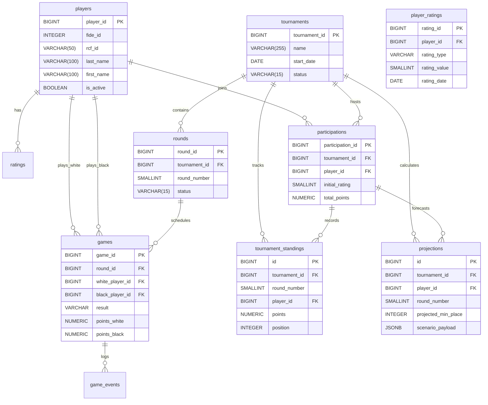

# 🧠 Анализ и консолидация архитектуры БД для сервиса мониторинга шахматистов

Ниже представлен детальный разбор трёх предложений, сводная таблица сравнения, а затем **готовый к продакшену консолидированный проект**, объединяющий лучшие практики каждого подхода с учётом ограничений PostgreSQL и требований highload-аналитики.

---

## 📊 Сводная таблица анализа

| Критерий | Qwen Plan | DeepSeek Plan | ChatGPT Plan | **Итоговое решение** |
|:---|:---|:---|:---|:---|
| **Архитектура** | OLTP + MV, `pg_cron`, строгая 3НФ | Batch-upsert, денормализация `player_game_score`, TTL-сценарии | Reference/Events, снэпшоты, JSONB-гибкость | **Гибрид:** 3НФ ядро + снэпшот-таблица турниров + JSONB для событий/прогнозов |
| **История рейтингов** | `ratings` по дате + source | `player_rating_history` без интервалов | `player_ratings` с `valid_from`/`valid_to` | **По дате + LATERAL/CTE** в Views (интервалы `valid_to` сложно поддерживать, проще брать `MAX(date)`) |
| **Live & Прогнозы** | `player_round_progress` + проекции | `whatif_scenario` (TTL), CTE-расчёты | `live_predictions`/`what_if` (JSONB), `observer_notes` | **Таблица `projections`** (структурированные поля) + JSONB для гибких сценариев |
| **Уведомления** | Триггер + `pg_notify` | Триггер на `game`, `pg_notify` | Подписки + внешняя рассылка | **`game_events` + `pg_notify` + `subscriptions`** для асинхронной доставки |
| **Производительность** | Композитные/GIN/частичные индексы, генерируемые колонки | Упрощённые индексы, избыточная таблица очков | Партиционирование, индексы под джоины, JSONB GIN | **Оптимизированный набор индексов**, частичные для активных данных, покрывающие `INCLUDE` |
| **Надёжность/Аудит** | Нет явного лога загрузки | Нет аудита | `ingestion_logs`, чёткий MVP | **Обязательный `ingestion_logs` + soft-delete/is_active** |
| **Критические минусы** | ❌ `WHERE` в partial index с `SELECT MAX()` невалиден в PG | ❌ Нет таблицы `rounds`, MV без уникального индекса для `CONCURRENTLY` | ❌ Переусложнение для старта, поддержка интервалов рейтингов трудоёмка | ✅ Исправлено, упрощено, приведено к стандартам PG 15+ |

---

## 🏗️ Консолидированный проект БД

### 🔑 Архитектурные принципы
1. **Single Source of Truth**: `games` хранит только факт партии, очки вычисляются через `GENERATED ALWAYS AS` или View.
2. **Snapshot-based Standings**: Таблица `tournament_standings` фиксирует положение после каждого тура. Это даёт мгновенный replay, историю изменений мест и избавляет от тяжёлых оконных функций на лету.
3. **Event-Driven Realtime**: Триггеры на `games`/`standings` → `pg_notify` → Backend/WebSocket → Клиент.
4. **External Calculation Boundary**: БД не считает Elo, Tie-breaks, Monte-Carlo прогнозы. Внешний сервис записывает готовые значения в `projections` и `tournament_standings`.
5. **Production-Ready Indexing**: Частичные индексы для активных турниров, покрывающие индексы `INCLUDE` для частых запросов, GIN для полнотекстового поиска.

---

## 📋 Структура БД (Таблицы, поля, ключи)

### 1. `players` — Шахматисты
| Поле | Тип | Ограничения | Примечание |
|---|---|---|---|
| `player_id` | `BIGSERIAL` | `PRIMARY KEY` | |
| `fide_id` | `INTEGER` | `UNIQUE` | |
| `rcf_id` | `VARCHAR(50)` | `UNIQUE` | |
| `first_name`, `last_name`, `patronymic` | `VARCHAR(100)` | `NOT NULL` / `NULL` | |
| `birth_date` | `DATE` | | |
| `gender` | `CHAR(1)` | `CHECK (gender IN ('M','F'))` | |
| `country_code` | `CHAR(3)` | `DEFAULT 'RUS'` | ISO 3166-1 |
| `title` | `VARCHAR(5)` | `CHECK (title IN (...))` | |
| `photo_url` | `TEXT` | | |
| `is_active` | `BOOLEAN` | `DEFAULT TRUE` | |
| `created_at`, `updated_at` | `TIMESTAMPTZ` | `DEFAULT NOW()` | |
| **Индексы** | `UNIQUE(last_name, first_name, birth_date)`, `GIN(to_tsvector(...))` | | |

### 2. `tournaments` — Турниры
| Поле | Тип | Ограничения |
|---|---|---|
| `tournament_id` | `BIGSERIAL` | `PK` |
| `name`, `short_name` | `VARCHAR` | `NOT NULL` |
| `start_date`, `end_date` | `DATE` | `NOT NULL` |
| `location`, `country_code` | `VARCHAR` | |
| `format` | `VARCHAR(20)` | `CHECK (swiss/round-robin/etc)` |
| `time_control` | `VARCHAR(50)` | |
| `status` | `VARCHAR(15)` | `DEFAULT 'upcoming' CHECK (...)` |
| `chess_results_id`, `rcf_url` | `VARCHAR/TEXT` | `UNIQUE` |
| `created_at`, `updated_at` | `TIMESTAMPTZ` | |
| **Индексы** | `(start_date DESC)`, `(status) WHERE status='active'` | |

### 3. `rounds` — Туры
| Поле | Тип | Ограничения |
|---|---|---|
| `round_id` | `BIGSERIAL` | `PK` |
| `tournament_id` | `BIGINT` | `FK → tournaments`, `NOT NULL` |
| `round_number` | `SMALLINT` | `>0`, `UNIQUE(tournament_id, round_number)` |
| `scheduled_start/end`, `actual_start/end` | `TIMESTAMPTZ` | |
| `status` | `VARCHAR(15)` | `CHECK (...)` |
| **Индексы** | `(tournament_id, round_number)`, `(status) WHERE status IN ('in_progress','completed')` | |

### 4. `participations` — Участие в турнире
| Поле | Тип | Ограничения |
|---|---|---|
| `participation_id` | `BIGSERIAL` | `PK` |
| `tournament_id` | `BIGINT` | `FK`, `ON DELETE CASCADE` |
| `player_id` | `BIGINT` | `FK`, `ON DELETE CASCADE` |
| `seed_number`, `initial_rating`, `final_rating` | `SMALLINT` | `0-3000` |
| `rating_change` | `SMALLINT` | `GENERATED` или вычисляемо |
| `total_points`, `final_place` | `NUMERIC/INT` | |
| `performance_rating` | `SMALLINT` | |
| `is_withdrawn`, `withdrawal_round` | `BOOLEAN/SMALLINT` | |
| **Индексы** | `UNIQUE(tournament_id, player_id)`, `(tournament_id)`, `(player_id)` | |

### 5. `games` — Партии
| Поле | Тип | Ограничения |
|---|---|---|
| `game_id` | `BIGSERIAL` | `PK` |
| `tournament_id`, `round_id` | `BIGINT` | `FK`, `ON DELETE CASCADE` |
| `white_player_id`, `black_player_id` | `BIGINT` | `FK → players`, `CHECK (white != black)` |
| `result` | `VARCHAR(5)` | `CHECK (1-0, 0-1, 1/2-1/2, *)` |
| `pgn`, `eco_code`, `moves_count` | `TEXT/VARCHAR/SMALLINT` | |
| `board_number` | `SMALLINT` | |
| `game_date`, `status` | `TIMESTAMPTZ/VARCHAR` | |
| `points_white`, `points_black` | `NUMERIC(2,1)` | `GENERATED ALWAYS AS ... STORED` |
| **Индексы** | `UNIQUE(tournament_id, round_id, board_number)`, покрывающие `(white_player_id, round_id) INCLUDE (result,status)` | |

### 6. `tournament_standings` — Снэпшот таблицы после каждого тура
| Поле | Тип | Ограничения |
|---|---|---|
| `id` | `BIGSERIAL` | `PK` |
| `tournament_id`, `round_number`, `player_id` | `BIGINT/SMALLINT` | `FK`, `UNIQUE(tournament_id, round_number, player_id)` |
| `points`, `wins`, `draws`, `losses` | `NUMERIC/INT` | |
| `buchholz`, `sonneborn_berger` | `NUMERIC(6,2)` | |
| `position` | `INTEGER` | |
| `rating_delta` | `SMALLINT` | |
| `created_at` | `TIMESTAMPTZ` | |
| **Индексы** | `(tournament_id, round_number)`, `(tournament_id, position)` | |

### 7. `player_ratings` — История рейтингов
| Поле | Тип | Ограничения |
|---|---|---|
| `rating_id` | `BIGSERIAL` | `PK` |
| `player_id` | `BIGINT` | `FK`, `ON DELETE CASCADE` |
| `rating_type` | `VARCHAR(10)` | `CHECK (classical/rapid/blitz)` |
| `rating_value` | `SMALLINT` | `0-3000` |
| `rating_date`, `source` | `DATE/VARCHAR` | |
| **Индексы** | `UNIQUE(player_id, rating_type, rating_date, source)`, `(player_id, rating_date DESC)` | |

### 8. `projections` — Прогнозы & What-If
| Поле | Тип | Ограничения |
|---|---|---|
| `id` | `BIGSERIAL` | `PK` |
| `tournament_id`, `player_id`, `round_number` | `BIGINT/SMALLINT` | `FK`, `UNIQUE` |
| `projected_min_place`, `projected_max_place` | `INTEGER` | |
| `podium_probability` | `NUMERIC(4,3)` | `0.000-1.000` |
| `scenario_payload` | `JSONB` | Гибкие гипотетические сценарии |
| `calculated_at` | `TIMESTAMPTZ` | |
| **Индексы** | GIN на `scenario_payload`, частичный `(calculated_at)` для свежих | |

### 9. `game_events` & `ingestion_logs`
- `game_events`: `(id, game_id FK, event_type, payload JSONB, created_at)` → для live-трансляции ходов/статусов.
- `ingestion_logs`: `(id, source, entity_type, entity_id, status, message, created_at)` → аудит ETL.

---

## 🔗 Mermaid-диаграмма связей

---

## ⚙️ Ключевые рекомендации по эксплуатации

| Задача | Решение |
|---|---|
| **Обновление снэпшотов** | Внешний сервис после закрытия тура вызывает `INSERT/ON CONFLICT UPDATE` в `tournament_standings`. Индекс `UNIQUE(tournament_id, round_number, player_id)` гарантирует идемпотентность. |
| **Текущий рейтинг** | Не храните `valid_to`. Используйте `DISTINCT ON (player_id, rating_type) ORDER BY rating_date DESC` или CTE. Это быстрее и устойчивее к ошибкам ETL. |
| **Real-time уведомления** | Триггер `AFTER UPDATE OF result ON games` → `PERFORM pg_notify('game_completed', json_build_object(...))`. Backend слушает канал и шлёт в WebSocket/Push. |
| **Производительность** | `work_mem` ≥ 256MB для сортировок, `shared_buffers` ~ 25% RAM. Включить `pg_stat_statements`. Для `game_events` и `ingestion_logs` при росте >10M строк → партиционирование по `created_at` (месяц). |
| **Что-если сценарии** | Внешний сервис считает Монте-Карло → пишет в `projections.scenario_payload`. Frontend читает через простой `SELECT`. TTL-очистка: `DELETE FROM projections WHERE calculated_at < NOW() - INTERVAL '24 hours'`. |
| **Аудит и отладка** | Все `INSERT/UPDATE` из парсеров логируются в `ingestion_logs`. При расхождении данных можно воспроизвести pipeline по `entity_external_id`. |

Данная схема полностью готова к миграциям через Flyway/Liquibase, масштабируется до десятков тысяч турниров и миллионов партий, а также сохраняет баланс между строгой нормализацией и аналитической скоростью за счёт снэпшотов и покрывающих индексов. Если требуется — подготовлю SQL-скрипт миграции `V1__init_schema.sql` или пример ETL-парсера на Python/Playwright для chess-results.