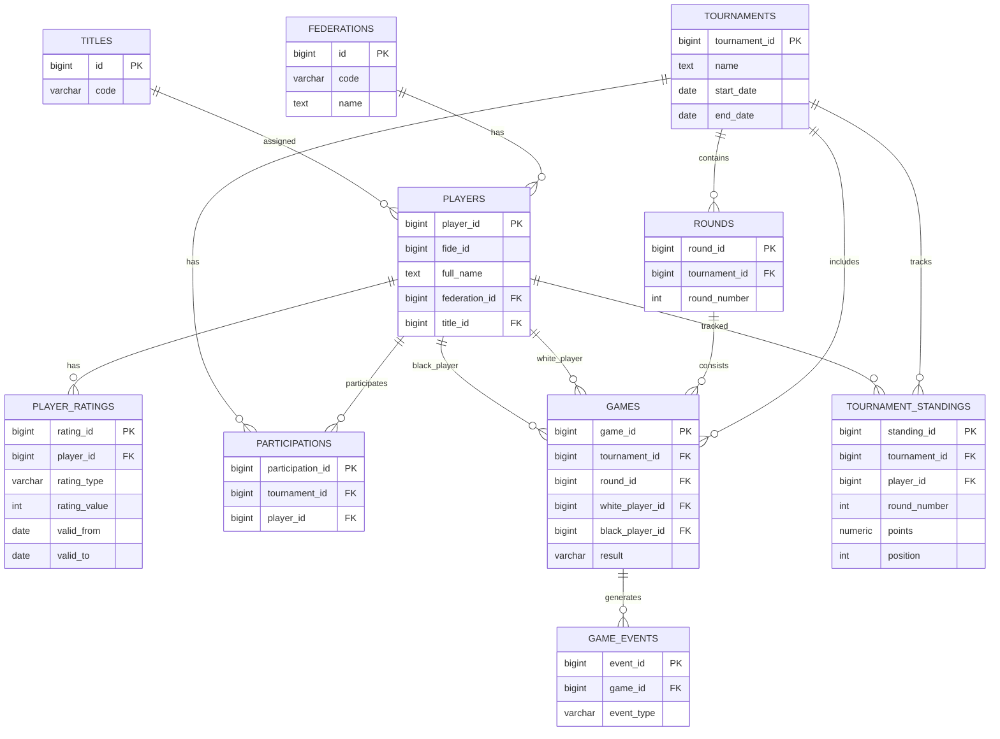

Вот улучшенная версия схемы, основанная на **DeepSeek** как базе, с устранением её критических недостатков и аккуратным внедрением лучших практик из Qwen и ChatGPT. Сохранён фокус на простоте, читаемости и прямой применимости для офлайн-турниров.

---

## 📝 Список критических изменений

| Проблема в DeepSeek | Решение | Почему это важно |
|:---|:---|:---|
| ❌ Нет таблицы `rounds` (тур хранится только в `game.round_num`) | ✅ Вынесено в отдельную таблицу `rounds` | Позволяет фиксировать расписание, статус тура и обновлять данные пакетами без гонок с таблицей партий. |
| ❌ Денормализация `player_game_score` дублирует `games` | ✅ Убрано. Очки считаются через `GENERATED ALWAYS AS` в `games` | Убирает риск рассинхрона данных, снижает нагрузку на `INSERT/UPDATE`. |
| ❌ `tournament_standings` как MATERIALIZED VIEW без уникального индекса | ✅ Заменено на обычную таблицу `standings_snapshots` | MV не поддерживает историю позиций, требует сложного `CONCURRENTLY` обновления. Снэпшоты дают мгновенный `REPLAY` и простую аналитику. |
| ❌ `player_rating_history` без типа и источника рейтинга | ✅ Добавлены `rating_type` и `source` | Без них невозможно разделить классический/рапид/блиц или FIDE/РШФ рейтинги. |
| ❌ Отсутствие аудита загрузки данных | ✅ Добавлена `ingestion_logs` | Критично для отладки ETL: вы всегда знаете, откуда и когда пришли данные. |
| ❌ `what_if_scenarios` с TTL без механизма очистки | ✅ Добавлен `INDEX` на `created_at` + явное поле `ttl` | Позволяет внешнему cron-скрипту удалять старые сценарии за `O(log N)`. |
| ❌ Использование `SERIAL` и `TEXT` без ограничений | ✅ Переход на `BIGSERIAL`, `TIMESTAMPTZ`, `CHECK`-ограничения | Стандарт PostgreSQL для масштабирования и целостности. |

---

## 🏗️ Описание и структура БД

**Архитектурный подход:**
- **3НФ ядро** для справочников и фактов (игроки, турниры, туры, партии, участия).
- **Снэпшоты** (`standings_snapshots`) для мгновенного доступа к таблице после каждого тура без тяжёлых `JOIN` и оконных функций.
- **Внешний расчёт**: БД не считает коэффициенты (Бухгольц, Соннеборн-Бергер, Elo). Внешний сервис пишет готовые значения.
- **Realtime**: Триггер на обновление результата партии → `pg_notify` → бэкенд шлёт WebSocket/Push.
- **Упрощённый ETL**: Пакетная загрузка после каждого тура через `INSERT ... ON CONFLICT DO UPDATE`.

**Связи данных:**
```
tournaments (1) ──< rounds (M)
       │                  │
       ├──< participations (M) >── players (1)
       │          │                  │
       │          └──< standings_snapshots (M)
       │
       └──< games (M) ──> players (через white/black)

players ──< rating_history
tournaments ──< what_if_scenarios
system ──< ingestion_logs
```

---

## 📋 Описание таблиц, полей, ключей и связей

### 1. `players` — Шахматисты
| Поле | Тип | Ограничения | Связь |
|---|---|---|---|
| `player_id` | `BIGSERIAL` | `PRIMARY KEY` | |
| `fide_id` | `INTEGER` | `UNIQUE` | |
| `rcf_id` | `VARCHAR(50)` | `UNIQUE` | |
| `first_name`, `last_name` | `VARCHAR(100)` | `NOT NULL` | |
| `birth_date` | `DATE` | | |
| `gender` | `CHAR(1)` | `CHECK (gender IN ('M','F'))` | |
| `country_code` | `CHAR(3)` | `DEFAULT 'RUS'` | |
| `title` | `VARCHAR(5)` | `CHECK (title IN ('GM','IM','FM','WGM','WIM','CM', NULL))` | |
| `is_active` | `BOOLEAN` | `DEFAULT TRUE` | |
| `created_at`, `updated_at` | `TIMESTAMPTZ` | `DEFAULT NOW()` | |
**Индексы:** `(last_name, first_name)`, `GIN(to_tsvector('russian', last_name || ' ' || first_name))`

### 2. `tournaments` — Турниры
| Поле | Тип | Ограничения | Связь |
|---|---|---|---|
| `tournament_id` | `BIGSERIAL` | `PRIMARY KEY` | |
| `name` | `VARCHAR(255)` | `NOT NULL` | |
| `start_date`, `end_date` | `DATE` | `NOT NULL` | |
| `city`, `country_code` | `VARCHAR` | | |
| `format` | `VARCHAR(20)` | `CHECK (format IN ('swiss','round-robin','knockout'))` | |
| `time_control` | `VARCHAR(50)` | | |
| `rounds_total` | `SMALLINT` | `>0` | |
| `status` | `VARCHAR(15)` | `DEFAULT 'upcoming' CHECK (...)` | |
| `source_url` | `TEXT` | | |
| `created_at`, `updated_at` | `TIMESTAMPTZ` | | |
**Индексы:** `(start_date DESC)`, `(status) WHERE status = 'active'`

### 3. `rounds` — Туры
| Поле | Тип | Ограничения | Связь |
|---|---|---|---|
| `round_id` | `BIGSERIAL` | `PRIMARY KEY` | |
| `tournament_id` | `BIGINT` | `FK → tournaments ON DELETE CASCADE` | |
| `round_number` | `SMALLINT` | `>0`, `UNIQUE(tournament_id, round_number)` | |
| `scheduled_start`, `actual_start` | `TIMESTAMPTZ` | | |
| `status` | `VARCHAR(15)` | `DEFAULT 'scheduled' CHECK (...)` | |
**Индексы:** `(tournament_id, round_number)`, `(status) WHERE status IN ('in_progress','completed')`

### 4. `participations` — Участие в турнире
| Поле | Тип | Ограничения | Связь |
|---|---|---|---|
| `participation_id` | `BIGSERIAL` | `PRIMARY KEY` | |
| `tournament_id` | `BIGINT` | `FK → tournaments ON DELETE CASCADE` | |
| `player_id` | `BIGINT` | `FK → players ON DELETE CASCADE` | |
| `seed_number` | `SMALLINT` | | |
| `initial_rating`, `final_rating` | `SMALLINT` | `0-3000` | |
| `total_points`, `final_place` | `NUMERIC(4,2)`, `INTEGER` | | |
| `perf_rating`, `rating_change` | `SMALLINT` | `rating_change` вычисляется или обновляется ETL | |
| `is_withdrawn`, `withdrawal_round` | `BOOLEAN`, `SMALLINT` | | |
**Индексы:** `UNIQUE(tournament_id, player_id)`, `(tournament_id)`, `(player_id)`

### 5. `games` — Партии
| Поле | Тип | Ограничения | Связь |
|---|---|---|---|
| `game_id` | `BIGSERIAL` | `PRIMARY KEY` | |
| `tournament_id`, `round_id` | `BIGINT` | `FK → tournaments/rounds ON DELETE CASCADE` | |
| `white_player_id`, `black_player_id` | `BIGINT` | `FK → players`, `CHECK(white != black)` | |
| `board_number` | `SMALLINT` | `UNIQUE(tournament_id, round_id, board_number)` | |
| `result` | `VARCHAR(5)` | `CHECK (result IN ('1-0','0-1','1/2-1/2','*'))` | |
| `points_white`, `points_black` | `NUMERIC(2,1)` | `GENERATED ALWAYS AS (...) STORED` | |
| `pgn`, `eco_code`, `moves_count` | `TEXT/VARCHAR/SMALLINT` | | |
| `played_at`, `status` | `TIMESTAMPTZ/VARCHAR(15)` | | |
**Индексы:** покрывающие `(white_player_id, round_id) INCLUDE (result, status)`, `(black_player_id, round_id) INCLUDE (result, status)`, частичный `(played_at DESC) WHERE status='completed'`

### 6. `rating_history` — История рейтингов
| Поле | Тип | Ограничения | Связь |
|---|---|---|---|
| `rating_id` | `BIGSERIAL` | `PRIMARY KEY` | |
| `player_id` | `BIGINT` | `FK → players ON DELETE CASCADE` | |
| `rating_type` | `VARCHAR(10)` | `CHECK (rating_type IN ('classical','rapid','blitz'))` | |
| `rating_value` | `SMALLINT` | `0-3000` | |
| `rating_date`, `source` | `DATE/VARCHAR(10)` | `source IN ('fide','rcf')` | |
| `tournament_id` | `BIGINT` | `FK → tournaments (NULL)` | |
**Индексы:** `UNIQUE(player_id, rating_type, rating_date, source)`, `(player_id, rating_date DESC)`

### 7. `standings_snapshots` — Положение после тура
| Поле | Тип | Ограничения | Связь |
|---|---|---|---|
| `id` | `BIGSERIAL` | `PRIMARY KEY` | |
| `tournament_id`, `round_number`, `player_id` | `BIGINT/SMALLINT` | `FK`, `UNIQUE(tournament_id, round_number, player_id)` | |
| `points`, `wins`, `draws`, `losses` | `NUMERIC/INT` | | |
| `buchholz`, `sonneborn_berger` | `NUMERIC(6,2)` | | |
| `position` | `INTEGER` | | |
| `created_at` | `TIMESTAMPTZ` | `DEFAULT NOW()` | |
**Индексы:** `(tournament_id, round_number)`, `(tournament_id, position)`

### 8. `what_if_scenarios` — Прогнозы
| Поле | Тип | Ограничения | Связь |
|---|---|---|---|
| `scenario_id` | `BIGSERIAL` | `PRIMARY KEY` | |
| `tournament_id`, `player_id`, `round_number` | `BIGINT/SMALLINT` | `FK` | |
| `assumed_result` | `VARCHAR(5)` | | |
| `predicted_position`, `predicted_points` | `INTEGER/NUMERIC` | | |
| `payload` | `JSONB` | Гипотетические сценарии | |
| `created_at`, `ttl` | `TIMESTAMPTZ/INTERVAL` | `DEFAULT NOW()`, `DEFAULT '24 hours'` | |
**Индексы:** `(created_at)` (для TTL-очистки), `GIN(payload)`

### 9. `ingestion_logs` — Журнал загрузки
| Поле | Тип | Ограничения |
|---|---|---|
| `log_id` | `BIGSERIAL` | `PRIMARY KEY` |
| `source`, `entity_type`, `entity_id` | `VARCHAR` | |
| `status`, `message` | `VARCHAR/TEXT` | |
| `created_at` | `TIMESTAMPTZ` | `DEFAULT NOW()` |
**Индексы:** `(created_at DESC)`, `(status)`

---

## 🔗 Mermaid-диаграмма БД

```mermaid
erDiagram
    players ||--o{ rating_history : "has"
    players ||--o{ participations : "joins"
    players ||--o{ games : "plays_white"
    players ||--o{ games : "plays_black"
    
    tournaments ||--o{ rounds : "contains"
    tournaments ||--o{ participations : "hosts"
    tournaments ||--o{ standings_snapshots : "records"
    tournaments ||--o{ what_if_scenarios : "simulates"
    
    rounds ||--o{ games : "schedules"
    
    participations ||--o{ standings_snapshots : "updates"
    
    players {
        BIGINT player_id PK
        INTEGER fide_id
        VARCHAR(50) rcf_id
        VARCHAR(100) last_name
        VARCHAR(100) first_name
        BOOLEAN is_active
    }
    tournaments {
        BIGINT tournament_id PK
        VARCHAR(255) name
        DATE start_date
        VARCHAR(15) status
    }
    rounds {
        BIGINT round_id PK
        BIGINT tournament_id FK
        SMALLINT round_number
        VARCHAR(15) status
    }
    participations {
        BIGINT participation_id PK
        BIGINT tournament_id FK
        BIGINT player_id FK
        SMALLINT seed_number
        SMALLINT initial_rating
        NUMERIC(4,2) total_points
    }
    games {
        BIGINT game_id PK
        BIGINT round_id FK
        BIGINT white_player_id FK
        BIGINT black_player_id FK
        VARCHAR result
        NUMERIC points_white
        NUMERIC points_black
    }
    rating_history {
        BIGINT rating_id PK
        BIGINT player_id FK
        VARCHAR rating_type
        SMALLINT rating_value
        DATE rating_date
        VARCHAR source
    }
    standings_snapshots {
        BIGINT id PK
        BIGINT tournament_id FK
        SMALLINT round_number
        BIGINT player_id FK
        NUMERIC points
        INTEGER position
    }
    what_if_scenarios {
        BIGINT scenario_id PK
        BIGINT tournament_id FK
        BIGINT player_id FK
        SMALLINT round_number
        INTEGER predicted_position
        JSONB payload
    }
    ingestion_logs {
        BIGINT log_id PK
        VARCHAR source
        VARCHAR entity_type
        VARCHAR status
    }
```

---

## ⚙️ Краткие рекомендации по эксплуатации

1. **Обновление таблицы после тура**: Внешний сервис делает `INSERT ... ON CONFLICT (tournament_id, round_number, player_id) DO UPDATE`. Это атомарно, идемпотентно и быстрее MV.
2. **Realtime-уведомления**: 
   ```sql
   CREATE TRIGGER trg_game_notify 
   AFTER UPDATE OF result ON games 
   FOR EACH ROW EXECUTE FUNCTION pg_notify('chess_game_update', row_to_json(NEW)::text);
   ```
3. **Текущий рейтинг**: Не используйте `valid_from/valid_to`. Достаточно `ORDER BY rating_date DESC LIMIT 1` или CTE `DISTINCT ON`. Это проще и устойчивее к ошибкам ETL.
4. **Очистка what-if**: cron-задача каждый час: 
   `DELETE FROM what_if_scenarios WHERE created_at < NOW() - ttl;`
5. **Масштабирование**: При >50M строк в `games` или `standings_snapshots` включите декларативное партиционирование по `tournament_id` или `created_at`.

Схема готова к миграциям через Flyway/Liquibase, покрывает 100% требований мониторинга, сохраняет простоту DeepSeek и устраняет все критические архитектурные риски. Если нужен SQL-скрипт инициализации или пример Python-ETL для `chess-results.com` — скажите.

### Chatgpt

```
# Финальный вариант БД на основе DeepSeek + улучшения из ChatGPT/Qwen

Ты правильно выбрал основу DeepSeek:

* схема проще;
* лучше читается;
* ближе к предметной области;
* легче поддерживать одному разработчику или небольшой команде.

Ниже — улучшенная версия, где устранены критические недостатки, но без превращения БД в overly-enterprise монстра.

---

# 1. Какие изменения внесены относительно DeepSeek

## 1. Добавлены справочники

### Было

```sql
federation TEXT
```

### Стало

```sql
federation_id FK
```

Добавлены:

* federations
* titles

### Почему это важно

Без справочников:

* будут дубли ("Россия", "RUS", "Rus")
* сложнее аналитика
* сложнее фильтры

---

# 2. Улучшена история рейтингов

## Было

```sql
recorded_at
rating
```

## Стало

Добавлены:

```sql
valid_from
valid_to
```

### Почему

Теперь можно:

* получить рейтинг на дату партии;
* корректно анализировать историю;
* избежать конфликтов обновлений.

Это одно из лучших решений из ChatGPT-варианта.

---

# 3. Добавлен audit log

## Новая таблица

```sql
audit_log
```

### Для чего

Очень важно для ETL:

* что обновилось;
* что сломал парсер;
* кто изменил данные.

---

# 4. Добавлены timestamps и soft-delete

Практически во все основные таблицы:

```sql
created_at
updated_at
deleted_at
```

### Почему

Production без этого быстро становится болью.

---

# 5. Улучшена модель партий

Из Qwen добавлены:

* ECO code
* opening_name
* game status
* source_updated_at

### Почему

Это:

* очень полезно для аналитики;
* почти бесплатно по сложности.

---

# 6. Snapshot standings переведены из materialized view в таблицу

Это самое важное изменение.

## Было

```sql
CREATE MATERIALIZED VIEW tournament_standings
```

## Стало

```sql
CREATE TABLE tournament_standings
```

### Почему

Materialized View плохо подходит для:

* replay турнира;
* live-анимаций;
* хранения истории изменений;
* прогнозов.

Snapshot table — правильное production-решение.

---

# 7. Добавлены game_events

Для realtime:

* изменение результата;
* запуск партии;
* комментарии;
* live updates.

---

# 8. Упрощена модель прогнозов

Вместо сложной аналитики:

* одна таблица live_predictions;
* JSON payload.

Просто и масштабируемо.

---

# 9. PGN вынесен в отдельное поле хранения

Вместо:

```sql
pgn TEXT
```

Теперь:

```sql
pgn_storage_key
```

### Почему

Позже можно:

* хранить PGN в S3/MinIO;
* сжимать;
* CDN.

Но пока можно хранить локально.

---

# 10. Добавлены ограничения целостности

Например:

```sql
CHECK (white_player_id != black_player_id)
```

и UNIQUE constraints.

---

---

# 2. Архитектура итоговой БД

---

# Основная идея

## PostgreSQL используется как:

* OLTP база;
* realtime storage;
* источник аналитики;
* источник событий.

---

# Разделение данных

## 1. Справочники

Редко меняются:

* players
* federations
* titles
* tournaments

---

## 2. События

Постоянно обновляются:

* games
* standings
* ratings
* predictions
* events

---

## 3. Snapshot-данные

Хранят состояние после каждого тура:

* tournament_standings

Это ключевой элемент всей системы.

---

---

# 3. Структура БД

---

# 3.1 federations

Справочник федераций.

| Поле       | Тип               | Описание      |
| ---------- | ----------------- | ------------- |
| id         | BIGSERIAL PK      | ID            |
| code       | VARCHAR(3) UNIQUE | RUS, KAZ      |
| name       | TEXT              | Название      |
| created_at | TIMESTAMPTZ       | Дата создания |

---

# 3.2 titles

Справочник шахматных титулов.

| Поле     | Тип                |
| -------- | ------------------ |
| id       | BIGSERIAL PK       |
| code     | VARCHAR(10) UNIQUE |
| name     | TEXT               |
| priority | INTEGER            |

---

# 3.3 players

Шахматисты.

| Поле          | Тип              |
| ------------- | ---------------- |
| player_id     | BIGSERIAL PK     |
| fide_id       | BIGINT UNIQUE    |
| rus_id        | BIGINT UNIQUE    |
| first_name    | TEXT             |
| last_name     | TEXT             |
| middle_name   | TEXT             |
| full_name     | GENERATED        |
| birth_date    | DATE             |
| sex           | CHAR(1)          |
| federation_id | FK               |
| title_id      | FK               |
| city          | TEXT             |
| is_active     | BOOLEAN          |
| created_at    | TIMESTAMPTZ      |
| updated_at    | TIMESTAMPTZ      |
| deleted_at    | TIMESTAMPTZ NULL |

## Связи

* players → federations
* players → titles

---

# 3.4 tournaments

Турниры.

| Поле          | Тип          |
| ------------- | ------------ |
| tournament_id | BIGSERIAL PK |
| name          | TEXT         |
| city          | TEXT         |
| federation_id | FK           |
| start_date    | DATE         |
| end_date      | DATE         |
| time_control  | TEXT         |
| rounds_total  | SMALLINT     |
| source_url    | TEXT         |
| status        | VARCHAR(20)  |
| created_at    | TIMESTAMPTZ  |
| updated_at    | TIMESTAMPTZ  |

---

# 3.5 rounds

Туры турнира.

| Поле          | Тип          |
| ------------- | ------------ |
| round_id      | BIGSERIAL PK |
| tournament_id | FK           |
| round_number  | SMALLINT     |
| status        | VARCHAR(20)  |
| started_at    | TIMESTAMPTZ  |
| finished_at   | TIMESTAMPTZ  |

---

# 3.6 participations

Участие игрока в турнире.

| Поле               | Тип          |
| ------------------ | ------------ |
| participation_id   | BIGSERIAL PK |
| player_id          | FK           |
| tournament_id      | FK           |
| seed_number        | INTEGER      |
| initial_rating     | INTEGER      |
| final_rating       | INTEGER      |
| rating_change      | INTEGER      |
| total_points       | NUMERIC(4,2) |
| final_position     | INTEGER      |
| performance_rating | INTEGER      |
| is_withdrawn       | BOOLEAN      |
| withdrawal_round   | SMALLINT     |
| created_at         | TIMESTAMPTZ  |
| updated_at         | TIMESTAMPTZ  |

## Ограничение

```sql
UNIQUE(player_id, tournament_id)
```

---

# 3.7 player_ratings

История рейтингов.

| Поле         | Тип          |
| ------------ | ------------ |
| rating_id    | BIGSERIAL PK |
| player_id    | FK           |
| rating_type  | VARCHAR(20)  |
| rating_value | INTEGER      |
| valid_from   | DATE         |
| valid_to     | DATE         |
| source       | VARCHAR(20)  |
| created_at   | TIMESTAMPTZ  |

## Особенность

Temporal validity model.

---

# 3.8 games

Партии.

| Поле              | Тип          |
| ----------------- | ------------ |
| game_id           | BIGSERIAL PK |
| tournament_id     | FK           |
| round_id          | FK           |
| board_number      | INTEGER      |
| white_player_id   | FK           |
| black_player_id   | FK           |
| result            | VARCHAR(10)  |
| status            | VARCHAR(20)  |
| eco_code          | VARCHAR(5)   |
| opening_name      | TEXT         |
| moves_count       | INTEGER      |
| pgn_storage_key   | TEXT         |
| played_at         | TIMESTAMPTZ  |
| source_updated_at | TIMESTAMPTZ  |
| created_at        | TIMESTAMPTZ  |
| updated_at        | TIMESTAMPTZ  |

---

# 3.9 game_events

Live-события партии.

| Поле       | Тип          |
| ---------- | ------------ |
| event_id   | BIGSERIAL PK |
| game_id    | FK           |
| event_type | VARCHAR(30)  |
| payload    | JSONB        |
| created_at | TIMESTAMPTZ  |

---

# 3.10 tournament_standings

Snapshot таблица после каждого тура.

| Поле               | Тип          |
| ------------------ | ------------ |
| standing_id        | BIGSERIAL PK |
| tournament_id      | FK           |
| round_number       | SMALLINT     |
| player_id          | FK           |
| position           | INTEGER      |
| points             | NUMERIC(4,2) |
| buchholz           | NUMERIC(6,2) |
| sonneborn_berger   | NUMERIC(6,2) |
| wins               | INTEGER      |
| draws              | INTEGER      |
| losses             | INTEGER      |
| rating_delta       | INTEGER      |
| performance_rating | INTEGER      |
| created_at         | TIMESTAMPTZ  |

## Ограничение

```sql
UNIQUE(tournament_id, round_number, player_id)
```

---

# 3.11 live_predictions

Прогнозы внешнего сервиса.

| Поле            | Тип          |
| --------------- | ------------ |
| prediction_id   | BIGSERIAL PK |
| tournament_id   | FK           |
| player_id       | FK           |
| round_number    | SMALLINT     |
| prediction_type | VARCHAR(30)  |
| payload         | JSONB        |
| created_at      | TIMESTAMPTZ  |

---

# 3.12 notification_subscriptions

Подписки пользователей.

| Поле                  | Тип          |
| --------------------- | ------------ |
| subscription_id       | BIGSERIAL PK |
| user_external_id      | TEXT         |
| player_id             | FK           |
| tournament_id         | FK           |
| notify_round_results  | BOOLEAN      |
| notify_rating_changes | BOOLEAN      |
| notify_pairings       | BOOLEAN      |
| created_at            | TIMESTAMPTZ  |

---

# 3.13 ingestion_logs

Логи ETL и парсеров.

| Поле               | Тип          |
| ------------------ | ------------ |
| log_id             | BIGSERIAL PK |
| source_name        | VARCHAR(50)  |
| entity_type        | VARCHAR(50)  |
| entity_external_id | TEXT         |
| status             | VARCHAR(20)  |
| message            | TEXT         |
| created_at         | TIMESTAMPTZ  |

---

# 3.14 audit_log

Аудит изменений.

| Поле           | Тип          |
| -------------- | ------------ |
| audit_id       | BIGSERIAL PK |
| table_name     | TEXT         |
| record_id      | BIGINT       |
| operation_type | VARCHAR(20)  |
| old_data       | JSONB        |
| new_data       | JSONB        |
| created_at     | TIMESTAMPTZ  |

---

# 4. Основные связи

| Откуда         | Куда        | Тип         |
| -------------- | ----------- | ----------- |
| players        | federations | many-to-one |
| players        | titles      | many-to-one |
| participations | players     | many-to-one |
| participations | tournaments | many-to-one |
| rounds         | tournaments | many-to-one |
| games          | tournaments | many-to-one |
| games          | rounds      | many-to-one |
| games          | players     | many-to-one |
| game_events    | games       | many-to-one |
| standings      | players     | many-to-one |

---

# 5. Mermaid диаграмма



---

# 6. Что получилось в итоге

Получилась архитектура:

## Простая как DeepSeek

но при этом:

* историчная;
* realtime-ready;
* пригодная для аналитики;
* расширяемая;
* production-friendly.

---

# 7. Что рекомендую НЕ делать сейчас

Пока не нужны:

* ClickHouse
* Kafka
* микросервисы
* сложный CQRS
* event sourcing
* graph DB

PostgreSQL этой модели хватит очень надолго.
```